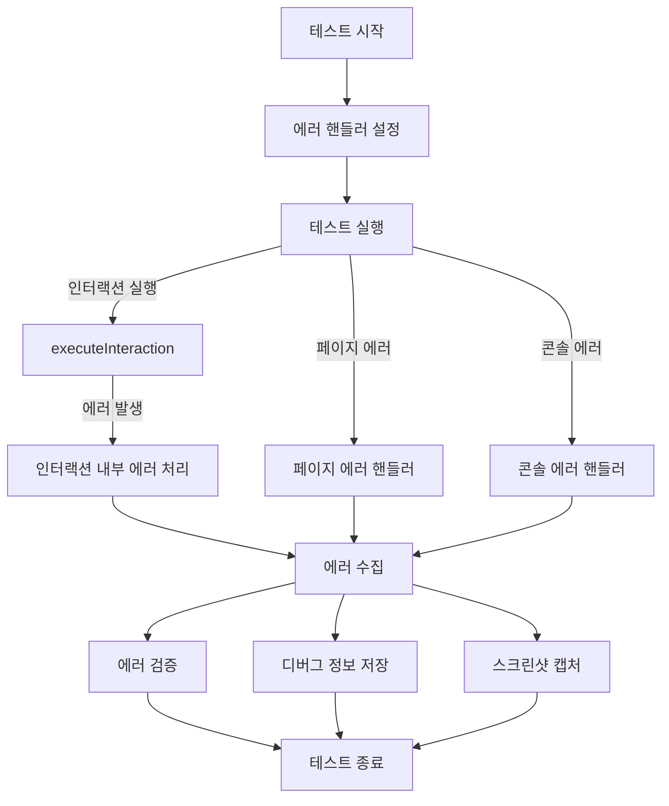
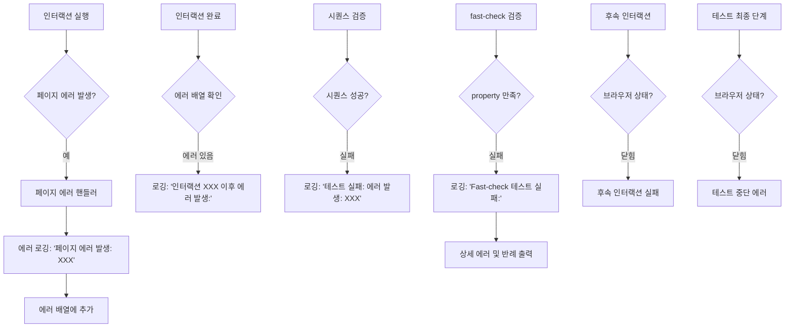
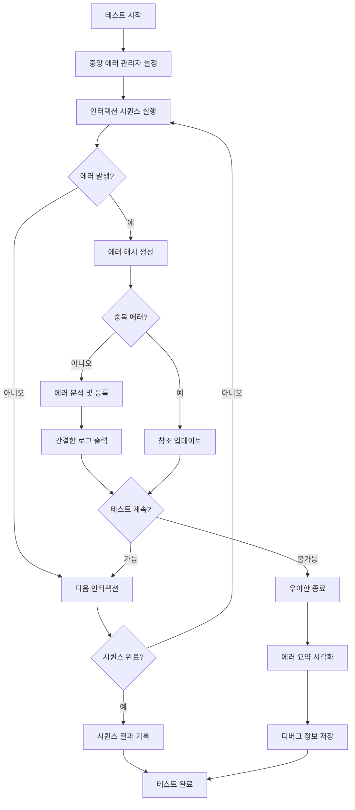

# UI 컴포넌트 테스트의 에러 처리 흐름 및 구조

## 📝 개요

이 문서는 Storybook UI 컴포넌트 테스트 시스템에서 에러가 어떻게 포착되고, 처리되며, 기록되는지에 초점을 맞추고 있어. 현재 코드에서는 하나의 에러가 여러 곳에서 중복 처리되는 복잡한 구조를 가지고 있으므로, 이를 명확히 이해하고 개선하는데 도움을 주기 위한 내용이야.

## 🔄 에러 처리 흐름 개요



## 📋 실제 에러 로그 패턴 분석

실제 에러 발생 시 생성되는 로그를 분석해보면 여러 단계의 중복된 에러 보고가 발생해. 아래는 전형적인 에러 로그 패턴이야:

### 1. 초기 에러 감지 및 보고

```
페이지 에러 발생: At is not a constructor
관련 인터랙션: click on #storybook-root .button-type.btn.btn-outline.svelte-ropvmm
```

이 부분은 `pageerror` 이벤트 핸들러에서 에러를 감지하고 콘솔에 출력하는 첫 번째 단계야.

### 2. 인터랙션 이후 에러 보고

```
인터랙션 "click on #storybook-root .button-type.btn.btn-outline.svelte-ropvmm" 이후 에러 발생:
- 페이지 에러: At is not a constructor
```

이는 인터랙션 실행 후 에러 배열을 검사하는 코드에서 생성되는 로그야.

### 3. 테스트 실패 요약

```
테스트 실패: 에러 발생: 페이지 에러: At is not a constructor
```

이것은 시퀀스 검증 단계에서 에러가 있을 때 출력되는 요약 메시지야.

### 4. Fast-check 테스트 실패 정보

```
--------------------------------
Fast-check 테스트 실패:
오류 메시지: Property failed after 1 tests
{ seed: 99746634, path: "0", endOnFailure: true }
Counterexample: [[{"type":"click","selector":"#storybook-root .button-type.btn.btn-outline.svelte-ropvmm"},{"type":"hover","selector":"#storybook-root .button-type.btn.btn-outline.svelte-ropvmm"},{"type":"hover","selector":"#storybook-root .button-type.btn.btn-outline.svelte-ropvmm"},{"type":"hover","selector":"#storybook-root .button-type.btn.btn-outline.svelte-ropvmm"}]]
Shrunk 0 time(s)

Encountered failures were:
- [[...생략...]]
- Error: {
  message: '페이지 에러: At is not a constructor',
  stack: 'TypeError: At is not a constructor\n' +
    '    at HTMLButtonElement.onclick [as __click] (http://localhost:6001/assets/button.stories-X5oKMgrn.js:28:4575)\n' +
    '    at HTMLDivElement.ne (http://localhost:6001/assets/props-CK4U3sYf.js:1:15685)',
  ...생략...
}
```

Fast-check 라이브러리의 테스트 실패 정보로, 실패 사례(counterexample) 및 더 상세한 에러 정보를 제공해.

### 5. 후속 인터랙션 실패

```
인터랙션 실행 중 오류 발생 (hover on #storybook-root .button-type.btn.btn-outline.svelte-ropvmm): page.waitForTimeout: Target page, context or browser has been closed
```

첫 에러 발생 이후 이어지는 인터랙션에서도 실패가 발생할 수 있으며, 이 경우는 브라우저가 이미 닫혔기 때문에 발생한 후속 에러야.

### 6. 테스트 중단 최종 에러

```
테스트 진행 중 오류 발생: page.isVisible: Target page, context or browser has been closed
    at verifyComponentState (C:\Users\pofgi\Projects\Monorepo\storybook\e2e\universal-testers.js:482:31)
    at runSingleIteration (C:\Users\pofgi\Projects\Monorepo\storybook\e2e\universal-testers.js:763:32)
    at testUIComponent (C:\Users\pofgi\Projects\Monorepo\storybook\e2e\universal-testers.js:844:26)
    at C:\Users\pofgi\Projects\Monorepo\storybook\e2e\traverse.test.js:38:21
```

이는 테스트 자체가 더 이상 진행할 수 없을 때 발생하는 최종 에러로, 소스 코드의 위치를 포함한 스택 트레이스를 제공해.

## 🔍 에러 감지 및 처리 단계

실제 에러 로그를 기반으로 에러 처리 흐름을 더 명확히 이해할 수 있어:



## 🧩 에러 정보의 중복 구조

실제 로그를 보면 하나의 에러에 대해 여러 번 중복 보고되는 것을 확인할 수 있어. 예를 들어 "At is not a constructor" 에러는:

1. 페이지 에러 핸들러에서 처음 감지되어 로깅됨
2. 인터랙션 이후 에러 검사에서 다시 보고됨
3. 테스트 실패 요약에서 다시 언급됨
4. Fast-check 실패 정보에서 상세 스택 트레이스와 함께 다시 보고됨

이러한 중복 구조를 표로 정리하면:

| 에러 감지 단계     | 로그 형식                               | 포함 정보                           |
| ------------------ | --------------------------------------- | ----------------------------------- |
| 페이지 에러 핸들러 | `페이지 에러 발생: [메시지]`            | 에러 메시지, 관련 인터랙션          |
| 인터랙션 이후 검사 | `인터랙션 "[인터랙션]" 이후 에러 발생:` | 에러 메시지, 인터랙션 정보          |
| 테스트 실패 요약   | `테스트 실패: 에러 발생: [메시지]`      | 간략한 에러 요약                    |
| Fast-check 실패    | `Fast-check 테스트 실패:`               | 반례, 스택 트레이스, 상세 에러 객체 |
| 후속 에러          | `인터랙션 실행 중 오류 발생: [메시지]`  | 후속 인터랙션과 에러                |
| 테스트 중단 에러   | `테스트 진행 중 오류 발생: [메시지]`    | 스택 트레이스, 소스 위치            |

## 🚨 실제 에러 발생 시 처리 흐름

실제 에러 발생 예시를 통해 전체 처리 흐름을 살펴보면:

1. **에러 발생 트리거**:

   - 유저가 클릭한 버튼에서 JavaScript 에러가 발생 (`At is not a constructor`)

2. **에러 감지**:

   - 페이지 이벤트 리스너가 `pageerror` 이벤트를 감지
   - 현재 실행 중인 인터랙션(`click`)과 에러를 연결

3. **에러 로깅 및 수집**:

   - 에러 정보가 `errors` 배열에 추가
   - 콘솔에 에러와 관련 인터랙션 로깅

4. **인터랙션 이후 처리**:

   - 인터랙션 완료 후 누적된 에러 확인
   - 에러가 발견되면 추가 로깅 수행

5. **시퀀스 검증 및 Fast-check 처리**:

   - 인터랙션 시퀀스 성공 여부 판단
   - Fast-check 라이브러리가 테스트 속성 실패 처리
   - 반례(실패 사례) 및 상세 에러 정보 출력

6. **후속 인터랙션 실패**:

   - 에러로 인해 브라우저가 닫히거나 상태가 불안정해짐
   - 이후 인터랙션(`hover`)도 실패하여 추가 에러 발생

7. **테스트 중단**:
   - 브라우저가 닫혔으므로 더 이상 테스트를 진행할 수 없음
   - 최종 에러와 스택 트레이스 출력

## 💡 로그 분석 기반 개선 방안

실제 에러 로그를 바탕으로 다음과 같은 구체적인 개선점을 제안할 수 있어:

### 1. 에러 중복 보고 통합

현재는 동일한 에러가 여러 단계에서 중복 보고되고 있어. 이를 통합하여 핵심 정보만 명확하게 로깅하는 구조로 개선하는 것이 좋아:

```javascript:에러 보고 통합 예시
// 통합된 에러 보고자
class ErrorReporter {
  constructor() {
    this.reportedErrors = new Set(); // 이미 보고된 에러 추적
    this.errorDetails = new Map();   // 에러 ID와 상세 정보 매핑
  }

  // 에러 해시 생성 (중복 식별용)
  createErrorHash(error, context) {
    return `${error.message}-${context.type || 'unknown'}-${Date.now()}`;
  }

  // 에러 보고 - 중복 방지
  reportError(error, context) {
    const errorHash = this.createErrorHash(error, context);

    // 이미 보고된 에러인지 확인
    if (this.reportedErrors.has(errorHash)) {
      // 필요시 기존 에러 정보 업데이트
      return this.errorDetails.get(errorHash);
    }

    // 새 에러 보고
    console.error(`[${context.source}] 에러 발생: ${error.message}`);

    if (context.interaction) {
      console.error(`관련 인터랙션: ${context.interaction.type} on ${context.interaction.selector}`);
    }

    // 상세 정보 저장
    const errorInfo = {
      id: errorHash,
      error,
      context,
      reportTime: new Date().toISOString(),
      // 필요한 추가 정보
    };

    this.reportedErrors.add(errorHash);
    this.errorDetails.set(errorHash, errorInfo);

    return errorInfo;
  }

  // 에러 요약 표시 (테스트 종료 시)
  summarizeErrors() {
    if (this.reportedErrors.size === 0) {
      return;
    }

    console.error('\n===== 에러 요약 =====');
    for (const errorInfo of this.errorDetails.values()) {
      console.error(`- [${errorInfo.context.source}] ${errorInfo.error.message}`);
      // 핵심 정보만 요약 표시
    }
    console.error('=====================\n');
  }
}
```

### 2. 에러 원인 자동 분석

현재 로그에서는 에러의 근본 원인이 명확하지 않아. 스택 트레이스와 컨텍스트를 분석하여 더 의미 있는 정보를 제공할 수 있어:

```javascript:에러 원인 분석 예시
function analyzeErrorCause(error, context) {
  // 스택 트레이스 파싱
  const stackLines = (error.stack || '').split('\n');

  // 유용한 정보 추출
  const browserContext = context.browserInfo || {};
  const interactionContext = context.interaction || {};

  // 특정 패턴 식별
  if (error.message.includes('is not a constructor')) {
    return {
      cause: 'constructor_error',
      description: '객체를 생성자로 잘못 호출했습니다',
      suggestion: '해당 함수가 생성자인지 확인하고, new 키워드 사용이 올바른지 검토하세요',
      relatedCode: stackLines[1] || '정보 없음',
    };
  }

  if (error.message.includes('Target page, context or browser has been closed')) {
    return {
      cause: 'browser_closed',
      description: '테스트 중 브라우저가 예기치 않게 종료되었습니다',
      suggestion: '이전 에러가 브라우저를 종료시켰는지 확인하세요',
      impact: '이후 모든 인터랙션이 실패할 것입니다',
    };
  }

  // 기본 응답
  return {
    cause: 'unknown',
    description: '알 수 없는 에러가 발생했습니다',
    stack: stackLines.slice(0, 3).join('\n'),
  };
}
```

### 3. 시각적 에러 요약 제공

복잡한 로그 대신 시각적으로 명확한 에러 요약을 제공하면 디버깅이 용이해:

```javascript:시각적 에러 요약 예시
function createErrorSummary(errors, testInfo) {
  // 에러 분포 분석
  const errorTypes = {};
  const interactionErrors = {};

  errors.forEach(err => {
    // 에러 타입 집계
    const type = err.type || 'unknown';
    errorTypes[type] = (errorTypes[type] || 0) + 1;

    // 인터랙션별 에러 집계
    if (err.interaction) {
      const key = `${err.interaction.type} on ${err.interaction.selector}`;
      interactionErrors[key] = (interactionErrors[key] || 0) + 1;
    }
  });

  // 요약 로그 생성
  console.log('\n====== 테스트 에러 요약 ======');
  console.log(`총 에러 수: ${errors.length}`);

  console.log('\n[에러 타입 분포]');
  Object.entries(errorTypes).forEach(([type, count]) => {
    console.log(`- ${type}: ${count}회`);
  });

  console.log('\n[문제가 많은 인터랙션]');
  Object.entries(interactionErrors)
    .sort((a, b) => b[1] - a[1])
    .slice(0, 3)
    .forEach(([interaction, count]) => {
      console.log(`- ${interaction}: ${count}회 에러`);
    });

  console.log('\n[핵심 에러 메시지]');
  // 중복 제거하고 핵심 에러만 표시
  const uniqueMessages = new Set(errors.map(e => e.message));
  Array.from(uniqueMessages).slice(0, 5).forEach(msg => {
    console.log(`- ${msg}`);
  });

  console.log('==============================\n');
}
```

## 🏁 개선된 에러 처리 흐름 제안

실제 로그 분석을 바탕으로 개선된 에러 처리 흐름을 제안해:



## 📊 결론 및 요약

실제 로그 분석을 통해 현재 에러 처리 시스템의 몇 가지 주요 개선점을 확인했어:

1. **에러 중복 보고**: 동일한 에러가 여러 단계에서 반복적으로 보고되어 로그가 불필요하게 길어지고 혼란스러워져
2. **에러 컨텍스트 불명확**: 에러 원인과 관련 인터랙션의 연결이 불완전하거나 중복됨
3. **후속 실패 구분 부족**: 첫 에러 이후 발생하는 후속 실패(브라우저 닫힘 등)와 원인 에러의 구분이 명확하지 않음
4. **시각적 요약 부재**: 복잡한 텍스트 로그 대신 한눈에 파악할 수 있는 요약 정보가 필요함

이러한 분석을 바탕으로 에러 처리 시스템을 개선하면 디버깅 효율성을 크게 높일 수 있을 거야. 특히 중앙화된 에러 관리 시스템과 시각적 요약을 도입하는 것이 가장 효과적인 개선 방향이라고 생각해!
