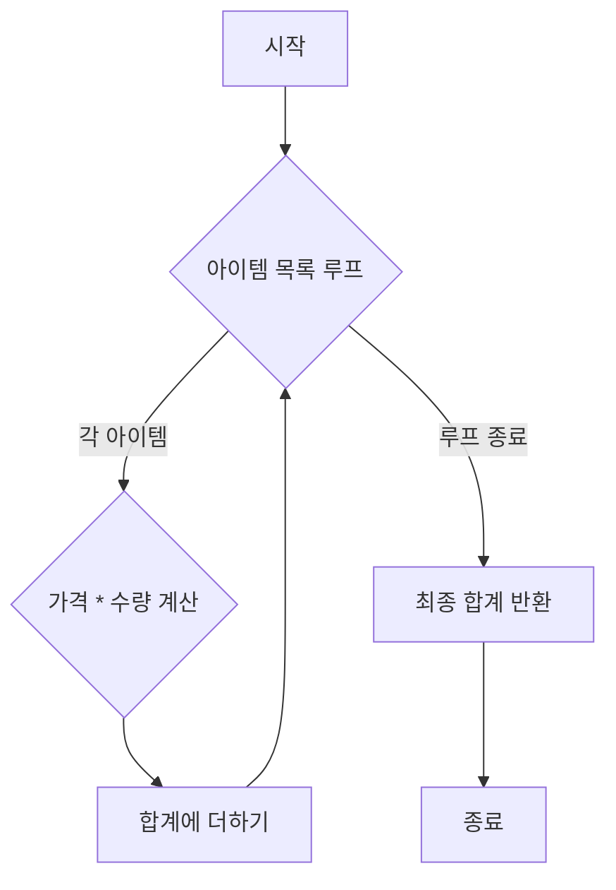

# Guidelines for Writing a Code Review

## Step 1: Code Analysis

- Identify the main purpose and functionality of the code.
- Determine the programming language and any frameworks or libraries used.
- Analyze code complexity and interactions among key components.
- Highlight core functions, classes, variables, and their relationships.
- Trace the data flow and pinpoint potential confusion points.
- Identify specific code sections that can benefit from visual illustrations.

## Step 2: Documentation Planning

- Outline the overall structure and sections of the document.
- List relevant code examples and the corresponding visual aids.
- Specify which code elements need visualization and the appropriate diagram types.
- Plan explanations for complex or easily misunderstood sections.
- Propose any creative suggestions or additional insights for clarity.

### Target Reader

Assume that your audience is the developer who modified the code and is already familiar with it. Write with clarity and precision, focusing on providing insights and improvements.

### Purpose

1. Provide a concise summary of the modifications made to the codebase. This section should focus on what has been added, removed, or altered, along with the intended impact of these changes.
2. Assist the original developer by identifying not only areas for improvement but also uncovering potential issues that might have been overlooked. Focus on "what's wrong or could be improved" with an emphasis on detecting hidden problems.

### No Fluff

Eliminate unnecessary filler, padding, perfunctory content, box-ticking content, pro forma content, or content included merely as a formality. Focus solely on the technical content and interesting (or funny) insights related to the code. Remove introductions or extended formalities unless they add real value.

### Ensure That

- All key aspects of the code are clearly explained.
- The document is organized logically and flows naturally.
- Visual aids are effectively enhancing understanding.
- Complex logics or non-intuitive structures are represented clearly with diagrams.
- Potentially confusing or error-prone sections are sufficiently detailed.
- The reader can confidently understand and apply the code after reading the document.
- The document serves both beginners and advanced users with practical examples and detailed insights.

### Step 3: Document Creation

Compose a systematic document that should include:

#### Essential Elements

- **Overview:** Explanation of the code's purpose, functionality, and use cases.
- **Architecture/Structure:** Description of the overall code structure and relationships among major components.
- **Core Functionality Explanation:** Detailed description of major functions, classes, and modules.
- **API Documentation (if applicable):** Parameters, return values, exception handling, etc.
- **Usage Examples:** Clear examples demonstrating how to use the code.
- **Easily Confused Parts:** Detailed explanations for sections prone to misunderstandings.
- Additionally, use your creativity and initiative to think about what extra information would help the reader understand the provided code more easily, clearly, and quickly.

#### Detailed Explanation of Confusing Elements and Precautions

- Highlight code sections that are non-intuitive or likely to cause misunderstandings.
- Explain potential performance implications, side effects, and error scenarios.
- Describe common pitfalls developers might encounter and suggest solutions or improvements.

#### Recording Your Findings

- Record any findings, surprises, insights, or issues that the original author might have missed.
- If no major issues exist, keep this section concise.
- Utilize visual diagrams where necessary to illustrate potential pitfalls or better solutions.

#### Utilize Visuals Extensively

Actively incorporate visual tools such as diagrams and tables alongside text explanations. These visuals help to articulate the code's structure and flow intuitively.

##### Visual Code Explanations

- Add concise comment diagrams next to code blocks to explain complex sections.
- Integrate various visualization tools like tables or alternative charts to enhance understanding.
- Use Markdown tables to clearly represent types.
- For core algorithms, provide step-by-step visualizations.
- Depict the data transformation process using sequential diagrams.
- Create memory/resource usage diagrams for resource-intensive sections.

##### Visual Diagrams

- **Actively use Mermaid diagrams**: Provide diagram code that can be directly included in markdown.
- **Flowcharts**: Visualize code execution flow and major branching points.
- **Sequence Diagrams**: Represent object interactions and method call order.
- **Class Diagrams**: Express class structure, inheritance relationships, dependencies.
- **State Diagrams**: Represent state transitions for code where state changes are important.
- **ER Diagrams**: Express entity relationships if data models are included.
- **Component Diagrams**: Express system components and dependencies.

###### CRITICAL: MERMAID SYNTAX PRECAUTIONS (MUST FOLLOW)

To prevent parsing errors, PAY CLOSE ATTENTION TO THESE RULES:

- **ALWAYS** enclose node text in **DOUBLE QUOTES (`"`)**.
  - _Error Example:_ `B{Check function() call?}` -> Causes Error!
  - _Fix:_ `B{"Check function() call?"}`
  - _Error Example:_ `C[Next step(process)]` -> Causes Error!
  - _Fix:_ `C["Next step(process)"]`
- Use **DOUBLE QUOTES (`"`)** around subgraph titles containing spaces or special characters.
- Enclose complex text in sequence diagram messages in **QUOTES**.
- Keep node IDs simple (alphanumeric, e.g., `node1`, `processA`) and use special characters ONLY in the _displayed text_ (inside quotes).
- **LINE BREAKS:** **MUST USE `<br/>`** for line breaks within node text. **DO NOT USE `\\n` or `\n`**. The **entire** node text containing `<br/>` **MUST** be enclosed in **DOUBLE QUOTES (`"`)**.
  - _Error Example:_ `A["Line 1 \\n Line 2"]` -> May not render correctly!
  - _Fix:_ `A["Line 1<br/>Line 2"]`
- **NO MARKDOWN LISTS:** **NEVER** use Markdown list syntax (`-`, `*`, `1.`, etc.) **INSIDE** Mermaid code blocks (` ```mermaid ... ``` `). This will cause `Unsupported markdown: list` errors. If you need list-like appearance in node text, use `<br/>` for line breaks and format manually within quotes, without list markers.
- **NO MARKDOWN in Mermaid:** **ABSOLUTELY NEVER** use any other Markdown syntax (like backticks `` `...` `` for code emphasis) **INSIDE** Mermaid node labels or code blocks. This will break parsing. Keep node text purely descriptive.
- **NO COMMENTS in Mermaid:** **DO NOT** include comments (like `/* ... */` or `%% ...`) inside ` ```mermaid ... ``` ` blocks. Remove them entirely.
- **SUBGRAPH STRUCTURE for Clarity:** To avoid confusing layouts where subgraphs visually engulf unintended nodes, **structure your subgraph definitions carefully**:
  - Define **only the nodes belonging to the subgraph** and their **internal connections** _inside_ the `subgraph ... end` block.
  - Define connections linking the main flow **to** the subgraph start node and **from** the subgraph end node _outside_ the `subgraph ... end` block. This helps the layout engine render boundaries more accurately.
- **Diagram Types:** Use appropriate types: `flowchart`, `sequenceDiagram`, `classDiagram`, `stateDiagram-v2`, `erDiagram`. But the `componentDiagram` type might not be supported, leading to `UnknownDiagramError`. consider using more widely supported alternatives like `graph TD` or `flowchart TD` to represent similar structures.

#### Enhancing Document Quality

- Apply a clear markdown heading structure to improve **skimming**.
- Use visual aids like diagrams and tables for step-by-step explanations of complex concepts.
- Balance basic explanations for beginners with in-depth details for experts.
- Present real usage scenarios and problem-solving examples.
- Instead of copying code verbatim, provide commentary and additional insights that help clarify the code.
- Feel free to propose creative visual representations or extra information that could further aid comprehension.

#### Tone & Style

- 전부 한국어로 작성하라
- **Apply markdown formatting to make it easier to skim**
- Use **반말체 (informal speech)**: End sentences with "~이야" or "~해", etc.
- **Bad Example:** "이 함수는 데이터를 검증합니다."
- **Good Example:** "이 함수는 데이터를 검증해."
- 또는 반말보다 명사형이 더 적절할 경우에는, 반말이 아닌 명사형으로 문장을 끝내.
- 위의 모든 조건들의 목적은 이해를 더 쉽고 빠르게 만들기 위해서임.

### Example Output Demonstration

<Example>
Here is a small example demonstrating the desired style for documenting a single function:

````markdown
### `calculateTotal(items)` 함수

이 함수는 장바구니 아이템 목록을 받아서 총 가격을 계산해주는 함수야.

#### 작동 방식

각 아이템의 가격과 수량을 곱한 값을 모두 더해서 최종 합계를 반환해.



#### **주의할 점!**

- `items` 배열의 각 요소에는 `price`와 `quantity` 속성이 꼭 있어야 해. 없으면 에러가 날 수 있어! (현재 에러 처리 로직은 없어.)
- 가격이 음수거나 수량이 이상한 값일 경우에 대한 검증은 따로 없어. 입력값을 잘 확인해야 해.
````

</Example>
