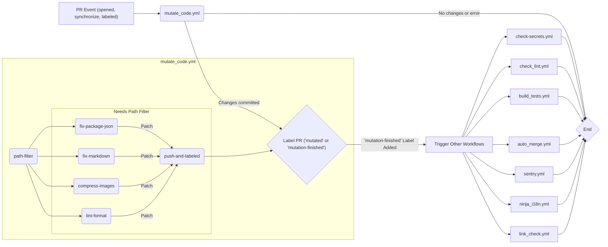

# GitHub Actions 워크플로우 문서 (Korean, Informal)

이 문서는 `.github/workflows` 디렉토리에 있는 GitHub Actions 워크플로우들을 설명해. 워크플로우들은 주로 Pull Request 이벤트에 반응하여 코드 품질 검사, 자동 수정, 테스트, 배포 관련 작업들을 자동화하는 역할을 담당해.

## 전체 워크플로우 흐름 개요

Pull Request가 생성되거나 업데이트되면, 주로 `mutate_code.yml` 워크플로우가 먼저 실행돼. 이 워크플로우는 코드 변경 사항을 분석하고, 필요한 자동 수정(포맷팅, 이미지 압축 등)을 적용한 후, 특정 레이블(`mutation-finished` 또는 `mutated`)을 PR에 추가해.

`mutation-finished` 레이블이 추가되면, 다른 여러 워크플로우들 (`check-secrets`, `check_lint`, `build_tests`, `auto_merge`, `sentry`, `ninja_i18n`, `link_check`)이 트리거되어 각각의 검사 및 처리 작업을 수행해.



## 개별 워크플로우 상세 설명

---

### 1. `mutate_code.yml`

- **개요**: 이 워크플로우는 PR이 열리거나, 코드가 업데이트되거나, 특정 레이블(`restart`)이 붙었을 때 실행돼. 코드 변경 사항을 감지하여 자동으로 코드를 수정하고 포맷팅하는 핵심적인 역할을 해. 이미지 압축, Markdown 파일 수정, `package.json` 일관성 수정, 코드 린트 및 포맷팅 등을 수행하고, 변경 사항이 있으면 `[automated-mutation]` 커밋 메시지와 함께 푸시하고 PR에 레이블을 추가해.
- **트리거**:
  - `pull_request`: `types: [opened, synchronize, labeled]`
- **주요 작업 (Jobs)**:

  ```mermaid
  graph TD
      A[path-filter] --> B(fix-package-json);
      A --> C(fix-markdown);
      A --> D(compress-images);
      A --> E(lint-format);
      B -- ".patch artifact" --> F(push-and-labeled);
      C -- ".patch artifact" --> F;
      D -- ".patch artifact" --> F;
      E -- ".patch artifact" --> F;

      subgraph Path Filtering & Initial Check
          A["path-filter<br/>변경된 파일 경로 필터링 (images, markdown, package-json)<br/>'restart' 레이블 제거"]
      end

      subgraph Code Mutation Jobs
          B["fix-package-json<br/>'package.json' 의존성 버전 불일치 수정<br/>변경 시 .patch 아티팩트 생성"]
          C["fix-markdown<br/>Markdown 파일 린트/포맷팅<br/>변경 시 .patch 아티팩트 생성"]
          D["compress-images<br/>이미지 파일 압축<br/>변경 시 .patch 아티팩트 생성"]
          E["lint-format<br/>전체 코드 린트/포맷팅 (lint-fix)<br/>변경 시 .patch 아티팩트 생성"]
      end

      subgraph Final Push & Labeling
          F["push-and-labeled<br/>모든 .patch 아티팩트 적용<br/>변경사항 있으면 커밋 & 푸시 ('[automated-mutation]')<br/>PR 레이블 추가 ('mutated' 또는 'mutation-finished')"]
      end
  ```

- **핵심 기능 설명**:
  - `path-filter`: 변경된 파일 경로를 분석하여 이미지, 마크다운, `package.json` 파일 변경 여부를 출력으로 설정해. 이후 작업들이 조건부로 실행되도록 해. `restart` 레이블이 있으면 제거해 재시작을 가능하게 해.
  - `fix-package-json`, `fix-markdown`, `compress-images`, `lint-format`: 각 파일 타입에 맞는 수정/포맷팅/압축 작업을 수행해. 각 작업은 독립적으로 실행될 수 있지만, `lint-format`은 `fix-package-json` 이후에 실행되어야 할 수 있으므로 의존성 및 아티팩트 전달이 중요해. 변경 사항이 발생하면 `.patch` 파일을 아티팩트로 업로드하여 다음 단계(`push-and-labeled`)에서 취합할 수 있도록 해.
  - `push-and-labeled`: 이전 단계들에서 생성된 모든 `.patch` 아티팩트를 다운로드하여 현재 브랜치에 적용해. 변경 사항이 최종적으로 존재하면, `[automated-mutation]` 커밋 메시지로 커밋하고 해당 PR 브랜치에 푸시해. 변경 사항 유무에 따라 `mutated` 또는 `mutation-finished` 레이블을 PR에 추가해.
- **혼동하기 쉬운 부분 및 주의사항**:
  - **아티팩트 사용**: 각 수정 작업(fix-_, compress-_, lint-\*)은 독립적인 환경에서 실행되므로, 변경 사항을 다음 단계로 전달하기 위해 `.patch` 파일을 아티팩트로 사용해. `push-and-labeled` 작업에서 이 패치들을 모두 적용하여 최종 변경 사항을 만들어. 이는 작업 간의 상태 공유 방식이야.
  - **임시 커밋**: `fix-markdown`과 `lint-format` 작업 내에서 임시 커밋을 사용하는 이유는 `git diff`의 기준점을 명확히 하기 위해서야. 이전 단계에서 적용된 패치 변경사항을 제외하고, 오직 해당 작업(마크다운 수정 또는 린트 수정)에 의한 변경만을 감지하여 `.patch` 파일을 생성하기 위함이야.
  - **실행 조건 (`if`)**: `path-filter` 작업의 실행 조건은 복잡해. `restart` 레이블이 있거나, 레이블 이벤트가 아니면서 `mutation-finished` 레이블이 없고 자동 커밋 메시지가 아닐 때 실행돼. 이는 자동 커밋으로 인한 무한 루프를 방지하고, 수동 재시작을 가능하게 해.
  - **`TOKEN1` 시크릿**: `GITHUB_TOKEN` 대신 `TOKEN1`을 사용하는 이유는 아마도 자동 커밋을 푸시하기 위해 기본 토큰보다 더 높은 권한(예: 쓰기 권한, 브랜치 보호 규칙 우회)이 필요하기 때문일 수 있어. 이 토큰은 Personal Access Token(PAT)일 가능성이 높으며, 보안 관리에 유의해야 해.
  - **`HUSKY: 0` 환경 변수**: Git Hook(Husky)을 비활성화하여 워크플로우 내에서 Git 명령 실행 시 예상치 못한 Hook 동작을 방지해.

---

### 2. `check-secrets.yml`

- **개요**: `mutation-finished` 레이블이 추가되면 실행돼. PR에 새로 추가된 코드에 혹시라도 비밀 정보(API 키, 암호 등)가 포함되어 있는지 검사해.
- **트리거**:
  - `pull_request_target`: `types: [labeled, synchronize]`
  - `if: github.event.action == 'labeled' && github.event.label.name == 'mutation-finished'`
- **주요 작업 (Jobs)**:
  - `check-secrets`: `trufflehog` 액션을 사용하여 PR의 변경사항(`base`와 `head` 커밋 사이)을 스캔해.
- **핵심 기능 설명**:
  - `actions/checkout@v4`: `pull_request_target` 이벤트는 기본적으로 base 커밋을 체크아웃하지만, 여기서는 특정 ref를 지정하지 않았으므로 기본 동작을 따라.
  - `trufflesecurity/trufflehog@main`: `base`와 `head` 옵션을 사용하여 PR의 실제 변경 내용만 스캔하도록 지정해. 이는 전체 리포지토리를 스캔하는 것보다 효율적이야. `--results=verified,unknown` 옵션으로 검증되었거나 확인되지 않은 결과만 표시하도록 해 노이즈를 줄여.
- **혼동하기 쉬운 부분 및 주의사항**:
  - **`pull_request_target`**: 이 이벤트는 기본 리포지토리 컨텍스트에서 실행되므로 시크릿 접근 권한이 있지만, PR 코드 자체에 접근해야 하므로 `trufflehog` 액션에 `base`와 `head`를 명시적으로 전달하는 것이 중요해.

---

### 3. `check_lint.yml`

- **개요**: `mutation-finished` 레이블이 추가되면 실행돼. 코드 스타일과 규칙 준수 여부를 검사(린트)해.
- **트리거**:
  - `pull_request_target`: `types: [labeled, synchronize]`
  - `if: github.event.action == 'labeled' && github.event.label.name == 'mutation-finished'`
- **주요 작업 (Jobs)**:
  - `check-lint`: Turborepo 캐시를 설정하고, Node.js와 pnpm 환경을 구성한 뒤, 의존성을 설치하고, `paraglide-compile`(아마도 i18n 관련 코드 생성)을 실행한 다음, `pnpm run lint` 명령으로 린트를 수행해.
- **핵심 기능 설명**:
  - `actions/checkout@v4`: `ref: ${{ github.event.pull_request.head.sha }}`를 사용하여 PR의 최신 코드를 체크아웃해. `TOKEN1`을 사용하여 비공개 리포지토리나 submodule 접근 문제를 해결할 수 있어. `fetch-depth: 2`는 diff 생성에 필요한 최소한의 히스토리만 가져와 속도를 높여.
  - **캐싱**: `actions/cache@v4`로 Turborepo 캐시(`.turbo`)를, `setup-node@v4`로 pnpm 캐시를 사용하여 빌드 및 설치 시간을 단축해.
  - `pnpm/action-setup@v4`, `actions/setup-node@v4`: `package.json`에 명시된 버전을 사용하여 pnpm과 Node.js 환경을 설정해 일관성을 유지해.
  - `pnpm install --prefer-offline`: 오프라인 캐시를 우선 사용하여 의존성 설치 속도를 높여.
  - `pnpm run paraglide-compile`: Paraglide JS 라이브러리를 사용하여 타입 세이프한 i18n 코드를 컴파일/생성하는 단계로 보여.
  - `pnpm run lint`: 프로젝트에 설정된 린트 규칙에 따라 코드를 검사해.
- **혼동하기 쉬운 부분 및 주의사항**:
  - **`pull_request_target` + `checkout ref`**: 시크릿 접근 권한이 있는 `pull_request_target` 컨텍스트에서 PR의 실제 코드를 검사하기 위해 `ref`를 명시적으로 지정하는 것이 중요해.

---

### 4. `build_tests.yml`

- **개요**: `mutation-finished` 레이블이 추가되면 실행돼. 프로젝트를 빌드하고 단위 테스트 및 E2E 테스트(Vitest, Playwright)를 실행하며, 결과를 리포트로 생성하고 아티팩트로 업로드해.
- **트리거**:
  - `pull_request_target`: `types: [labeled, synchronize]`
  - `if: github.event.action == 'labeled' && github.event.label.name == 'mutation-finished'`
- **주요 작업 (Jobs)**:
  - `build`: 환경 설정(Node.js, pnpm, 캐시), 의존성 설치, Playwright 브라우저 설치, 테스트 실행(`pnpm run test`), 테스트 결과 리포팅 (`dorny/test-reporter`), Playwright 리포트 아티팩트 업로드를 수행해.
- **핵심 기능 설명**:
  - `check_lint.yml`과 유사하게 환경 설정 및 캐싱을 수행해.
  - `pnpm run playwright-install-env`: Playwright 테스트에 필요한 브라우저 바이너리를 설치해.
  - `pnpm run test`: `package.json`에 정의된 테스트 스크립트(아마도 Vitest와 Playwright 테스트 모두 포함)를 실행해.
  - `dorny/test-reporter@v1`: Vitest와 Playwright 테스트 결과를 GitHub Checks UI에 리포트 형식으로 표시해줘. `if: success() || failure()` 와 `continue-on-error: true`를 사용하여 테스트가 실패하더라도 리포트는 항상 생성되도록 해. 여러 번 호출되어 각기 다른 리포트(Vitest Report, Playwright Report, Playwright Results)를 생성해.
  - `actions/upload-artifact@v4`: Playwright 테스트 결과 상세 파일들을 아티팩트로 업로드하여 나중에 다운로드하여 분석할 수 있게 해.
- **혼동하기 쉬운 부분 및 주의사항**:
  - **다중 테스트 리포터**: `dorny/test-reporter`가 여러 번 사용되는 이유는 다른 종류의 테스트 결과(Vitest, Playwright) 또는 다른 형식의 결과(JUnit report, Playwright 자체 report)를 별도의 Check Run으로 표시하기 위해서일 수 있어. 각 `path` 설정이 다를 거야.
  - **`TOKEN1` 사용**: 체크아웃 시 `TOKEN1`을 사용하는 이유는 `check_lint.yml`과 동일하게 비공개 리포지토리 접근 등을 위해서일 수 있어.

---

### 5. `auto_merge.yml`

- **개요**: `mutation-finished` 레이블이 추가되거나, 자동 수정 커밋(`[automated-mutation]`)이 동기화되었을 때 실행돼. 조건에 따라 PR을 자동으로 병합하고, 병합 후에는 `mutation-finished` 레이블을 제거해. Dependabot PR은 별도로 처리해.
- **트리거**:
  - `pull_request_target`: `types: [labeled, synchronize]`
- **주요 작업 (Jobs)**:

  ```mermaid
  graph TD
      A["Trigger (Label 'mutation-finished' or Sync with '[automated-mutation]')"] --> B{Is it Dependabot PR?};
      B -- No --> C["automerge<br/>reitermarkus/automerge 사용<br/>'mutation-finished' 레이블 필요<br/>'never-merge' 레이블 없을 때 병합"];
      B -- Yes --> D["automerge-dependabot<br/>Dependabot 메타데이터 확인<br/>Semver-major 아니면 자동 병합 활성화 (gh pr merge --auto)"];
      C --> E("remove-mutation-finished-label<br/>항상 실행 (if: always())<br/>'mutation-finished' 레이블 제거");
      D --> E;
  ```

- **핵심 기능 설명**:
  - **조건부 실행 (`if`)**: 워크플로우의 각 작업은 복잡한 `if` 조건을 통해 실행 여부가 결정돼.
    - `automerge` / `automerge-dependabot`: Dependabot 레이블이 없고(`automerge`) 있거나(`automerge-dependabot`), `mutation-finished` 레이블이 추가되었거나 자동 수정 커밋이 동기화되었을 때 실행돼.
    - `remove-mutation-finished-label`: 앞선 자동 병합 작업의 성공 여부와 관계없이 (`if: always()`) `mutation-finished` 레이블이 존재하면 항상 실행돼 레이블을 정리해줘.
  - `automerge`: `reitermarkus/automerge@v2` 액션을 사용하여, `mutation-finished` 레이블이 있고 `never-merge` 레이블이 없는 PR을 자동으로 병합 시도해. `TOKEN1`을 사용하여 병합 권한을 얻어.
  - `automerge-dependabot`: Dependabot PR의 경우, `dependabot/fetch-metadata`로 업데이트 유형을 확인하고, 메이저 버전 업데이트가 아닐 경우 GitHub CLI (`gh pr merge --auto`)를 사용하여 자동 병합을 활성화해. 이 역시 `TOKEN1`을 사용해.
  - `remove-mutation-finished-label`: `actions/github-script`를 사용하여 `mutation-finished` 레이블을 PR에서 제거해. `try-catch` 구문으로 레이블이 없거나 삭제 중 오류가 발생해도 워크플로우가 실패하지 않도록 처리해.
- **혼동하기 쉬운 부분 및 주의사항**:
  - **Dependabot 분기 처리**: Dependabot PR은 일반 PR과 다른 방식(GitHub의 자동 병합 기능 활성화)으로 처리돼. 이는 Dependabot의 업데이트 전략(예: 메이저 업데이트는 자동 병합 안 함)을 존중하기 위해서야.
  - **`if: always()`**: `remove-mutation-finished-label` 작업의 `if: always()`는 이전 작업(automerge, automerge-dependabot)이 실패하더라도 이 작업은 항상 실행되어 레이블을 정리하도록 보장해줘.
  - **`TOKEN1` 권한**: 자동 병합 및 레이블 제거를 위해서는 `contents: write` 및 `pull-requests: write` 권한이 필요하며, `TOKEN1`이 이 권한을 제공해야 해.

---

### 6. `sentry.yml`

- **개요**: `mutation-finished` 레이블이 추가되면 실행돼. Sentry에 새로운 릴리즈를 생성하고 관련 커밋 정보를 연결해줘서 에러 트래킹을 용이하게 해.
- **트리거**:
  - `pull_request_target`: `types: [labeled, synchronize]`
  - `if: github.event.action == 'labeled' && github.event.label.name == 'mutation-finished'`
- **주요 작업 (Jobs)**:
  - `build`: 코드를 체크아웃하고 `getsentry/action-release@v3` 액션을 사용하여 Sentry 릴리즈를 생성해.
- **핵심 기능 설명**:
  - `actions/checkout@v4`: `ref: ${{ github.event.pull_request.head.sha }}`로 PR 코드를 가져오고, `fetch-depth: 0`으로 전체 Git 히스토리를 가져와 Sentry 릴리즈가 커밋 정보를 정확히 추적할 수 있도록 해.
  - `getsentry/action-release@v3`: Sentry 관련 시크릿(`SENTRY_AUTH_TOKEN`)과 변수(`SENTRY_ORG`, `SENTRY_PROJECT`)를 사용하여 Sentry 프로젝트에 'production' 환경으로 새 릴리즈를 생성하고 해당 커밋과 연결해줘.
- **혼동하기 쉬운 부분 및 주의사항**:
  - **`fetch-depth: 0`**: Sentry 릴리즈 액션은 이전 릴리즈와의 커밋 차이를 계산하기 위해 전체 Git 히스토리가 필요할 수 있어 `fetch-depth: 0`을 사용해.
  - **시크릿 및 변수**: Sentry 연동을 위해 `SENTRY_AUTH_TOKEN`, `SENTRY_ORG`, `SENTRY_PROJECT` 같은 시크릿 및 변수를 GitHub Actions 설정에 미리 등록해야 해.

---

### 7. `ninja_i18n.yml`

- **개요**: `mutation-finished` 레이블이 추가되면 실행돼. 국제화(i18n) 관련 파일이나 코드에 문제가 없는지 검사하는 액션을 실행해.
- **트리거**:
  - `pull_request_target`: `types: [labeled, synchronize]`
  - `if: github.event.action == 'labeled' && github.event.label.name == 'mutation-finished'`
- **주요 작업 (Jobs)**:
  - `ninja-i18n`: `opral/ninja-i18n-action@main` 액션을 사용하여 i18n 관련 린트 또는 검사를 수행해.
- **핵심 기능 설명**:
  - `opral/ninja-i18n-action@main`: 특정 i18n 라이브러리나 프레임워크(예: i18next, Lingui 등)의 규칙에 따라 번역 파일 누락, 키 오류 등을 검사하는 커뮤니티 액션으로 보여. `@main`을 사용하여 항상 최신 버전을 사용하도록 설정되어 있어. `GITHUB_TOKEN`을 환경 변수로 전달하여 리포지토리 정보 접근 등을 할 수 있게 해.
- **혼동하기 쉬운 부분 및 주의사항**:
  - **`@main` 사용**: 액션 버전을 `@main`으로 지정하면 항상 최신 코드를 사용하게 되어 편리하지만, 예기치 않은 변경(breaking change)이 발생할 수 있는 위험도 있어. 특정 버전 태그(예: `@v1`)를 사용하는 것이 더 안정적일 수 있어.
  - **권한**: `contents: write` 권한이 명시되어 있는데, 이 액션이 단순히 읽기만 하는지 아니면 i18n 관련 파일을 수정/생성하는지에 따라 필요한 권한이 달라질 수 있어. 주석에는 "읽기 권한에서 쓰기 권한으로 변경"이라고 되어 있네.

---

### 8. `link_check.yml`

- **개요**: `mutation-finished` 레이블이 추가되면 실행돼. 코드나 문서 내의 외부/내부 링크들이 유효한지(깨지지 않았는지) 검사해.
- **트리거**:
  - `pull_request_target`: `types: [labeled, synchronize]`
  - `if: github.event.action == 'labeled' && github.event.label.name == 'mutation-finished'`
- **주요 작업 (Jobs)**:
  - `build`: 코드를 체크아웃하고 `umbrelladocs/action-linkspector@v1` 액션을 사용하여 링크를 검사하고 결과를 PR 리뷰 코멘트로 보고해.
- **핵심 기능 설명**:
  - `actions/checkout@v4`: `ref: ${{ github.event.pull_request.head.sha }}`로 PR 코드를 가져와서 검사 대상을 최신 상태로 유지해.
  - `umbrelladocs/action-linkspector@v1`: 리포지토리 내의 파일들에서 링크를 찾아 유효성을 검사하는 액션이야.
    - `github_token: ${{ secrets.github_token }}`: PR 코멘트 작성 등 GitHub API 사용을 위해 토큰을 전달해.
    - `reporter: github-pr-review`: 검사 결과를 PR의 리뷰 코멘트 형식으로 보고하도록 설정해.
    - `fail_level: any`: 유효하지 않은 링크가 하나라도 발견되면 워크플로우를 실패 처리하도록 설정해.
- **혼동하기 쉬운 부분 및 주의사항**:
  - **네트워크 의존성**: 외부 링크를 검사하므로, 일시적인 네트워크 문제나 대상 서버의 문제로 인해 검사가 실패할 수 있어.
  - **검사 범위**: 액션의 기본 설정이나 추가 설정에 따라 검사하는 파일 범위(예: Markdown만 검사할지, 코드 내 주석의 링크도 검사할지)가 달라질 수 있어.
