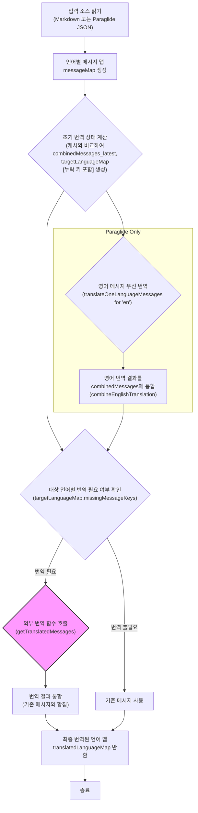
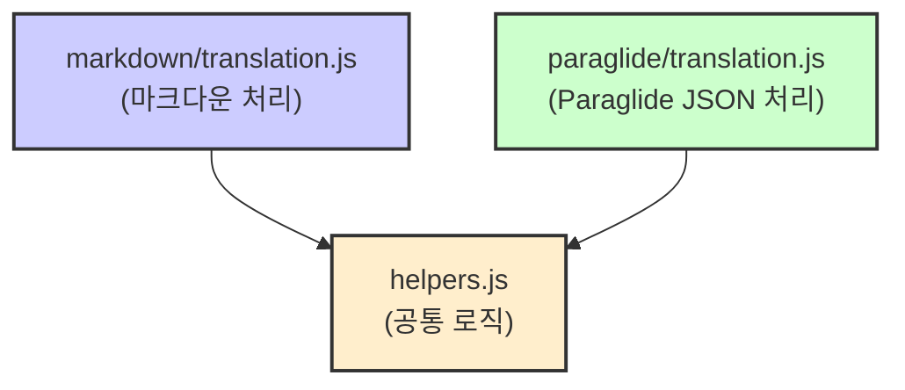
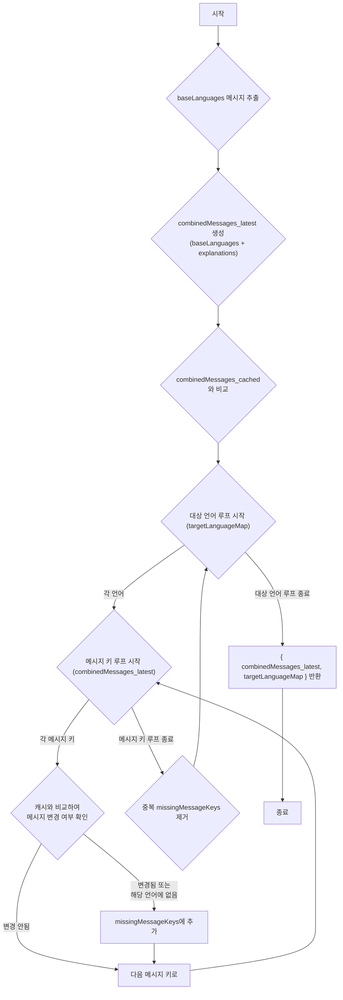
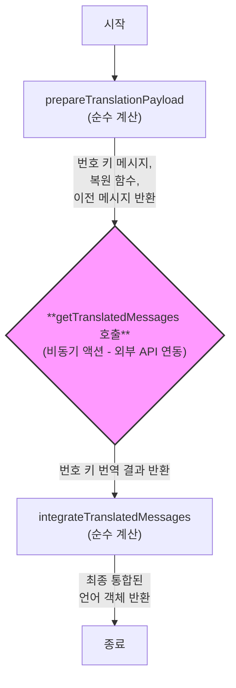
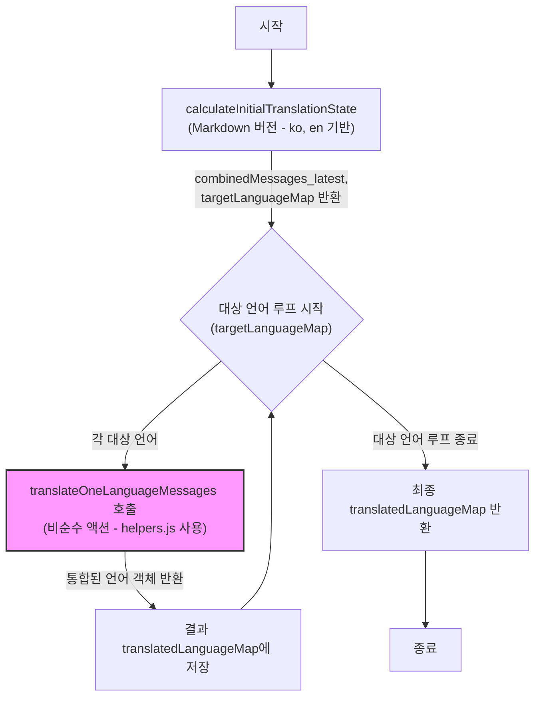
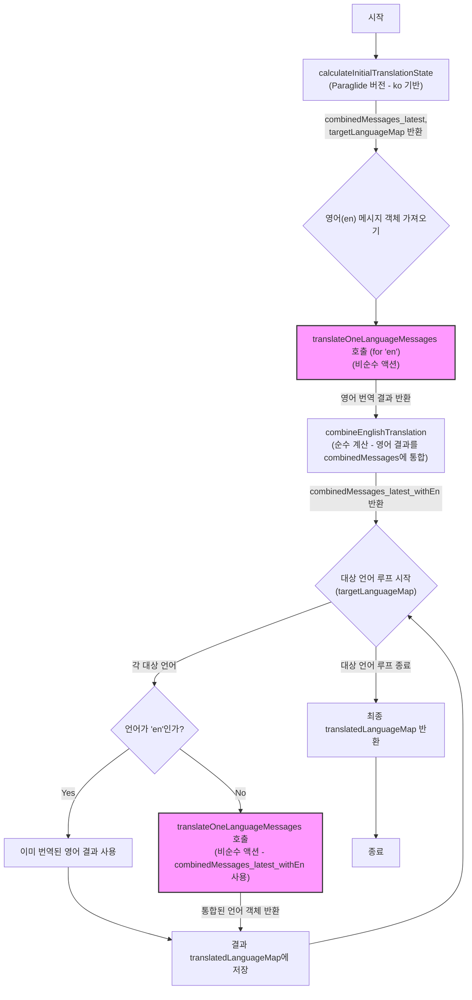

# 번역 스크립트 문서 (`libraries/scripts/src/translation/`)

이 문서는 `libraries/scripts/src/translation` 폴더에 있는 번역 관련 스크립트들의 작동 방식을 설명해. 주로 마크다운 파일이나 Paraglide JSON 파일을 기반으로 번역을 관리하고, 외부 번역 API와 연동하는 기능을 제공해.

**주요 목표:**

* 여러 언어의 번역 리소스를 효율적으로 관리.
* 기본 언어(한국어, 영어 등)를 기준으로 변경된 내용이나 새로운 내용을 감지.
* 부족한 번역 내용을 자동으로 채우기 위한 기반 마련 (외부 번역 함수 연동).
* 함수형 프로그래밍 원칙을 따라 코드의 예측 가능성과 재사용성을 높임.

**전체 프로세스 개요:**



## 구조 (Structure)

스크립트는 크게 세 부분으로 나뉘어 있어.



* **`markdown/translation.js`**: 마크다운 파일(`.md`) 기반의 번역 관리를 담당해. 각 언어 파일과 `explanation.md` 파일을 읽어서 처리하는 로직이 들어있어. 마치, 여러 개의 작은 메모장(`.md`)에 적힌 내용을 모아서 정리하는 비서 같다고 할 수 있지.
* **`paraglide/translation.js`**: Paraglide 라이브러리에서 사용하는 `messages/{lang}.json` 파일 구조를 기반으로 번역 관리를 담당해. 특히 **영어를 먼저 번역**하고, 그 결과를 바탕으로 다른 언어를 번역하는 특징이 있어. 이건 마치, 기준 번역본(영어)을 먼저 만들고 다른 언어로 번역하는 번역가와 비슷해.
* **`helpers.js`**: 두 방식(Markdown, Paraglide)에서 공통으로 사용하는 핵심 로직들을 모아둔 곳이야. 상태 계산, 번역 요청 준비, 결과 통합 등의 재사용 가능한 함수들이 들어있어. 여러 도구(마크다운 비서, Paraglide 번역가)가 공통으로 사용하는 만능 도구 상자 같은 역할이야.

## 주요 데이터 구조

스크립트 전체에서 사용되는 중요한 데이터들의 형태와 의미는 다음과 같아.

| 데이터 구조             | 타입   | 설명                                                                                                                                 | 예시 (간략)                                                                                                |
| :---------------------- | :----- | :----------------------------------------------------------------------------------------------------------------------------------- | :--------------------------------------------------------------------------------------------------------- |
| `messageMap`            | Object | 언어 코드(e.g., 'ko', 'en')를 키로 가지고, 각 언어별 메시지 맵(키: 메시지 ID, 값: 번역된 문자열)을 값으로 가짐.                             | `{ ko: { hello: "안녕" }, en: { hello: "Hello" } }`                                                            |
| `explanations`          | Object | 메시지 ID를 키로 가지고, 해당 메시지에 대한 설명(주로 `explanation.md` 파일 내용)을 값으로 가짐.                                             | `{ hello: "인사말" }`                                                                                        |
| `combinedMessages_cached` | Object | **이전 실행**에서 생성된 결합 메시지 정보. 변경 여부를 확인하기 위한 캐시 역할.                                                              | `{ hello: { ko: "안녕", en: "Hello", exp: "..." } }`                                                            |
| `combinedMessages_latest` | Object | **현재 실행**에서 기본 언어(들)를 기준으로 생성된 최신 결합 메시지 정보. 메시지 ID를 키로, 값은 `{ ko: "...", en: "...", explanation: "..." }` 형태. | `{ hello: { ko: "안녕", en: "Hello", exp: "..." } }`                                                            |
| `targetLanguageMap`     | Object | 번역이 필요한 대상 언어들의 상태 정보. 언어 코드(e.g., 'fr', 'de')를 키로, 값은 `{ value: { ... }, missingMessageKeys: [...] }` 형태.     | `{ fr: { value: { hello: "Salut" }, missingMessageKeys: ["bye"] } }`                                        |
| `dictionary`            | Object | (선택 사항) 특정 언어에 대한 번역 용어 사전. 외부 번역 함수(`getTranslatedMessages`)에 전달됨.                                              | `{ open: "열기" }` (한국어 사전의 경우)                                                                       |
| `translatedLanguageMap` | Object | `getTranslatedLanguageMap` 함수의 최종 반환 값. 언어 코드를 키로, 값은 `translateOneLanguageMessages` 함수의 결과 객체.                    | `{ fr: { value: {...}, missingMessageKeys: [...], translatedMessages: {...}, newMessages: {...} }, ... }` |

## 핵심 로직: `helpers.js` (공통 도우미 함수들)

여기에 있는 함수들은 마크다운 방식과 Paraglide 방식 양쪽에서 모두 사용하는 핵심적인 역할을 해. 함수형 프로그래밍 규칙에 따라 **순수 함수(`계산`)** 와 **비순수 함수(`액션`)** 를 구분하려고 노력했어.

### `calculateInitialTranslationStateByBaseLanguages(baseLanguages, messageMap, explanations, combinedMessages_cached)` - 순수 함수 (`계산`)

이 함수는 번역 프로세스를 시작하기 위한 초기 상태를 계산해.

1. `baseLanguages` (e.g., `['ko', 'en']` 또는 `['ko']`)에 해당하는 언어들의 메시지만 `messageMap`에서 추출해.
2. 추출된 기본 언어 메시지들과 `explanations`를 조합하여 `combinedMessages_latest` 객체를 만들어. 이게 현재 소스 코드 기준의 최신 메시지 정보야.
3. `combinedMessages_latest`와 캐시된 `combinedMessages_cached`를 비교해.
4. 기본 언어를 제외한 나머지 언어들(`targetLanguageMap`의 키들)에 대해 다음을 계산해:
    * 기존 번역 값 (`value`)
    * 번역이 필요하거나 업데이트가 필요한 메시지 키 목록 (`missingMessageKeys`). 메시지가 변경되었거나, 해당 언어에 아예 번역이 없는 경우 이 목록에 추가돼.
5. 최종적으로 `combinedMessages_latest`와 `targetLanguageMap`을 반환해.



### `combineEnglishTranslation(combinedMessages_latest, englishMessageObject_translated)` - 순수 함수 (`계산`)

**(Paraglide 방식에서만 사용)** 영어 번역 결과를 기존 `combinedMessages_latest`에 합치는 역할을 해.

1. `combinedMessages_latest` (주로 `ko`와 `explanation`만 있음)를 순회해.
2. 각 메시지 키에 대해, `englishMessageObject_translated.newMessages`에 있는 영어 번역 값을 가져와 기존 정보(`ko`, `explanation`)와 합쳐서 새로운 객체를 만들어 반환해.

결과적으로 `combinedMessages_latest_withEn` 객체가 만들어지는데, 여기엔 `ko`, `en`, `explanation` 정보가 모두 포함돼.

### `prepareTranslationPayload(languageMessageObject, combinedMessages_latest)` - 순수 함수 (`계산`)

외부 번역 함수(`getTranslatedMessages`)를 호출하기 전에 필요한 데이터를 준비해.

1. `languageMessageObject.missingMessageKeys`에 해당하는 메시지들만 `combinedMessages_latest`에서 뽑아서 `combinedMessages_target` 객체를 만들어. 이게 번역해야 할 내용들이야.
2. `generateKeyNumberFunctions`를 사용해서 `combinedMessages_target`의 메시지 키(문자열)를 임시 번호(숫자)로 바꾸는 함수(`convertToNumberKeys`)와 다시 원래 키로 복원하는 함수(`restoreFromNumberKeys`)를 생성해.
    * **왜 키를 번호로 바꿀까?** 외부 번역 API 중에는 복잡한 문자열 키 대신 간단한 식별자(숫자 등)를 요구하는 경우가 있어 호환성을 높이고, 때로는 전송 데이터 양을 줄이는 효과도 기대할 수 있어.
3. `missingMessageKeys`에 포함되지 않은 기존 번역 메시지들을 `olderMessages` 배열에 담아. 이건 번역 컨텍스트로 활용될 수 있어.
4. `combinedMessages_target`를 번호 키로 변환한 객체, 키 복원 함수, `olderMessages` 배열을 반환해.

### `integrateTranslatedMessages(languageMessageObject, translatedMessages_numbers, restoreFromNumberKeys)` - 순수 함수 (`계산`)

외부 번역 함수로부터 받은 결과(번호 키 사용)를 다시 원래 메시지 키로 복원하고, 기존 언어 메시지 객체와 통합해.

1. `restoreFromNumberKeys` 함수를 사용해서 번호 키로 된 `translatedMessages_numbers`를 원래 메시지 키를 사용하는 `translatedMessages` 객체로 변환해.
2. `mutative` 라이브러리를 사용해서 불변성을 유지하면서, `languageMessageObject.value`(기존 번역)에 `translatedMessages`(새 번역 결과)를 덮어쓴 `newMessages` 객체를 생성해.
3. 마찬가지로 `mutative`를 사용해서 원본 `languageMessageObject`를 복사하고, 여기에 `translatedMessages`와 `newMessages` 필드를 추가한 최종 결과 객체를 반환해.

### `translateOneLanguageMessages(language, languageMessageObject, dictionary, combinedMessages_latest, getTranslatedMessages)` - 비순수 함수 (`액션`)

특정 언어 하나에 대한 전체 번역 과정을 처리해. **외부 함수 `getTranslatedMessages`를 호출하는 비순수 작업(액션)을 포함**하고 있어.



1. `prepareTranslationPayload`를 호출해서 번역 요청에 필요한 데이터(번호 키 메시지 등)를 준비해 (`계산`).
2. 준비된 데이터와 언어 코드(`language`), 사전(`dictionary`) 정보를 가지고 **`getTranslatedMessages` 함수를 비동기로 호출**해. 이 함수는 실제 번역 작업을 수행하는 외부 함수야 (`액션`).
3. `getTranslatedMessages`로부터 번역 결과(번호 키 사용)를 받아와.
4. `integrateTranslatedMessages`를 호출해서 번역 결과를 원래 메시지 키로 복원하고 기존 정보와 통합해 (`계산`).
5. 최종적으로 통합된 언어 정보 객체를 반환해. 이 객체에는 `value`(기존 번역), `missingMessageKeys`, `translatedMessages`(이번에 번역된 것만), `newMessages`(기존 + 이번 번역 합쳐진 전체) 등이 포함돼.

## 핵심 로직: `markdown/translation.js` (마크다운 파일 기반)

마크다운 파일을 소스로 사용할 때의 특화된 로직이야.

### `convertMarkdownFiles(initialMarkdownFiles, initialLanguageMessageMap)` - 순수 함수 (`계산`)

입력으로 받은 마크다운 파일 객체 배열(`initialMarkdownFiles`)을 분석해서 언어별 메시지 맵(`languageMessageMap`)과 설명 맵(`explanations`)으로 변환해.

1. 파일 경로를 분석해서 언어 코드(e.g., 'ko', 'en', 'explanation')와 파일 키(폴더 경로)를 추출해.
2. 언어 코드에 따라 `languageMessageMap` 또는 `explanations` 객체에 파일 내용을 저장해.

### `calculateInitialTranslationState(messageMap, explanations, combinedMessages_cached)` - 순수 함수 (`계산`)

마크다운 방식의 초기 상태 계산 함수야. 내부적으로 `helpers.js`의 `calculateInitialTranslationStateByBaseLanguages`를 호출하는데, **기본 언어(baseLanguages)로 항상 `['ko', 'en']`을 사용**하는 점이 특징이야. 즉, 한국어와 영어 메시지를 기준으로 변경 사항을 감지하고 다른 언어들의 번역 필요 여부를 판단해.

### `getTranslatedLanguageMap(messageMap, explanations, dictPerLanguage, combinedMessages_cached, getTranslatedMessages)` - 비순수 함수 (`액션`)

마크다운 방식의 메인 번역 실행 함수야.



1. `calculateInitialTranslationState` (Markdown 버전)를 호출해서 초기 상태(`combinedMessages_latest`, `targetLanguageMap`)를 얻어와.
2. `targetLanguageMap`에 있는 각 대상 언어에 대해 루프를 돌아.
3. 각 언어별로 `helpers.js`의 `translateOneLanguageMessages` 함수를 호출해서 번역을 수행하고 결과를 받아와 (`액션` 포함).
4. 모든 대상 언어의 번역 결과를 모아서 `translatedLanguageMap` 객체로 만들어 반환해.

## 핵심 로직: `paraglide/translation.js` (Paraglide JSON 기반)

Paraglide의 `messages/{lang}.json` 파일 구조를 소스로 사용할 때의 특화된 로직이야.

### `calculateInitialTranslationState(messageMap, explanations, combinedMessages_cached)` - 순수 함수 (`계산`)

Paraglide 방식의 초기 상태 계산 함수야. 내부적으로 `helpers.js`의 `calculateInitialTranslationStateByBaseLanguages`를 호출하는데, **기본 언어(baseLanguages)로 항상 `['ko']`만 사용**하는 점이 특징이야. 즉, 한국어 메시지만을 기준으로 변경 사항을 감지해. 영어 번역은 이후 별도 단계에서 처리돼.

### `getTranslatedLanguageMap(messageMap, explanations, dictPerLanguage, combinedMessages_cached, getTranslatedMessages)` - 비순수 함수 (`액션`)

Paraglide 방식의 메인 번역 실행 함수야. **영어를 먼저 번역하는 로직**이 포함된 것이 가장 큰 특징이야.



1. `calculateInitialTranslationState` (Paraglide 버전)를 호출해서 초기 상태(`combinedMessages_latest`, `targetLanguageMap`)를 얻어와 (한국어 기준).
2. `targetLanguageMap`에서 영어(`en`)에 해당하는 메시지 정보(`englishMessageObject`)를 가져와.
3. `translateOneLanguageMessages`를 호출해서 **영어를 먼저 번역해** (`액션`).
4. `combineEnglishTranslation`를 호출해서 영어 번역 결과를 `combinedMessages_latest`와 합쳐 `combinedMessages_latest_withEn`를 만들어 (`계산`). 여기엔 이제 `ko`, `en`, `explanation`이 모두 포함돼.
5. `targetLanguageMap`에 있는 각 대상 언어에 대해 루프를 돌아.
    * 만약 현재 언어가 영어(`en`)라면, 이미 번역된 결과(`englishMessageObject_translated`)를 그대로 사용해.
    * 영어가 아닌 다른 언어라면, `translateOneLanguageMessages`를 호출해서 번역을 수행해 (`액션`). 이때 **영어 번역이 포함된 `combinedMessages_latest_withEn`를 기반**으로 번역을 요청해.
6. 모든 대상 언어의 번역 결과를 모아서 `translatedLanguageMap` 객체로 만들어 반환해.

## 혼동하기 쉬운 부분 (Confusing Parts)

* **`combinedMessages` (cached vs latest):**
    * `_cached`: 이전 실행 때 만들어진 결과물이야. 냉동 피자🍕 같은 거지.
    * `_latest`: 이번 실행 때 기본 언어 기준으로 새로 만든 거야. 방금 만든 따끈한 피자🔥! 둘을 비교해서 뭐가 바뀌었는지 알아내는 데 써.
* **`targetLanguageMap` 구조:** `{ fr: { value: { hello: "Salut" }, missingMessageKeys: ["bye"] } }` 같은 형태야.
    * `value`: 이 언어가 원래 가지고 있던 번역 값들이야 (오래된 걸 수도 있음).
    * `missingMessageKeys`: 이번에 번역하거나 업데이트해야 할 메시지 키 목록이야. `combinedMessages` 비교 결과, 이 언어에 없거나 내용이 바뀐 키들이 여기 들어가. 여행 가기 전에 빠진 짐 목록📝 같다고 보면 돼.
* **순수(`계산`) vs 비순수(`액션`):**
    * `계산`: 입력이 같으면 항상 같은 출력을 내놓고, 외부 세계에 영향을 주지 않아 (e.g., `calculateInitial...`, `prepare...`, `integrate...`). 수학 문제 풀이📐 같아.
    * `액션`: 외부 세계와 상호작용하거나(파일 읽기, API 호출 등), 호출할 때마다 결과가 달라질 수 있어 (e.g., `getTranslatedLanguageMap`, `translateOneLanguageMessages` - 내부적으로 `getTranslatedMessages` 호출). 식당에 주문하기🍽️ 같아. 결과를 예측하기 어렵고 외부(주방)에 영향을 줘.
    * 이 코드에서는 `액션`인 `getTranslatedMessages` 호출 부분을 명확히 분리해서 관리하려고 노력했어.
* **키 넘버링 (`prepareTranslationPayload`):** 메시지 키(`"hello_world"`)를 숫자(`1`)로 잠시 바꾸는 거야. 어떤 번역 서비스는 긴 글자 대신 짧은 번호표를 더 좋아하거든. 번역 끝나면 다시 원래 이름표로 바꿔줘 (`restoreFromNumberKeys`). 옷 맡길 때 번호표 받고 찾을 때 다시 주는 거랑 비슷해🧥.
* **Markdown vs Paraglide (`calculateInitial...` 차이):**
    * Markdown: 한국어(`ko`)와 영어(`en`) 둘 다를 기준으로 변경 사항을 감지해.
    * Paraglide: 한국어(`ko`)만 기준으로 변경 사항을 감지하고, 영어는 나중에 따로 번역해서 합쳐.

## 사용 예시 (Usage Example)

(실제 사용 시에는 파일 읽기, `getTranslatedMessages` 구현 등이 필요함)

```javascript
// 가상의 main.js

import { getTranslatedLanguageMap as getTranslatedMap_markdown } from './markdown/translation.js';
import { getTranslatedLanguageMap as getTranslatedMap_paraglide } from './paraglide/translation.js';
// ... 필요한 파일 읽기 로직 ...
// ... messageMap, explanations, dictPerLanguage, combinedMessages_cached 준비 ...

// 외부 번역 함수 구현 (예시)
async function getTranslatedMessages_dummy(language, combinedMessages_target_numbers, olderMessages, dictionary) {
  console.log(`🌐 ${language} 언어로 번역 요청 받음:`, combinedMessages_target_numbers);
  console.log(`   (참고용 이전 메시지: ${olderMessages.length}개, 사전 키: ${Object.keys(dictionary || {}).length}개)`);
  const translated = {};
  for (const key in combinedMessages_target_numbers) {
    translated[key] = `[${language}] 번역됨: ${combinedMessages_target_numbers[key].ko || combinedMessages_target_numbers[key].en || '원본 없음'}`;
  }
  await new Promise(resolve => setTimeout(resolve, 100)); // 가짜 딜레이
  return translated;
}

// --- Markdown 방식 사용 ---
// const markdown_messageMap = { ... }; // Markdown 파일 읽어서 생성
// const markdown_explanations = { ... };
// const markdown_combined_cached = { ... };
// const markdown_dict = { ... };

// const translatedMap_md = await getTranslatedMap_markdown(
//   markdown_messageMap,
//   markdown_explanations,
//   markdown_dict,
//   markdown_combined_cached,
//   getTranslatedMessages_dummy // 실제 번역 함수 연결
// );
// console.log('📊 Markdown 방식 최종 결과:', translatedMap_md);

// --- Paraglide 방식 사용 ---
// const paraglide_messageMap = { ... }; // JSON 파일 읽어서 생성
// const paraglide_explanations = { ... };
// const paraglide_combined_cached = { ... };
// const paraglide_dict = { ... };

// const translatedMap_pg = await getTranslatedMap_paraglide(
//   paraglide_messageMap,
//   paraglide_explanations,
//   paraglide_dict,
//   paraglide_combined_cached,
//   getTranslatedMessages_dummy // 실제 번역 함수 연결
// );
// console.log('📊 Paraglide 방식 최종 결과:', translatedMap_pg);

```

이 문서를 통해 번역 스크립트의 작동 방식을 이해하는 데 도움이 되길 바라! 😊
