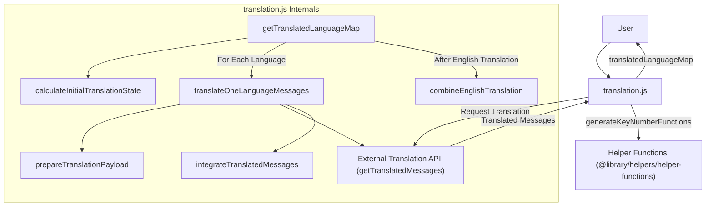
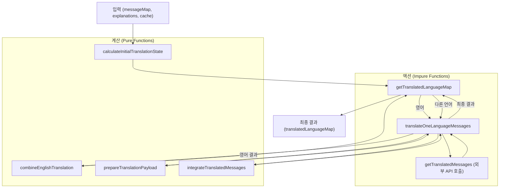
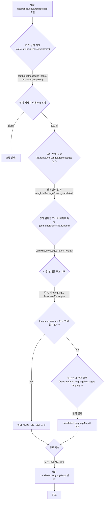

# `translation.js` 스크립트 문서

이 문서는 `translation.js` 파일의 코드 작동 방식을 이해하기 쉽게 설명하는 문서야. 다국어 메시지 번역 과정을 자동화하고 관리하는 역할을 해. 함수형 프로그래밍 원칙을 따라 작성되었고, 특히 **계산(순수 함수)**과 **액션(부수 효과가 있는 함수)**을 분리하는 데 중점을 뒀어.

## 1. 개요: 그래서 뭐 하는 코드인데? 🤔

이 스크립트는 마치 **똑똑한 번역 공장 조립 라인**과 같아.

1. **입력:** 여러 언어의 기존 메시지(`messageMap`), 각 메시지에 대한 설명(`explanations`), 그리고 이전에 번역했던 결과 캐시(`combinedMessages_cached`)를 받아.
2. **분석:** 한국어 메시지와 설명을 기준으로 '최신 표준 메시지'(`combinedMessages_latest`)를 만들고, 다른 언어들에 어떤 메시지가 없거나 업데이트가 필요한지(`missingMessageKeys`) 파악해.
3. **영어 우선 번역:** 영어가 기준 언어 중 하나로 중요하기 때문에, 먼저 영어 번역을 외부 번역 서비스(`getTranslatedMessages`)에 요청해.
4. **나머지 번역:** 영어 번역 결과를 포함한 최신 정보를 바탕으로, 다른 언어들의 번역도 순차적으로 외부 번역 서비스에 요청해.
5. **결과 취합:** 모든 번역 결과를 깔끔하게 정리해서(`translatedLanguageMap`) 최종 결과물로 내보내.



**핵심 목표:**

* 변경된 내용이나 새로 추가된 메시지만 효율적으로 번역 요청하기.
* 번역 서비스에 요청할 때, 키를 숫자로 바꿔서 보내고 다시 원래 키로 복원하기 (아마도 API 제약 때문?).
* 코드를 **계산**(데이터 처리, 예측 가능)과 **액션**(외부 시스템과 통신, 상태 변경 등 예측 어려움)으로 명확히 나눠서 관리하기 쉽게 만들기.

## 2. 아키텍처 & 핵심 원칙: 코드 이렇게 짰어! 📜

이 코드는 `javascript/functional-programming` 규칙을 따르려고 노력했어.

* **계산 vs 액션:**
    * **계산 (Pure Functions):** 입력값이 같으면 항상 같은 결과를 내놓는 함수들. 예를 들어 `calculateInitialTranslationState`, `combineEnglishTranslation`, `prepareTranslationPayload`, `integrateTranslatedMessages`가 여기에 속해. 얘네들은 테스트하기 쉽고 예측 가능해.
    * **액션 (Impure Functions):** 외부 세계와 상호작용하거나(예: API 호출), 내부 상태를 변경하는 등 부수 효과가 있는 함수들. `getTranslatedLanguageMap`과 `translateOneLanguageMessages`는 내부에 `getTranslatedMessages`라는 외부 번역 함수를 호출하기 때문에 액션에 속해. 액션은 최소화하고 계산과 분리하는 게 목표야.

* **불변성 (Immutability):** 데이터를 직접 수정하지 않고, 변경이 필요할 땐 항상 새로운 복사본을 만들어 반환해. 이건 코드의 예측 가능성을 높이고 버그를 줄이는 데 도움이 돼.
    * **Ramda (`R`):** 함수형 프로그래밍을 위한 유틸리티 라이브러리야. 데이터 변환, 함수 조합 등에 사용돼 (`R.mapObjIndexed`, `R.pipe`, `R.omit`, `R.uniq`). Ramda 함수들은 기본적으로 불변성을 지켜줘.
    * **Mutative (`create`):** 복잡하거나 깊게 중첩된 객체를 불변성을 유지하면서 쉽게 업데이트하기 위해 사용돼. Ramda로 처리하기 복잡할 때 좋은 대안이야. `draft` 객체를 직접 수정하는 것처럼 보이지만, 내부적으로는 새로운 객체를 생성해서 반환해줘.

    ```javascript
    // 예시: Mutative로 missingMessageKeys 업데이트 (calculateInitialTranslationState 내부)
    const finalTargetLanguageMap = create(initialTargetLanguageMap, draft => {
        // ... draft[language].missingMessageKeys.push(messageKey) ...
        // 여기서 draft를 직접 수정하는 것처럼 보이지만, create 함수가 불변성을 보장해줌
    });

    // 예시: Mutative로 번역 결과 통합 (integrateTranslatedMessages 내부)
    const newMessages = create(languageMessageObject.value, draft => {
        for (const [messageKey, message] of Object.entries(translatedMessages)) {
            draft[messageKey] = message; // draft 수정 -> 새 객체 생성
        }
    });
    ```



## 3. 핵심 기능: 전체 번역 플로우 🗺️ (`getTranslatedLanguageMap`)

이 함수가 전체 번역 과정을 지휘하는 메인 함수야.



**단계별 설명:**

1. `calculateInitialTranslationState`를 호출해서 최신 통합 메시지(`combinedMessages_latest`)와 언어별 번역 필요 정보(`targetLanguageMap`)를 준비해.
2. `targetLanguageMap`에서 영어(`en`) 데이터를 찾아. 없으면 에러를 던지고 멈춰. (영어 번역이 중요해서 그런가 봐)
3. `translateOneLanguageMessages` 함수를 호출해서 **영어 번역**을 먼저 실행해. (비동기 `await` 사용)
4. 영어 번역이 성공하면, `combineEnglishTranslation` 함수를 사용해서 영어 번역 결과를 `combinedMessages_latest`에 합쳐서 `combinedMessages_latest_withEn`을 만들어. 이제 모든 언어 번역에 영어 텍스트를 참고할 수 있게 돼.
5. `targetLanguageMap`에 있는 나머지 언어들을 하나씩 돌면서:
    * 만약 현재 언어가 영어이고 이미 번역 결과가 있다면 건너뛰고 저장된 영어 결과를 사용해.
    * 그 외 언어는 `translateOneLanguageMessages` 함수를 다시 호출해서 번역을 실행해 (`combinedMessages_latest_withEn`를 전달해서 영어 번역본도 참고하도록!).
6. 각 언어의 번역 결과를 `translatedLanguageMap` 객체에 모아.
7. 모든 언어 처리가 끝나면 `translatedLanguageMap`을 반환해.

## 4. 핵심 기능: 단일 언어 번역 ⚙️ (`translateOneLanguageMessages`)

이 함수는 특정 언어 하나에 대한 번역 작업을 처리해.

```mermaid
flowchart TD
    A["시작: translateOneLanguageMessages 호출"] --> B{"번역 페이로드 준비<br/>(prepareTranslationPayload)"};
    B -- "combinedMessages_target_numbers, restoreFn, olderMessages" --> C{"외부 번역 API 호출<br/>(getTranslatedMessages)"};
    C -- "번호 키로 된 번역 결과 (translatedMessages_numbers)" --> D{"번역 결과 통합<br/>(integrateTranslatedMessages)"};
    D -- "최종 언어 객체 (업데이트됨)" --> E["종료: 업데이트된 언어 객체 반환"];

    subgraph "prepareTranslationPayload 상세"
        direction LR
        P1["입력: languageMessageObject, combinedMessages_latest"] --> P2{"missingMessageKeys 목록 가져오기"};
        P2 --> P3{"combinedMessages_latest에서 해당 키 메시지 추출 (combinedMessages_target)"};
        P3 --> P4{"generateKeyNumberFunctions 호출"};
        P4 -- "convertToNumberKeys, restoreFromNumberKeys" --> P5{"convertToNumberKeys 적용 (combinedMessages_target_numbers)"};
        P5 --> P6{"기존 메시지 추출 (olderMessages)"};
        P6 --> P7["출력: combinedMessages_target_numbers, restoreFromNumberKeys, olderMessages"];
    end

    subgraph "integrateTranslatedMessages 상세"
        direction LR
        I1["입력: languageMessageObject, translatedMessages_numbers, restoreFn"] --> I2{"restoreFromNumberKeys 호출 (translatedMessages)"};
        I2 --> I3{"Mutative 'create' 호출 (원본 languageMessageObject.value 기반)"};
        I3 -- "draft" --> I4{"draft에 번역 결과(translatedMessages) 병합"};
        I4 -- "newMessages" --> I5{"Mutative 'create' 호출 (원본 languageMessageObject 기반)"};
        I5 -- "draft" --> I6{"draft에 translatedMessages, newMessages 추가"};
        I6 --> I7["출력: 업데이트된 languageMessageObject"];
    end

    B --> P1; P7 --> C;
    C --> I1; I7 --> D;
```



**단계별 설명:**

1. **페이로드 준비 (`prepareTranslationPayload`):**
    * 번역이 필요한 메시지 키(`missingMessageKeys`) 목록을 가져와.
    * `combinedMessages_latest`에서 해당 키에 해당하는 메시지 내용(한국어, 영어, 설명 등)을 뽑아 `combinedMessages_target` 객체를 만들어.
    * `@library/helpers/helper-functions`의 `generateKeyNumberFunctions`를 호출해. 이건 아마 메시지 키(`hello_world`)를 숫자 키(`1`)로 바꾸는 함수(`convertToNumberKeys`)와, 나중에 숫자 키를 다시 원래 키로 되돌리는 함수(`restoreFromNumberKeys`)를 만들어주는 헬퍼 같아. 왜 키를 숫자로 바꾸는지는 확실하지 않지만, 아마 외부 API 제약이나 효율성 때문일 수 있어.
    * `convertToNumberKeys`를 사용해서 `combinedMessages_target`의 키를 숫자로 바꾼 `combinedMessages_target_numbers`를 만들어. 이게 실제 API로 보낼 데이터야.
    * `missingMessageKeys`에 포함되지 않은, 즉 이미 번역되어 있던 기존 메시지들(`olderMessages`)도 따로 모아둬. 이건 번역 API가 참고하라고 주는 걸 수 있어.
    * `combinedMessages_target_numbers`, `restoreFromNumberKeys`, `olderMessages`를 반환해.
2. **외부 API 호출 (`getTranslatedMessages`):**
    * 준비된 `language`, `combinedMessages_target_numbers`, `olderMessages`, `dictionary` (사전 데이터)를 외부 비동기 함수 `getTranslatedMessages`에 넘겨서 실제 번역을 요청해.
    * API는 번역된 메시지를 **숫자 키** 형태(`translatedMessages_numbers`)로 반환할 거야.
3. **결과 통합 (`integrateTranslatedMessages`):**
    * API로부터 받은 숫자 키 번역 결과(`translatedMessages_numbers`)를 `restoreFromNumberKeys` 함수를 사용해서 다시 원래 메시지 키(`hello_world` 등)로 복원해 (`translatedMessages`).
    * `mutative`의 `create` 함수를 두 번 사용해서 불변성을 유지하며 최종 결과 객체를 만들어:
        * 첫 번째 `create`: 원본 언어 메시지(`languageMessageObject.value`)를 기반으로, 복원된 번역 결과(`translatedMessages`)를 덮어써서 `newMessages` 객체를 만들어. 이게 최신 번역본이 반영된 전체 메시지 맵이야.
        * 두 번째 `create`: 원본 `languageMessageObject`를 기반으로, 위에서 만든 `newMessages`와 복원된 번역 결과만 담은 `translatedMessages`를 추가해서 최종 업데이트된 `languageMessageObject`를 만들어 반환해.

## 5. 핵심 기능: 초기 상태 계산 📊 (`calculateInitialTranslationState`)

번역을 시작하기 전에 필요한 모든 정보를 준비하는 중요한 단계야.

**하는 일:**

1. **최신 통합 메시지 생성 (`combinedMessages_latest`):**
    * 한국어 메시지(`messageMap.ko`)를 기반으로 시작해.
    * 각 메시지 키에 대해 한국어 값(`ko: value`)과 해당 메시지의 설명(`explanation: explanations[key]`)을 결합해서 새로운 객체를 만들어. 이게 번역의 기준이 되는 '최신 표준 메시지' 정보야.

    ```javascript
    // combinedMessages_latest 예시 구조
    {
      "hello_world": { "ko": "안녕하세요", "explanation": "인사말" },
      "open": { "ko": "열기", "explanation": "버튼 텍스트" }
    }
    ```

2. **대상 언어 맵 초기화 (`initialTargetLanguageMap`):**
    * `messageMap`에서 한국어(`ko`)를 제외한 나머지 언어들의 데이터를 가져와.
    * 각 언어별로 기존 메시지(`value`)와 함께, 빈 `missingMessageKeys` 배열을 가진 객체 형태로 만들어.

    ```javascript
    // initialTargetLanguageMap 예시 구조 (영어만 있다고 가정)
    {
      "en": {
        "value": { "open": "Open" }, // 기존 영어 메시지
        "missingMessageKeys": [] // 아직 비어있음
      }
    }
    ```

3. **누락/변경 메시지 키 식별 (`finalTargetLanguageMap`):**
    * `mutative`를 사용해서 `initialTargetLanguageMap`을 업데이트해.
    * `combinedMessages_latest`의 각 메시지 키(`messageKey`)에 대해 다음을 검사해:
        * **캐시 비교:** 현재 메시지 정보(`combinedMessage`)가 이전에 캐시된 정보(`combinedMessages_cached[messageKey]`)와 다른지 비교해 (`JSON.stringify` 사용). 캐시된 정보가 없거나 내용(한국어 또는 설명)이 변경되었으면 `isMessageChanged`는 `true`가 돼.
        * **언어별 확인:** 모든 대상 언어(`language`)에 대해 다음을 확인해:
            * 해당 언어에 이 `messageKey` 자체가 없거나 (`!languageMessage.value[messageKey]`)
            * 또는 위에서 확인한 대로 메시지 내용이 변경되었다면 (`isMessageChanged`)
            * 해당 언어의 `missingMessageKeys` 배열에 이 `messageKey`를 추가해. (번역이 필요하다는 뜻!)
    * 마지막으로 각 언어의 `missingMessageKeys` 배열에서 중복된 키를 제거해 (`R.uniq`).

    ```javascript
    // finalTargetLanguageMap 예시 구조 (영어)
    {
      "en": {
        "value": { "open": "Open" },
        // "hello_world"는 새로 추가되었거나 캐시와 다르고,
        // "close"는 영어 value에 없으므로 missingMessageKeys에 추가됨
        "missingMessageKeys": ["hello_world", "close"]
      }
    }
    ```

**결론:** 이 함수는 캐시와 현재 상태를 비교해서, 각 언어별로 어떤 메시지를 새로 번역하거나 업데이트해야 하는지 정확히 파악하는 역할을 해.

## 6. 핵심 기능: 번역 결과 통합 🧩 (`combineEnglishTranslation`, `integrateTranslatedMessages`)

번역 API로부터 결과를 받아서 기존 데이터와 합치는 부분이야. 불변성을 지키는 게 중요해.

* **`combineEnglishTranslation`:** 영어 번역 결과를 `combinedMessages_latest`에 합치는 간단한 함수야. `R.mapObjIndexed`를 사용해서 `combinedMessages_latest`의 각 항목에 `en: englishMessageObject_translated.newMessages[messageKey]` 필드를 추가한 새 객체를 만들어 반환해.

* **`integrateTranslatedMessages`:** `translateOneLanguageMessages` 내부에서 호출되며, 좀 더 복잡한 통합 작업을 해.
    * 핵심은 `mutative`의 `create`를 두 번 사용하는 거야.
    * **첫 번째 `create`:** `languageMessageObject.value` (해당 언어의 기존 번역본)를 기반으로 새 `draft`를 만들고, 여기에 `restoreFromNumberKeys`로 복원한 번역 결과(`translatedMessages`)를 덮어써. 결과물은 `newMessages`인데, 이게 최신 번역이 반영된 그 언어의 전체 메시지 맵이야.
    * **두 번째 `create`:** 원본 `languageMessageObject`를 기반으로, 위에서 만든 `newMessages`와 번역된 부분만 담은 `translatedMessages`를 속성으로 추가해.

    **왜 `mutative`를 쓸까?** Ramda 같은 라이브러리로도 불변 업데이트를 할 수 있지만, 객체의 특정 키 값만 업데이트하는 경우 `mutative`처럼 `draft`를 직접 수정하는 방식이 코드를 더 직관적이고 간결하게 만들 수 있어. 특히 여러 키를 업데이트해야 할 때 유용해.

## 7. 주의사항 & 팁 💡

* **외부 의존성:** 이 스크립트는 두 가지 중요한 외부 요소에 의존해:
    * `@library/helpers/helper-functions`의 `generateKeyNumberFunctions`: 이게 정확히 어떻게 키-숫자 매핑을 하는지는 이 파일만 봐서는 알 수 없어. 해당 헬퍼 함수를 확인해야 할 수도 있어.
    * `getTranslatedMessages`: 실제 번역을 수행하는 비동기 함수. 이 함수의 인터페이스(파라미터, 반환값 형식)를 정확히 맞춰야 해. 이 함수가 어떻게 구현되었는지에 따라 전체 번역 품질과 성능이 달라질 거야.
* **에러 처리:** 현재 영어(`en`) 메시지가 `messageMap`에 없으면 에러를 발생시키고 중단돼. 다른 종류의 에러 처리(예: 번역 API 실패)는 `getTranslatedMessages` 함수 자체나 이 스크립트를 호출하는 쪽에서 처리해야 할 수 있어.
* **테스트 코드:** 파일 하단에 주석 처리된 테스트용 데이터와 호출 코드가 있어. (`// const result = await getTranslatedLanguageMap(...)`) 이걸 참고하면 스크립트를 어떻게 사용하고 어떤 결과가 나오는지 이해하는 데 도움이 될 거야.
