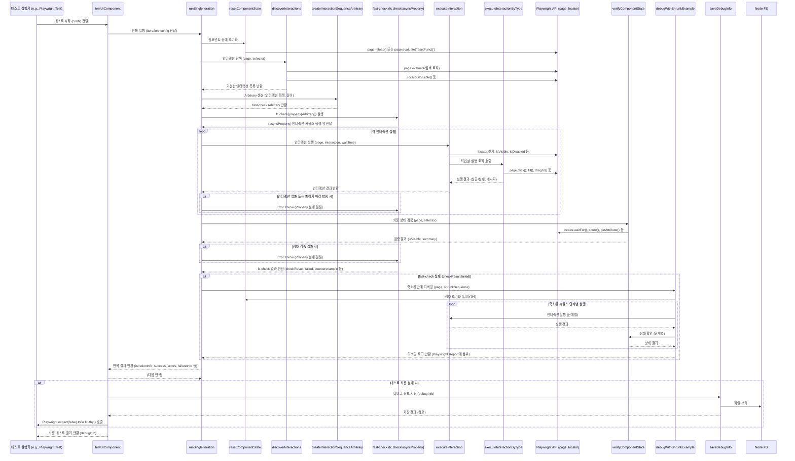

# Storybook 범용 E2E 테스터 문서

## 1. 개요

이 코드는 Storybook에 있는 UI 컴포넌트들을 위한 범용 End-to-End (E2E) 테스트 유틸리티 모음이야. Playwright를 사용해서 실제 브라우저 환경에서 컴포넌트와 상호작용하고, 특히 **fast-check 라이브러리**를 이용한 **속성 기반 테스트(Property-Based Testing, PBT)**를 수행하는 데 중점을 둬.

**핵심 목표:**

- 다양하고 예측 불가능한 사용자 인터랙션 시퀀스를 자동으로 생성하고 실행해서, 일반적인 시나리오 테스트로는 잡기 힘든 **엣지 케이스 버그**나 **예상치 못한 상태 문제**를 발견하는 거야.
- 테스트 실패 시, **어떤 인터랙션 조합**이 문제를 일으켰는지 **최소한의 재현 가능한 시퀀스(shrinking)**를 찾아내고, 상세한 디버깅 정보를 제공해서 원인 분석을 돕는 거지.

**주요 기술:**

- **Playwright**: 브라우저 자동화 및 E2E 테스트 프레임워크
- **fast-check**: JavaScript용 속성 기반 테스트 라이브러리
- **JavaScript (Node.js)**: 테스트 스크립트 실행 환경

---

## 2. 주요 기능 및 흐름

테스트는 크게 다음과 같은 흐름으로 진행돼.

```mermaid
graph TD
    A[testUIComponent 시작] --> B{테스트 반복 (iterationCount 만큼)};
    B -- 반복 --> C[runSingleIteration 실행];
    C --> D(컴포넌트 상태 초기화 - resetComponentState);
    D --> E(상호작용 요소 탐색 - discoverInteractions);
    E --> F{인터랙션 존재?};
    F -- Yes --> G(인터랙션 시퀀스 Arbitrary 생성 - createInteractionSequenceArbitrary);
    F -- No --> H(기본 렌더링 상태 확인 - verifyComponentState);
    H --> I[반복 종료];
    G --> J(fast-check 실행 - fc.check);
    J -- asyncProperty --> K{인터랙션 시퀀스 생성};
    K -- 각 인터랙션 --> L(인터랙션 실행 - executeInteraction);
    L -- 성공 --> M{모든 인터랙션 성공?};
    M -- Yes --> N(최종 상태 검증 - verifyComponentState);
    N --> O{Property 만족?};
    O -- Yes --> P(테스트 성공);
    P --> K;  // 다음 시퀀스 또는 종료
    M -- No --> Q(실패: 인터랙션 오류);
    L -- 실패 --> Q;
    O -- No --> R(실패: 최종 상태 검증 실패);
    Q --> S{Shrinking 시도};
    R --> S;
    S -- 축소된 반례 발견 --> T(디버깅 실행 - debugWithShrunkExample);
    T --> U(실패 정보 기록);
    U --> I;
    J -- fast-check 종료 --> V{테스트 실패?};
    V -- Yes --> W(디버그 정보 저장 - saveDebugInfo);
    W --> I;
    V -- No --> I;
    B -- 모든 반복 완료 --> X(최종 결과 반환 및 Playwright 단언);
    X --> Y[testUIComponent 종료];

    style A fill:#f9f,stroke:#333,stroke-width:2px
    style Y fill:#f9f,stroke:#333,stroke-width:2px
    style C fill:#ccf,stroke:#333,stroke-width:2px
    style J fill:#ccf,stroke:#333,stroke-width:2px
    style L fill:#ccf,stroke:#333,stroke-width:2px
    style T fill:#ccf,stroke:#333,stroke-width:2px
    style W fill:#fcc,stroke:#333,stroke-width:1px
```

1. **`testUIComponent`**: 전체 테스트 프로세스를 시작하고 설정값을 관리해.
2. **`runSingleIteration`**: 설정된 횟수만큼 테스트 반복을 실행해. 각 반복은 독립적인 PBT 세션이야.
3. **`resetComponentState`**: 각 반복 시작 전에 컴포넌트 상태를 초기화해. 페이지를 새로고침하거나, Storybook에 정의된 리셋 함수를 호출할 수 있어.
4. **`discoverInteractions`**: 현재 화면에 보이는 컴포넌트 내에서 상호작용 가능한 모든 DOM 요소를 찾아내. 버튼, 입력 필드, 셀렉트 박스, 스크롤 가능한 영역 등을 식별하고, 각 요소에 대해 가능한 인터랙션 타입(클릭, 입력, 선택, 스크롤, 드래그 앤 드롭 등) 목록을 만들어.
5. **`createInteractionSequenceArbitrary`**: `discoverInteractions`에서 찾은 인터랙션 목록을 기반으로, `fast-check`가 사용할 Arbitrary(무작위 데이터 생성기)를 만들어. 이 Arbitrary는 다양한 길이와 조합의 인터랙션 시퀀스를 생성할 수 있어.
6. **`fc.check` / `fc.asyncProperty`**: `fast-check`의 핵심 실행 부분이야. `createInteractionSequenceArbitrary`가 만든 Arbitrary를 사용해서 무작위 인터랙션 시퀀스를 생성하고, 각 시퀀스를 비동기적으로 실행해.
7. **`executeInteraction`**: 생성된 시퀀스 내의 각 인터랙션을 Playwright API를 사용해서 실제로 브라우저에서 수행해. (`click`, `fill`, `dragTo` 등)
8. **상태 검증**: 각 인터랙션 시퀀스가 완료된 후, `verifyComponentState`를 사용해서 컴포넌트가 여전히 유효한 상태인지 (예: 화면에 보이는지) 확인해.
9. **Shrinking 및 디버깅**: 만약 `fast-check`가 속성(property)을 위반하는 인터랙션 시퀀스를 발견하면 (즉, 테스트 실패), 해당 시퀀스를 **최소한의 실패 재현 시퀀스**로 줄이려고 시도해 (Shrinking).
10. **`debugWithShrunkExample`**: Shrinking을 통해 찾아낸 최소 실패 시퀀스를 단계별로 다시 실행하면서, 각 단계의 상태와 발생한 에러를 상세히 로깅하여 디버깅을 도와.
11. **결과 보고 및 저장**: `testUIComponent`는 모든 반복 결과를 종합하고, 테스트가 실패했을 경우 상세한 디버그 정보를 담은 JSON 파일을 `debugLogDir`에 저장해. 최종적으로 Playwright의 `expect`를 사용해서 테스트 통과/실패를 단언해.

---

## 3. 아키텍처 및 주요 함수 관계

주요 함수들이 어떻게 서로 호출하고 데이터를 주고받는지 보여주는 다이어그램이야.



---

## 4. 핵심 함수 상세 설명

### 4.1. `discoverInteractions(page, componentSelector, verbose)`

- **역할**: 주어진 `componentSelector` 내부를 탐색해서 사용자가 상호작용할 수 있는 모든 요소를 찾아내고, 각 요소에 대해 가능한 인터랙션 정보를 생성해.
- **동작 과정**:

  1. `verifyComponentState`로 컴포넌트가 보이는지 먼저 확인. 안 보이면 빈 배열 반환.
  2. `page.evaluate()`를 사용해서 브라우저 컨텍스트 내에서 `componentSelector` 하위의 모든 요소(`*`)를 순회해.
  3. 각 요소에 대해 `getUniqueSelector` (브라우저 내 정의) 함수로 고유한 CSS 선택자를 생성해 (`data-testid` 우선 사용).
  4. 요소의 태그 이름, 타입, 역할(role), 비활성화(disabled, aria-disabled) 여부, 읽기 전용(readonly) 여부, 옵션 목록(select 태그), 범위(range input), 드래그 가능 여부(`draggable`, `data-draggable`), 드롭 가능 여부(`data-droppable`) 등을 수집해.
  5. `getComputedStyle`과 스크롤/클라이언트 크기 비교를 통해 스크롤 가능 여부(`isScrollableX`, `isScrollableY`)를 판단해.
  6. 이렇게 수집된 요소 정보(`elementInfos`)를 Playwright 스크립트로 가져와.
  7. 각 요소 정보에 대해 Playwright의 `locator.isVisible()`을 사용해서 **실제로 화면에 보이는지** 다시 한번 확인해. (DOM에는 있지만 시각적으로 가려진 경우 제외)
  8. 보이는 요소 중 드래그 가능한 요소(`draggableElements`)와 드롭 가능한 요소(`droppableElements`)를 따로 모아둬.
  9. **보이는 요소** 각각에 대해 `getInteractionsFromElementInfo`를 호출해서 클릭, 입력, 선택 등의 기본 인터랙션을 생성해.
  10. **드래그 가능한 요소**와 **드롭 가능한 요소**들의 모든 조합에 대해 `dragDrop` 타입 인터랙션을 생성해.
  11. 최종적으로 생성된 모든 인터랙션 객체 배열을 반환해.

- **`page.evaluate` 사용 이유**: 브라우저의 DOM API(`querySelectorAll`, `getComputedStyle`, `parentElement`, `scrollHeight` 등)를 직접 사용해야 효율적이고 정확하게 요소 정보와 스크롤 가능 여부 등을 판단할 수 있기 때문이야. Playwright Locator API만으로는 이런 복잡한 DOM 탐색과 계산을 하기 어려워.

### 4.2. `createInteractionSequenceArbitrary(interactions, length)`

- **역할**: `discoverInteractions`가 반환한 인터랙션 목록을 기반으로, `fast-check`가 무작위 인터랙션 시퀀스를 생성할 수 있도록 `fc.Arbitrary` 객체를 만들어.
- **핵심 아이디어**: 다양한 종류의 인터랙션(클릭, 입력, 선택 등)과 각 인터랙션에 필요한 값(입력할 텍스트, 선택할 옵션 값, 설정할 범위 값, 스크롤 방향/양 등)을 무작위로 조합해야 해.
- **동작 과정 (복잡성 주의!)**:

  1. 입력받은 `interactions` 배열을 타입별(click, fill, select, dragDrop 등)로 분류해.
  2. 각 타입별 인터랙션 목록을 기반으로 `fast-check` Arbitrary를 생성해.
     - **단순 행위 인터랙션 (Click, Hover, DoubleClick, Drag)**: `fc.constantFrom(...행위_인터랙션_목록)`을 사용해서 목록 중 하나를 무작위로 선택하는 Arbitrary를 만들어.
     - **DragDrop 인터랙션**: `fc.constantFrom(...dragDrop_인터랙션_목록)`을 사용. (Source/Target Selector 포함)
     - **값 기반 인터랙션 (Fill, Select, Range, Scroll)**: 이게 좀 복잡해.
       - 해당 타입의 각 **원본 인터랙션 객체**(`originalInteraction`)에 대해 루프를 돌아.
       - 원본 인터랙션의 정보(valueType, options, min/max, isScrollable 등)를 바탕으로, 필요한 **값**을 생성하는 `fc.Arbitrary`를 `_getValueArbitraryForType`을 호출해서 만들어 (예: `fc.string()`, `fc.emailAddress()`, `fc.integer()`, `fc.constantFrom(...options)` 등).
       - `fc.tuple(fc.constant(index), 값_Arbitrary)`를 사용해서, 원본 인터랙션의 **인덱스**와 **생성된 값**을 튜플로 묶는 Arbitrary를 만들어. 이 인덱스는 나중에 어떤 원본 인터랙션에 해당하는 값인지 알아내기 위해 필요해.
  3. **Mapper & Unmapper (중요!)**: `fast-check`가 shrinking을 제대로 수행하려면, 생성된 복잡한 객체(여기서는 인터랙션 객체)를 다시 원래의 단순한 형태(여기서는 선택된 인터랙션 또는 [인덱스, 값] 튜플)로 되돌릴 수 있어야 해. 이를 위해 `map`과 `unmap` 함수를 사용해.

     - `.map(mapper, unmapper)`:

       - `mapper`: `fast-check`가 생성한 기본 값(e.g., 인터랙션 객체 또는 [인덱스, 값] 튜플)을 최종적으로 사용할 인터랙션 객체 형태로 변환해. 이 때 `type` 속성을 명시적으로 추가하고, 값 기반 인터랙션의 경우 `value`와 `originalIndex`를 포함시켜.
       - `unmapper`: `mapper`가 만든 최종 인터랙션 객체를 받아서, `fast-check`가 원래 생성했던 형태(단순 인터랙션 객체 또는 [인덱스, 값] 튜플)로 복원해줘. (`unmapActionInteraction`, `unmapValueInteraction`, `unmapDragDrop` 헬퍼 함수 사용)

     - **예시 (Fill)**:

       ```javascript
       // 1. 값 Arbitrary 생성
       const valueArb = _getValueArbitraryForType('text') // fc.string() 등
       
       // 2. 인덱스와 값 Arbitrary를 튜플로 묶음
       const tupleArb = fc.tuple(fc.constant(i), valueArb) // i는 fillInteractions 배열 내 현재 인덱스
       
       // 3. map/unmap 적용
       const fillInteractionArb = tupleArb.map(
       	// Mapper: [index, value] 튜플 -> 최종 인터랙션 객체
       	([index, value]) => ({
       		...fillInteractions[index], // 원본 인터랙션 정보 복사
       		type: 'fill', // 타입 명시
       		value, // 생성된 값 추가
       		originalIndex: index, // 원본 인덱스 저장 (unmap용)
       	}),
       	// Unmapper: 최종 인터랙션 객체 -> [index, value] 튜플
       	unmapValueInteraction('fill'), // (내부 로직: obj => [obj.originalIndex, obj.value])
       )
       ```

  4. 이렇게 각 타입별로 생성된 모든 Arbitrary들을 `fc.oneof(...arbitraries)`를 사용해서 하나로 합쳐. 그러면 이 중 하나가 무작위로 선택돼.
  5. 마지막으로 `fc.array(통합_Arbitrary, { minLength: 1, maxLength: ... })`를 사용해서, 위에서 만든 단일 인터랙션 Arbitrary를 여러 개 포함하는 **인터랙션 시퀀스** (배열)를 생성하는 최종 Arbitrary를 만들어 반환해. `minLength: 1`은 shrinking 시 단일 인터랙션까지 축소될 수 있게 해줘.

### 4.3. `executeInteraction(page, interaction, waitTime, verbose)`

- **역할**: `fast-check`가 생성한 단일 `interaction` 객체를 받아서, Playwright를 이용해 실제 브라우저에서 해당 동작을 수행하고 결과를 반환해.
- **동작 과정**:

  1. 결과 객체(`result`) 초기화.
  2. 현재 실행 중인 인터랙션 정보를 전역 변수(`currentInteraction`)에 기록 (에러 로깅 시 사용).
  3. 페이지 에러(`pageerror`) 리스너를 **임시로** 등록해. (실행 중 발생하는 에러 감지)
  4. `page.locator(interaction.selector)`로 대상 요소를 찾아.
  5. `locator.isVisible()`과 `locator.isDisabled()`로 요소가 상호작용 가능한 상태인지 확인해. 불가능하면 에러 처리 후 반환.
  6. **`executeInteractionByType(page, interaction, result)`** 함수를 호출해서 실제 인터랙션 타입에 맞는 Playwright 액션을 수행해.
  7. `page.waitForTimeout(waitTime)`으로 설정된 시간만큼 잠시 대기해. (주의: 명시적 대기가 더 권장되지만, 범용성을 위해 timeout 사용)
  8. 실행 중 페이지 에러가 발생했었는지 확인하고 결과 객체에 기록해. (에러 발생 자체로 실패 처리하진 않음)
  9. Try-catch 블록으로 Playwright 액션 자체에서 발생한 에러(요소를 못 찾거나, 액션 실패 등)를 잡아서 결과 객체에 기록하고 `success: false`로 설정해.
  10. **중요**: 에러가 발생해도 여기서 throw하지 않고, `result` 객체에 성공 여부와 에러 정보를 담아 반환해. 최종 판단은 호출자인 `runSingleIteration`의 `fc.asyncProperty` 내에서 이루어져.
  11. `finally` 블록에서 임시로 등록했던 페이지 에러 리스너를 **반드시 제거**해.

- **`executeInteractionByType`**: `executeInteraction`의 복잡도를 줄이기 위해 분리된 함수야. `interaction.type`에 따라 `page.click()`, `locator.dblclick()`, `locator.dragTo()`, `page.fill()`, `page.hover()`, `page.selectOption()`, `locator.evaluate()` (range, scroll 설정용) 등 적절한 Playwright 액션을 호출하고, 성공 메시지나 값을 `result` 객체에 채워 넣어.

### 4.4. `runSingleIteration(page, iteration, errors, config)`

- **역할**: 단일 PBT 반복 세션을 실행하고 그 결과를 반환해. `fast-check` 실행, 실패 시 shrinking 결과 로깅 및 디버깅 트리거 역할을 담당해.
- **동작 과정**:
  1. 반복 정보 객체(`iterationInfo`) 초기화.
  2. `resetComponentState` 호출.
  3. `discoverInteractions` 호출해서 가능한 인터랙션 목록 가져오기. 인터랙션 없으면 기본 상태만 확인하고 종료.
  4. `createInteractionSequenceArbitrary` 호출해서 `fast-check`용 Arbitrary 생성.
  5. **페이지 에러 핸들러 등록**: 이 반복 세션 전체에서 발생하는 페이지 에러를 수집하기 위해 `page.on('pageerror', ...)` 등록.
  6. **`fc.check(fc.asyncProperty(sequenceArb, async (sequence) => { ... }))` 실행**:
     - `sequenceArb`로부터 인터랙션 `sequence` (배열) 생성됨.
     - **시퀀스별 페이지 에러 핸들러 등록**: 현재 실행 중인 `sequence` 내에서만 발생하는 페이지 에러를 감지하기 위해 별도의 핸들러(`sequenceErrorHandler`)를 등록. (Shrinking 시 어떤 인터랙션에서 에러가 났는지 더 정확히 파악하기 위함)
     - `sequence` 내의 각 `interaction`에 대해 `executeInteraction` 호출하여 실행.
     - `executeInteraction`이 실패(`result.success === false`)하거나, **`sequenceErrorHandler`가 페이지 에러를 감지하면**, 즉시 에러를 `throw` 해서 `fast-check`에게 해당 시퀀스가 실패했음을 알려. (이 throw가 shrinking을 트리거해!)
     - 모든 인터랙션 성공 후, `verifyComponentState`로 최종 상태 검증. 실패하면 에러 `throw`.
     - `finally` 블록에서 **시퀀스별 에러 핸들러 제거**.
  7. `fc.check` 완료 후 결과(`checkResult`) 확인:
     - **성공**: `iterationInfo.success = true`.
     - **실패 (`checkResult.failed === true`)**:
       - `iterationInfo.success = false`.
       - `checkResult.counterexample[0]` (축소된 실패 시퀀스) 확인.
       - `logShrunkSequence`로 축소된 시퀀스 정보 로깅.
       - `iterationInfo.failureInfo`에 반례 정보 기록.
       - `isPageClosed`로 페이지 상태 확인 후, **`debugWithShrunkExample`** 호출하여 단계별 디버깅 실행 및 로그 첨부.
  8. `finally` 블록에서 **반복 세션 전체의 페이지 에러 핸들러 제거** 및 수집된 에러를 `errors` 배열에 추가.
  9. `iterationInfo` 반환.

### 4.5. `testUIComponent(page, config)`

- **역할**: 전체 테스트 프로세스를 조율하는 **최상위 진입점 함수**. 여러 번의 테스트 반복을 실행하고, 전역 에러를 처리하며, 최종 결과를 집계하고 보고해.
- **동작 과정**:
  1. 설정값 병합 및 디버그 정보 객체(`debugInfo`) 초기화.
  2. 컴포넌트 이름 추출 (`extractComponentName`).
  3. **전역 에러 핸들러 등록**: `page.on('pageerror', ...)`와 `page.on('console', ...)` 등록. 여기서 잡히는 에러는 특정 인터랙션과 직접 연결하기 어려울 수 있지만, 전체 테스트 중 발생하는 예외 상황을 감지해. 에러 발생 시 `currentInteraction` 정보를 함께 로깅하려고 시도해.
  4. `iterationCount`만큼 루프를 돌면서 `runSingleIteration` 호출.
  5. 각 `runSingleIteration`의 결과를 `debugInfo.iterations`에 추가하고, 에러 발생 여부(`errors.length > 0` 또는 `iterationInfo.success === false`)를 확인하여 전체 테스트 성공 여부(`isSuccessful`) 업데이트. 에러 발생 시 즉시 루프 중단 (`break`).
  6. Try-catch 블록으로 `runSingleIteration` 외부에서 발생할 수 있는 예기치 않은 오류 처리.
  7. `finally` 블록에서 **전역 에러 핸들러 제거**.
  8. 최종 테스트 결과(`isSuccessful`) 판정.
  9. **실패 시**:
     - `saveDebugInfo` 호출하여 `debugInfo` 객체를 JSON 파일로 저장.
     - Playwright 테스트 리포트에 실패를 명시적으로 알리기 위해 `test.step` 내에서 `expect(false, errorMessage).toBeTruthy()` 호출.
  10. 최종 `debugInfo` 객체 반환.

### 4.6. `debugWithShrunkExample(page, shrunkSequence, componentSelector, waitTime)`

- **역할**: `fast-check`가 찾아낸 **최소 실패 재현 인터랙션 시퀀스 (`shrunkSequence`)**를 받아서, 실제로 단계별로 실행해보면서 어떤 단계에서 문제가 발생하는지 상세 로그를 남겨 디버깅을 돕는 함수야.
- **동작 과정**:
  1. 디버깅 로그를 담을 배열(`logArray`) 초기화.
  2. 페이지가 열려있는지 확인 (`isPageClosed`). 닫혔으면 즉시 종료.
  3. `resetComponentState`로 컴포넌트 상태 초기화.
  4. **디버깅용 에러 핸들러 등록**: 이 함수 실행 중에만 발생하는 페이지/콘솔 에러를 감지하고, 현재 실행 중인 단계(`stepTracker`) 정보와 함께 로깅하기 위해 `page.on('pageerror', ...)`와 `page.on('console', ...)` 등록.
  5. `shrunkSequence` 배열을 순회하면서 각 인터랙션을 하나씩 실행:
     - 매 단계 시작 전에 페이지가 닫혔는지 확인.
     - 현재 단계 번호와 인터랙션 정보를 `stepTracker`에 기록.
     - `executeInteraction` 호출하여 인터랙션 실행 (verbose=true로 상세 로그 출력).
     - **페이지/콘솔 에러 발생 확인**: 이번 단계 실행 직후 에러가 감지되었으면, 해당 단계에서 문제가 발생했을 가능성이 높으므로 로그 남기고 루프 중단 (`break`). (이것이 shrinking과 연계되는 핵심!)
     - `verifyComponentState`로 현재 상태 확인 및 로깅.
     - `executeInteraction` 자체에서 에러가 발생하면 로그 남기고 루프 중단.
  6. `finally` 블록에서 **디버깅용 에러 핸들러 제거**.
  7. 수집된 `logArray` 반환 (이 로그는 Playwright 테스트 리포트에 첨부됨).

---

## 5. 데이터 타입 정의 (JSDoc @typedef)

코드 상단에 JSDoc 주석으로 주요 데이터 구조들이 정의되어 있어.

- **`Interaction`**: 단일 사용자 인터랙션을 나타내는 객체. `type`, `selector`, `value`, `valueType`, `min`, `max`, `options`, `isScrollableX/Y`, `sourceSelector`, `targetSelector` 등의 속성을 가져.
- **`StepTracker`**: `debugWithShrunkExample`에서 현재 디버깅 중인 단계를 추적하는 객체.
- **`TestConfig`**: `testUIComponent`에 전달하는 설정 객체. `iterationCount`, `sequenceLength`, `numRuns`, `componentSelector`, `waitAfterInteraction`, `resetComponent`, `debugLogDir`, `verbose` 등.
- **`IterationInfo`**: `runSingleIteration`의 결과 객체. 반복 번호, 실행된 시퀀스 정보(`SequenceInfo[]`), 에러 목록, 시작/종료 시간, 성공 여부, 실패 정보(`failureInfo`) 등을 포함.
- **`DebugInfo`**: `testUIComponent`가 최종적으로 반환하고 파일로 저장하는 디버그 정보 객체. 테스트 설정, 반복 결과(`IterationInfo[]`), 전체 에러 목록, 컴포넌트 정보, 성공 여부 등을 포함.
- **`SequenceInfo`**: 단일 인터랙션 시퀀스의 실행 결과. 인터랙션 결과(`InteractionResult[]`), 에러 목록, 시작/종료 시간 등을 포함.
- **`InteractionResult`**: `executeInteraction`의 결과 객체. 성공 여부, 에러 메시지/스택, 결과 값, 추가 메시지 등을 포함.

---

## 6. 혼동하기 쉬운 부분 및 주의사항

- **`fast-check`의 `map`/`unmap`**:
  - **왜 필요해?**: `fast-check`가 복잡한 객체(여기서는 인터랙션 객체)를 생성하고 shrinking할 때, 내부적으로는 더 단순한 값(문자열, 숫자, 튜플 등)을 기반으로 작동해. `map`은 이 단순한 값을 우리가 원하는 복잡한 객체로 변환하고, `unmap`은 그 반대로 복잡한 객체를 원래의 단순한 값으로 되돌려서 `fast-check`가 shrinking을 효율적으로 수행할 수 있게 도와줘. 특히 값 기반 인터랙션(`fill`, `select`, `range`, `scroll`)에서 생성된 값(`value`)과 해당 값이 적용될 원본 인터랙션 객체(`interactions[index]`)를 연결하기 위해 [인덱스, 값] 튜플을 중간 단계로 사용하는 부분이 핵심이야.
  - **주의**: `unmap` 함수가 `map` 함수와 정확히 역관계를 이루지 않으면 shrinking이 제대로 동작하지 않거나 오류가 발생할 수 있어. `originalIndex` 같은 추가 정보가 필요한 이유야.
- **Shrinking과 디버깅 연계**:
  - `fast-check`는 테스트 실패 시, 실패를 유발하는 **가장 짧은** 인터랙션 시퀀스를 찾으려고 시도해 (Shrinking).
  - `runSingleIteration` 내의 `asyncProperty` 콜백에서 인터랙션 실행 중 에러가 발생(`throw`)하면, `fast-check`는 해당 시퀀스가 실패했다고 판단하고 shrinking을 시작해.
  - Shrinking이 완료되면 `checkResult.counterexample`에 최소 실패 시퀀스가 담겨 나와.
  - `debugWithShrunkExample`는 이 최소 시퀀스를 받아서, **어느 단계에서** 처음으로 에러(페이지 에러, 콘솔 에러, 실행 자체 실패 등)가 발생하는지 확인하며 로그를 남겨. 이를 통해 실패 원인을 좁혀갈 수 있어.
- **비동기 에러 핸들링 및 `isPageClosed`**:
  - Playwright는 페이지 자체에서 발생하는 에러(`pageerror`)나 콘솔 에러(`console`)를 이벤트로 알려줘.
  - 이 코드는 테스트의 다른 단계(전체, 반복, 시퀀스, 디버깅)에서 이 이벤트 리스너를 적절히 등록하고 제거하면서 에러를 감지하고 로깅해. 특히 현재 실행 중인 인터랙션(`currentInteraction`)이나 단계(`stepTracker`) 정보와 연결하려고 시도하는 것이 중요해.
  - `isPageClosed` 함수는 Playwright 작업 수행 중 페이지가 예기치 않게 닫히는 경우(예: 충돌)를 감지해서 불필요한 에러 발생을 막고 테스트 흐름을 안전하게 중단시키는 역할을 해. 페이지가 닫힌 상태에서 Playwright API를 호출하면 에러가 나거든. `page.evaluate('1+1')` 같은 간단한 코드를 실행시켜서 페이지와의 통신 가능 여부로 판단해.
- **`page.evaluate` 사용**:
  - `discoverInteractions`에서 DOM 요소 정보(특히 `computedStyle`, 스크롤 크기)를 효율적으로 얻거나, `getUniqueSelector` 같은 브라우저 내 로직을 실행하기 위해 필요해.
  - `executeInteractionByType`에서 `range` input 값을 설정하거나 `scroll`을 수행할 때, Playwright의 기본 `fill`이나 `scroll` 액션만으로는 부족하거나 이벤트 발생이 원하는 대로 안 될 수 있어서, `evaluate` 내에서 직접 JavaScript로 값을 설정하고 이벤트를 발생시키는 방식을 사용해.
- **성능 고려사항**:
  - `discoverInteractions`는 페이지 내 모든 요소를 검사하므로, 컴포넌트가 매우 복잡하면 시간이 걸릴 수 있어.
  - `fast-check`의 `numRuns`와 `sequenceLength`가 크면 테스트 실행 시간이 길어져. 적절한 값 설정이 중요해.
  - `waitAfterInteraction` 값도 실행 시간에 영향을 줘. 너무 짧으면 비동기 업데이트가 반영되기 전에 다음 인터랙션이 실행될 수 있고, 너무 길면 불필요하게 테스트가 느려져.
- **테스트 안정성**:
  - 네트워크 상태나 테스트 환경에 따라 Playwright 액션이 실패하거나 타임아웃될 수 있어. `executeInteractionByType` 내부에 적절한 타임아웃(`timeout: 5000`)이 설정되어 있지만, 더 안정적인 대기(예: `locator.waitFor`)를 고려할 수도 있어. (하지만 범용성을 위해 현재 구조 유지)
  - `resetComponentState`가 실패해도 테스트는 계속 진행되지만, 이전 상태의 영향으로 예상치 못한 결과가 나올 수 있어.

---

## 7. 사용 예시

이 유틸리티들은 보통 Playwright 테스트 파일(`.spec.js`) 안에서 이렇게 사용될 거야.

```javascript
// 예시: src/components/MyComponent.spec.js

import { expect, test } from '@playwright/test'

import { testUIComponent } from './path/to/universal-testers' // 경로 수정 필요

test.describe('MyComponent E2E Tests', () => {
	test('should handle various user interactions without errors', async ({ page }) => {
		// 테스트하려는 컴포넌트의 Storybook 페이지로 이동
		await page.goto('/iframe.html?id=components-mycomponent--default&viewMode=story')

		// 테스트 설정 정의 (필요에 따라 조절)
		const config = {
			iterationCount: 5, // 테스트 반복 횟수
			sequenceLength: 8, // 각 시퀀스의 최대 인터랙션 수
			numRuns: 20, // fast-check 실행 횟수
			componentSelector: '#storybook-root', // 컴포넌트를 감싸는 최상위 요소 선택자
			waitAfterInteraction: 150, // 각 인터랙션 후 대기 시간 (ms)
			verbose: true, // 상세 로그 출력 여부
			debugLogDir: './test-results/mycomponent-debug-logs', // 디버그 로그 저장 위치
		}

		// 범용 테스터 실행
		const result = await testUIComponent(page, config)

		// 최종 결과 확인 (성공 여부 단언)
		// testUIComponent 내부에서 실패 시 expect(false).toBeTruthy()를 호출하므로,
		// 여기서 별도의 expect가 필수는 아닐 수 있지만, 명시적으로 추가 가능
		expect(
			result.success,
			`UI Component test failed. Check logs: ${result.debugFilePath || 'No log file'}`,
		).toBe(true)

		// 필요하다면 result 객체의 다른 정보들을 추가로 검증할 수도 있어.
		// 예: expect(result.errors.length).toBe(0);
	})
})
```

**실행**: Playwright CLI를 사용해서 이 테스트 파일을 실행하면 돼 (`npx playwright test src/components/MyComponent.spec.js`).

---

## 8. "왜 이렇게 구현했는가?"

- **왜 PBT인가?**: 사용자의 모든 가능한 인터랙션 경로를 미리 예측하고 테스트 케이스를 작성하는 것은 거의 불가능해. PBT는 무작위 시퀀스를 통해 우리가 생각하지 못한 엣지 케이스나 상태 조합을 발견할 가능성을 높여줘.
- **왜 `discoverInteractions`인가?**: 컴포넌트의 내부 구현이 바뀌더라도, 테스트 코드를 크게 수정하지 않고 상호작용 가능한 요소를 동적으로 찾아내 테스트를 수행하기 위해서야. 범용성을 높이는 핵심 요소지.
- **왜 `map`/`unmap`이 복잡한가?**: `fast-check`의 shrinking 기능을 최대한 활용하면서도, 다양한 타입의 인터랙션과 그에 필요한 값들을 유연하게 생성하고 조합하기 위한 절충점이야. 특히 값 기반 인터랙션 처리가 까다로워서 이런 구조가 되었어.
- **왜 `debugWithShrunkExample`인가?**: PBT의 단점 중 하나는 실패 시 재현이 어렵다는 건데, `fast-check`의 shrinking 기능과 이 디버깅 함수를 결합해서 실패 원인을 찾는 과정을 크게 개선하기 위해서야.
