# 범용 Storybook E2E 테스터 (`universal-testers.js`) 문서

## 개요 (Overview)

이 스크립트는 Storybook으로 개발된 UI 컴포넌트들을 위한 **범용 엔드-투-엔드(E2E) 테스트 유틸리티**야. Playwright와 fast-check 라이브러리를 결합해서, 컴포넌트 내의 상호작용 가능한 요소들을 자동으로 찾아내고, 무작위적인 사용자 상호작용 시퀀스를 생성해서 실행해. 이걸 통해 예기치 않은 상태나 버그를 효과적으로 찾아낼 수 있어. 특히 fast-check의 속성 기반 테스트(Property-Based Testing, PBT) 접근법을 사용해서, 단순히 미리 정의된 시나리오를 넘어서 훨씬 광범위한 케이스를 자동으로 테스트할 수 있다는 장점이 있어. 테스트 실패 시에는 어떤 상호작용 순서에서 문제가 발생했는지 쉽게 파악할 수 있도록 상세한 디버깅 정보와 로그를 제공해줘.

## 아키텍처/구조 (Architecture/Structure)

테스트는 `testUIComponent` 함수를 중심으로 진행돼. 이 함수는 전체 테스트 흐름을 관리하고, 설정에 따라 여러 번의 반복(`runSingleIteration`)을 실행해. 각 반복에서는 현재 컴포넌트 상태에서 가능한 모든 상호작용(`Interaction`)을 탐색하고(`discoverInteractions`), 이를 바탕으로 fast-check가 무작위 상호작용 시퀀스를 생성해(`createInteractionSequenceArbitrary`). 생성된 시퀀스는 Playwright를 통해 하나씩 실행되고(`executeInteraction`), 각 단계 후 또는 시퀀스 종료 후 컴포넌트 상태를 검증해(`verifyComponentState`). 만약 fast-check가 실패하는 시퀀스(반례, counterexample)를 찾으면, 자동으로 시퀀스를 최소화(shrinking)하고, 해당 반례를 재현하며 상세 디버깅 정보(`debugWithShrunkExample`)를 기록해.

```mermaid
flowchart TD
    subgraph Test Execution Flow
        Start["testUIComponent(page, config) 호출"] --> Init["DebugInfo 객체 초기화"]
        Init --> LoopIter["iterationCount 만큼 반복 시작"]
        LoopIter --> RunIter["runSingleIteration(page, iteration, errors, config) 호출"]

        subgraph "runSingleIteration 내부"
            direction LR
            RunIter_Start["시작 및 상태 초기화 (resetComponentState)"] --> Discover["discoverInteractions(page, selector)"]
            Discover -- "상호작용 목록 반환" --> CheckEmpty{"상호작용 요소 존재?"}
            CheckEmpty -- "없음" --> VerifyEmpty["verifyComponentState()"]
            VerifyEmpty --> RunIter_End["반복 종료 (성공/실패 기록)"]
            CheckEmpty -- "있음" --> CreateArb["createInteractionSequenceArbitrary(interactions, length)"]
            CreateArb -- "Arbitrary 생성" --> FcCheck["fc.check(asyncProperty(sequenceArb, ...))"]

            subgraph "Fast-check Property"
                direction TB
                FcCheck_Start["무작위 시퀀스 생성"] --> SeqLoop["시퀀스 내 상호작용 반복"]
                SeqLoop --> ExecInteraction["executeInteraction(page, interaction, waitTime)"]
                ExecInteraction -- "성공" --> CheckPageClosed{"페이지 닫힘?"}
                CheckPageClosed -- "아니오" --> SeqLoop
                CheckPageClosed -- "예" --> ThrowPageClosedError["오류 발생 (페이지 닫힘)"]
                ExecInteraction -- "실패" --> ThrowInteractionError["오류 발생 (상호작용 실패)"]
                SeqLoop -- "시퀀스 완료" --> VerifyState["verifyComponentState(page, selector)"]
                VerifyState --> FcCheck_End["Property 성공/실패 반환"]
            end

            FcCheck -- "Property 결과" --> CheckFailure{"Fast-check 실패?"}
            CheckFailure -- "아니오 (성공)" --> RunIter_End
            CheckFailure -- "예 (실패)" --> LogShrunk["logShrunkSequence(checkResult)"]
            LogShrunk --> DebugShrunk["debugWithShrunkExample(page, shrunkSequence, ...)"]
            DebugShrunk -- "디버그 로그 생성" --> AttachLog["테스트 리포트에 로그 첨부"]
            AttachLog --> RecordFailure["실패 정보 기록 (failureInfo)"]
            RecordFailure --> RunIter_End
        end

        RunIter -- "IterationInfo 반환" --> UpdateDebug["DebugInfo 업데이트 (iterations 추가)"]
        UpdateDebug --> CheckIterError{"반복 중 오류 발생?"}
        CheckIterError -- "예" --> BreakLoop["반복 중단"]
        CheckIterError -- "아니오" --> LoopDecision{"모든 반복 완료?"}
        LoopDecision -- "아니오" --> LoopIter
        LoopDecision -- "예" --> EndLoop["반복 종료"]
        BreakLoop --> EndLoop
        EndLoop --> CheckSuccess{"전체 테스트 성공?"}
        CheckSuccess -- "예" --> ReturnSuccess["성공 결과 반환"]
        CheckSuccess -- "아니오" --> SaveDebug["saveDebugInfo() 호출"]
        SaveDebug --> AttachDebugPath["debugFilePath 기록"]
        AttachDebugPath --> AssertFail["Playwright expect(false).toBeTruthy() 호출 (테스트 강제 실패)"]
        AssertFail --> ReturnFail["실패 결과 반환"]
    end

```



## 핵심 기능 설명 (Core Functionality Explanation)

- **`discoverInteractions(page, componentSelector, verbose)`**:

  - 주어진 `componentSelector` 내부의 모든 요소(`*`)를 탐색해.
  - 각 요소에 대해 `getUniqueSelector` (브라우저 컨텍스트 내 실행)를 사용해서 고유한 CSS 선택자를 생성해. (data-testid, id, nth-child 순으로 우선순위)
  - 요소의 태그 이름, 타입, 역할(role), 활성화/비활성화 상태, 읽기 전용 여부, 스크롤 가능 여부 (`getComputedStyle` 확인), 드래그/드롭 가능 여부 등을 파악해.
  - Playwright의 `locator.isVisible()`을 사용해 화면에 보이는 요소만 필터링해.
  - 필터링된 요소 정보를 바탕으로 실행 가능한 `Interaction` 객체 목록을 생성해 (`getInteractionsFromElementInfo` 호출). 예를 들어, `<button>` 요소는 'click', 'hover', 'doubleClick' 인터랙션 객체를 생성. 드래그 가능한 요소와 드롭 가능한 요소 조합으로 'dragDrop' 인터랙션도 생성해.
  - 반환값: `Promise<Interaction[]>`

- **`createInteractionSequenceArbitrary(interactions, length)`**:

  - `discoverInteractions`에서 얻은 `Interaction` 목록을 입력받아.
  - fast-check의 `fc.Arbitrary<Interaction[]>`를 생성하는 함수야. 이게 무작위 상호작용 시퀀스를 만들어내는 핵심이지.
  - 내부적으로 상호작용 타입(click, fill, select, scroll 등)별로 Arbitrary를 구성해.
    - 'click', 'hover', 'doubleClick', 'drag' 같은 단순 행위는 `fc.constantFrom`으로 해당 타입의 상호작용 중 하나를 선택하도록 해.
    - 'fill', 'select', 'setRange', 'scroll' 같이 값이 필요한 상호작용은 `_getValueArbitraryForType`을 사용해 해당 타입에 맞는 무작위 값을 생성하는 Arbitrary(`valueArb`)와, 원래 상호작용 목록에서의 인덱스(`fc.constant(i)`)를 튜플(`fc.tuple`)로 묶어.
    - 생성된 값과 인덱스를 최종 `Interaction` 객체에 포함시켜. (`value`, `originalIndex` 속성)
  - **Mapper/Unmapper**: fast-check가 효과적으로 값을 축소(shrink)할 수 있도록 `map`과 unmapper 함수를 사용해.
    - `map`: 원래 상호작용 정보에 `type`과 생성된 `value`, `originalIndex`(값 기반 상호작용의 경우)를 추가해서 최종 상호작용 객체를 만들어.
    - `unmapper`: fast-check가 내부적으로 사용하는 함수로, `map`에서 추가된 정보를 제거하고 원래 형태(단순 행위는 정보 객체, 값 기반은 `[index, value]` 튜플)로 되돌려줘서 축소를 돕는다. (`unmapActionInteraction`, `unmapValueInteraction`, `unmapDragDrop`)
  - 모든 타입별 Arbitrary들을 `fc.oneof`로 묶어서 어떤 종류의 상호작용이든 선택될 수 있게 하고, `fc.array`를 사용해 이 Arbitrary들로 구성된 배열(즉, 상호작용 시퀀스)을 생성하는 최종 Arbitrary를 반환해. 배열 길이는 `minLength: 1`에서 `maxLength` 사이에서 무작위로 결정돼.
  - 반환값: `fc.Arbitrary<Interaction[]>`

- **`executeInteraction(page, interaction, waitTime, verbose)`**:

  - 단일 `Interaction` 객체를 받아 Playwright를 사용해 실제 웹 페이지에서 실행하는 함수야.
  - 먼저 `page.locator(interaction.selector)`로 대상 요소를 찾아.
  - `locator.isVisible()`과 `locator.isDisabled()`로 상호작용이 가능한지 확인해.
  - `executeInteractionByType` 함수를 호출해서 실제 상호작용 타입에 맞는 Playwright 액션(click, fill, selectOption, dragTo 등)을 수행해.
  - 각 상호작용 후 `page.waitForTimeout(waitTime)` 만큼 잠시 대기해 (주의사항 참고).
  - 페이지 에러(`pageerror` 이벤트)를 감지하는 핸들러를 일시적으로 등록/해제해서, 상호작용 실행 중 발생하는 예외를 잡아내.
  - 성공 여부, 발생한 에러 메시지/스택, 타임스탬프 등을 포함하는 `InteractionResult` 객체를 반환해.
  - 반환값: `Promise<InteractionResult>`

  ```mermaid
  stateDiagram-v2
      [*] --> Pending: 상호작용 대기
      Pending --> Executing: executeInteraction 호출
      Executing --> Success: Playwright 액션 성공 & pageerror 없음
      Executing --> Failure: Playwright 액션 실패 or pageerror 발생
      Success --> [*]: "결과 반환 (success: true)"
      Failure --> [*]: "결과 반환 (success: false, error 정보 포함)"
  ```

- **`testUIComponent(page, config)`**:

  - 테스트 실행의 메인 진입점이야. Playwright 페이지 객체와 설정 객체(`TestConfig`)를 받아.
  - 전체 테스트 시간, 컴포넌트 이름, URL 등 기본 정보를 포함하는 `DebugInfo` 객체를 생성해.
  - 설정된 `iterationCount`만큼 `runSingleIteration`을 반복 호출해.
  - 각 반복의 결과(`IterationInfo`)를 `DebugInfo.iterations`에 누적해.
  - 중간에 에러가 발생하거나 fast-check가 실패하면 반복을 중단하고 실패 처리해.
  - 테스트 실패 시(`debugInfo.success === false`), 상세 정보를 JSON 파일로 저장(`saveDebugInfo`)하고, Playwright 테스트 자체를 실패시키기 위해 `expect(false).toBeTruthy()`를 호출해.
  - 최종적으로 `DebugInfo` 객체를 반환해.
  - 반환값: `Promise<DebugInfo>`

- **`runSingleIteration(page, iteration, errors, config)`**:

  - 단일 테스트 반복(iteration)을 수행하는 핵심 로직이야.
  - `resetComponentState`로 컴포넌트 상태를 초기화 시도해.
  - `discoverInteractions`로 현재 상태에서 가능한 상호작용을 찾아.
  - `createInteractionSequenceArbitrary`로 시퀀스 생성 Arbitrary를 만들어.
  - `fc.check(fc.asyncProperty(...))`를 호출해서 속성 기반 테스트를 실행해.
    - `asyncProperty` 내에서는 생성된 무작위 시퀀스를 받아와서 `executeInteraction`을 사용해 하나씩 실행해.
    - 시퀀스 실행 중 상호작용 실패나 페이지 에러(`pageerror`)가 발생하면 즉시 해당 시퀀스는 실패로 간주하고 fast-check에 에러를 throw 해. (fast-check는 이걸 받아서 shrinking을 시도할 수 있어)
    - 시퀀스 실행이 성공적으로 끝나면 `verifyComponentState`로 최종 상태를 검증해.
  - `fc.check`가 실패하면(`checkResult.failed === true`), fast-check가 찾아낸 축소된 반례(`checkResult.counterexample`)를 사용해 `logShrunkSequence`와 `debugWithShrunkExample`을 호출해서 상세 분석 및 로깅을 수행해.
  - 반복 결과를 요약한 `IterationInfo` 객체를 반환해.
  - 반환값: `Promise<IterationInfo>`

- **`debugWithShrunkExample(page, shrunkSequence, componentSelector, waitTime)`**:

  - fast-check가 찾아낸 최소 실패 시퀀스(`shrunkSequence`)를 입력받아.
  - 컴포넌트 상태를 초기화하고, 해당 시퀀스를 **단계별로** 다시 실행해.
  - 각 단계(`executeInteraction`) 실행 전후로 페이지/콘솔 에러를 감지하고, `verifyComponentState`로 상태를 확인하며 로그를 상세히 기록해. 어느 단계에서 문제가 발생하는지 정확히 파악하는 데 도움을 줘.
  - 페이지가 닫혔는지(`isPageClosed`) 계속 확인하며 안전하게 실행해.
  - 실행 로그는 Playwright 테스트 리포트에 첨부돼.

  ```mermaid
  flowchart TD
      Start["debugWithShrunkExample 호출 (shrunkSequence)"] --> Reset["resetComponentState()"]
      Reset --> InitLog["로그 배열 및 에러 핸들러 초기화"]
      InitLog --> LoopStart["실패 시퀀스 반복 시작 (단계별)"]
      LoopStart --> CheckPageClosed1{"페이지 닫힘?"}
      CheckPageClosed1 -- "예" --> LogPageClosed1["로그 기록 & 종료"]
      CheckPageClosed1 -- "아니오" --> LogStep["현재 단계 로그 기록"]
      LogStep --> ExecInteraction["executeInteraction(page, interaction, waitTime, true)"]
      ExecInteraction --> LogResult["실행 결과 로그 기록"]
      LogResult --> CheckPageClosed2{"페이지 닫힘?"}
      CheckPageClosed2 -- "예" --> LogPageClosed2["로그 기록 & 종료"]
      CheckPageClosed2 -- "아니오" --> CheckErrors{"페이지/콘솔 에러 발생?"}
      CheckErrors -- "예" --> LogErrorDetected["에러 감지 로그 & 종료"]
      CheckErrors -- "아니오" --> VerifyState["verifyComponentState()"]
      VerifyState --> LogState["상태 확인 로그"]
      LogState --> LoopEnd{"모든 단계 완료?"}
      LoopEnd -- "아니오" --> LoopStart
      LoopEnd -- "예" --> Cleanup["이벤트 리스너 제거"]
      Cleanup --> ReturnLog["디버그 로그 배열 반환"]

      ExecInteraction -- "실행 중 에러" --> LogExecError["실행 에러 로그"]
      LogExecError --> CheckPageClosed3{"페이지 닫힘?"}
      CheckPageClosed3 -- "예" --> LogPageClosed3["로그 기록 & 종료"]
      CheckPageClosed3 -- "아니오" --> BreakLoop["반복 중단 & Cleanup"]
  ```

## API 문서 (API Documentation)

### 주요 Export 함수

| 함수명                 | 설명                                                                                        | 매개변수                                                                          | 반환값                                             |
| :--------------------- | :------------------------------------------------------------------------------------------ | :-------------------------------------------------------------------------------- | :------------------------------------------------- |
| `testUIComponent`      | 전체 UI 컴포넌트 테스트 프로세스를 실행하는 메인 함수.                                      | `page: Page`, `config?: TestConfig`                                               | `Promise<DebugInfo>`                               |
| `discoverInteractions` | 컴포넌트 내 상호작용 가능한 요소와 인터랙션 목록을 탐색.                                    | `page: Page`, `componentSelector: string`, `verbose?: boolean`                    | `Promise<Interaction[]>`                           |
| `executeInteraction`   | 단일 인터랙션을 페이지에서 실행.                                                            | `page: Page`, `interaction: Interaction`, `waitTime: number`, `verbose?: boolean` | `Promise<InteractionResult>`                       |
| `resetComponentState`  | 컴포넌트 상태를 초기화 (페이지 내 `resetComponentState` 함수 호출 시도 또는 페이지 리로드). | `page: Page`                                                                      | `Promise<void>`                                    |
| `verifyComponentState` | 컴포넌트의 가시성 및 기본 상태를 검증.                                                      | `page: Page`, `componentSelector: string`, `timeout?: number`                     | `Promise<{ isVisible: boolean; summary: string }>` |

### 주요 JSDoc 타입

| 타입명              | 설명                                                                | 주요 속성                                                                                                                                                                                                                                                  |
| :------------------ | :------------------------------------------------------------------ | :--------------------------------------------------------------------------------------------------------------------------------------------------------------------------------------------------------------------------------------------------------- |
| `Interaction`       | 단일 사용자 상호작용을 나타내는 객체.                               | `type: string` (click, fill 등), `selector: string`, `value?: any`, `valueType?: string`, `min?: number`, `max?: number`, `options?: string[]`, `isScrollableX?: boolean`, `isScrollableY?: boolean`, `sourceSelector?: string`, `targetSelector?: string` |
| `TestConfig`        | `testUIComponent` 함수의 설정을 위한 객체.                          | `iterationCount?: number`, `sequenceLength?: number`, `numRuns?: number`, `componentSelector?: string`, `waitAfterInteraction?: number`, `resetComponent?: boolean`, `debugLogDir?: string`, `verbose?: boolean`                                           |
| `IterationInfo`     | 단일 테스트 반복(`runSingleIteration`)의 결과를 담는 객체.          | `iterationNumber: number`, `sequences: SequenceInfo[]`, `errors: Error[]`, `startTime: string`, `endTime?: string`, `success: boolean`, `failureInfo?: { counterExample: Interaction[], error: Error, property: string }`                                  |
| `SequenceInfo`      | 단일 상호작용 시퀀스 실행 결과를 담는 객체.                         | `results: InteractionResult[]`, `errors: Error[]`, `startTime: string`, `endTime?: string`, `finalState?: string`                                                                                                                                          |
| `InteractionResult` | `executeInteraction`의 결과를 담는 객체.                            | `success: boolean`, `errorMessage?: string`, `errorStack?: string`, `error?: Error`, `value?: any`, `message?: string`, `timestamp: string`, `details: object`                                                                                             |
| `DebugInfo`         | `testUIComponent`의 전체 실행 결과 및 디버깅 정보를 담는 객체.      | `componentName: string`, `url: string`, `testConfig: TestConfig`, `iterations: IterationInfo[]`, `errors: Error[]`, `success: boolean`, `timestamp: string`, `debugFilePath?: string`                                                                      |
| `StepTracker`       | `debugWithShrunkExample`에서 현재 디버깅 단계를 추적하기 위한 객체. | `currentStep?: number`, `currentInteraction?: Interaction`                                                                                                                                                                                                 |

## 사용 예시 (Usage Examples)

```javascript
// example.spec.js
import { test, expect } from '@playwright/test'
import { testUIComponent } from './path/to/universal-testers.js'

test.describe('MyComponent Tests', () => {
	test('should withstand random interactions', async ({ page }) => {
		// Storybook의 MyComponent 페이지로 이동
		await page.goto(
			'http://localhost:6006/iframe.html?id=components-mycomponent--default&viewMode=story',
		)

		// 테스트 설정 정의 (선택 사항)
		const config = {
			iterationCount: 5, // 테스트 반복 횟수
			sequenceLength: 10, // 각 시퀀스의 최대 인터랙션 수
			numRuns: 50, // fast-check 실행 횟수
			waitAfterInteraction: 50, // 인터랙션 후 대기 시간 (ms)
			componentSelector: '#storybook-root', // 컴포넌트 루트 요소 선택자 (기본값 사용 가능)
			verbose: true, // 상세 로그 출력 활성화
		}

		// 범용 테스터 실행
		const result = await testUIComponent(page, config)

		// 테스트 결과 확인 (testUIComponent 내부에서 실패 시 expect(false)가 호출되므로,
		// 여기까지 오면 성공한 것으로 간주하거나 추가 검증 가능)
		console.log(`Test completed. Success: ${result.success}`)
		if (!result.success) {
			console.error(`Errors occurred: ${result.errors.length}`)
			// result.debugFilePath 경로에 상세 로그 파일이 저장됨
		}

		// 필요 시 추가적인 최종 상태 검증 로직 추가 가능
		// 예: expect(await page.locator('.final-state-indicator')).toBeVisible();
	})
})
```

## 혼동하기 쉬운 부분 및 주의사항 (Confusing Parts / Precautions - VERY IMPORTANT)

- **`page.evaluate()` 사용**: `discoverInteractions` 내부의 `getUniqueSelector`나 `resetComponentState` 등에서 `page.evaluate()`를 사용하는 부분이 있어. Playwright는 Locator API를 권장하지만, 복잡한 DOM 순회 로직(e.g., `parentElement`, `children`, `getComputedStyle`)이나 브라우저 전역 스코프의 함수(`globalThis.resetComponentState`)를 호출해야 하는 경우에는 `evaluate` 사용이 불가피하거나 더 효율적일 수 있어. 이 코드에서는 선택자 생성 로직과 전역 리셋 함수 호출 때문에 사용되었어.
- **`page.waitForTimeout(waitTime)`**: `executeInteraction`에서 각 상호작용 후에 고정된 시간(`waitTime`)만큼 기다리는데, 이건 **신중하게 사용해야 해**. 특정 상태 변화(e.g., 요소 나타남, 애니메이션 완료)를 기다리는 것이 아니라 무조건 시간을 지연시키는 거라, 네트워크 상태나 실행 환경에 따라 테스트가 불안정해질 수 있어(flaky test). 이상적으로는 `locator.waitFor()`, `expect(locator).toBeVisible()` 같은 명시적인 상태 기다림을 사용하는 것이 좋지만, 모든 상호작용 후 예측 가능한 상태 변화를 정의하기 어려워서 범용성을 위해 타임아웃을 사용한 것으로 보여. `waitTime` 값을 조절하거나, 특정 컴포넌트 테스트 시에는 이 부분을 커스텀하는 걸 고려해볼 수 있어.
- **Fast-check 와 Mapper/Unmapper**: `createInteractionSequenceArbitrary`에서 사용되는 `map`과 unmapper 함수들은 fast-check의 **shrinking(축소)** 메커니즘을 제대로 활용하기 위해 필수적이야.
  - `map`: fast-check가 생성한 기본값(e.g., 숫자 인덱스, 랜덤 문자열)을 실제 테스트에 필요한 `Interaction` 객체 형태로 변환해줘.
  - `unmapper`: fast-check가 실패 케이스를 찾았을 때, `map`으로 변환된 복잡한 객체에서 다시 원래의 단순한 형태(e.g., 인덱스와 값 튜플)로 되돌리는 방법을 알려줘. 이게 있어야 fast-check가 "어떤 입력값이 문제의 최소 원인이었나?"를 효율적으로 찾아낼 수 있어. 특히 `fill`, `select`, `setRange`, `scroll` 처럼 값이 있는 인터랙션의 unmapper(`unmapValueInteraction`)는 `[originalIndex, value]` 튜플을 반환하는데, `originalIndex`는 `fillInteractions` 배열 등 원본 목록에서의 인덱스를 가리켜. 이 구조가 복잡해 보일 수 있지만, 정확한 shrinking을 위해 필요해.
- **오류 처리**:
  - **페이지 오류 (`pageerror`)**: 테스트 실행 중 발생하는 자바스크립트 오류는 `page.on('pageerror', ...)` 핸들러로 감지돼. `executeInteraction`과 `runSingleIteration`, `testUIComponent` 레벨에서 모두 에러를 로깅하지만, 기본적으로 페이지 에러 자체가 즉시 테스트를 중단시키지는 않을 수 있어(핸들러 로직에 따라 다름). 하지만 `runSingleIteration`의 `asyncProperty` 내부에서는 페이지 에러가 발생하면 해당 시퀀스를 실패로 간주하고 에러를 throw해서 fast-check가 인지하도록 만들어.
  - **상호작용 실패**: `executeInteraction` 내에서 Playwright 액션(클릭, 입력 등)이 실패하면 `result.success`가 `false`가 되고, 이 결과는 `runSingleIteration`의 `asyncProperty`로 전달돼. 여기서도 에러를 throw해서 fast-check가 실패를 인지하고 shrinking을 시작하게 돼.
  - **주의**: 페이지 에러가 발생해도 상호작용 자체는 성공할 수 있고, 그 반대도 가능해. 디버깅 시에는 두 종류의 오류 로그를 모두 확인해야 해.
- **상태 초기화 (`resetComponentState`)**: 이 함수는 먼저 페이지 전역 스코프에 `resetComponentState`라는 함수가 있는지 확인하고 있으면 호출해. 만약 없다면 페이지를 그냥 `reload()` 해버려. 즉, 테스트 대상 컴포넌트가 자체적인 상태 초기화 메커니즘을 `globalThis.resetComponentState`로 노출하지 않으면, 매 반복마다 페이지 전체가 새로고침될 수 있다는 점을 알아야 해. 이는 테스트 속도에 영향을 줄 수 있어.
- **디버깅 (`debugWithShrunkExample`)**: fast-check가 실패 케이스를 찾았을 때 이 함수가 실행되는데, 축소된 시퀀스를 **한 단계씩** 재현하면서 로그를 남겨. Playwright 테스트 리포트에 첨부된 로그(`시퀀스 디버깅 로그`)를 보면, 어떤 상호작용 직후에 문제가 발생했는지(에러 발생, 상태 변화 등)를 따라가 볼 수 있어. 로그 메시지에 `[ 1 단계 인터랙션 실행: <클릭> ]`, `상태: visible - ...`, `< 2 단계 실행 중 에러 발생: ... >` 같은 형식으로 정보가 표시될 거야.
- **페이지 닫힘 확인 (`isPageClosed`)**: 긴 시퀀스 실행이나 디버깅 과정 중에 예기치 않게 페이지가 닫힐 수 있어 (예: 브라우저 충돌). `isPageClosed` 함수는 `page.evaluate('1 + 1')` 같은 간단한 연산을 시도하고, 실패하면 페이지가 닫힌 것으로 간주해. 이 검사를 통해 이미 닫힌 페이지에 Playwright 명령을 보내 발생하는 추가 오류를 방지하고 있어.
- **선택자 우선순위 (`getUniqueSelector`)**: 요소 선택자를 생성할 때 `data-testid` 속성이 있으면 최우선으로 사용하고, 없으면 `id`를, 그것도 없으면 `tagName:nth-child()` 형태의 구조적 선택자를 사용해. 안정적인 테스트를 위해서는 가급적 `data-testid`를 컴포넌트에 부여하는 것이 좋아.

## 시각적 코드 설명 (Visual Code Explanations)

### 주요 타입 요약 (Markdown Table)

| 타입명              | 설명                                 |
| :------------------ | :----------------------------------- |
| `Interaction`       | 단일 사용자 상호작용 정의            |
| `TestConfig`        | 테스트 실행 설정                     |
| `IterationInfo`     | 단일 테스트 반복 결과                |
| `SequenceInfo`      | 단일 상호작용 시퀀스 실행 결과       |
| `InteractionResult` | 단일 상호작용 실행 결과              |
| `DebugInfo`         | 전체 테스트 실행 결과 및 디버깅 정보 |
| `StepTracker`       | 축소된 반례 디버깅 시 현재 단계 추적 |

(각 타입의 상세 속성은 위 API 문서 섹션 참고)
