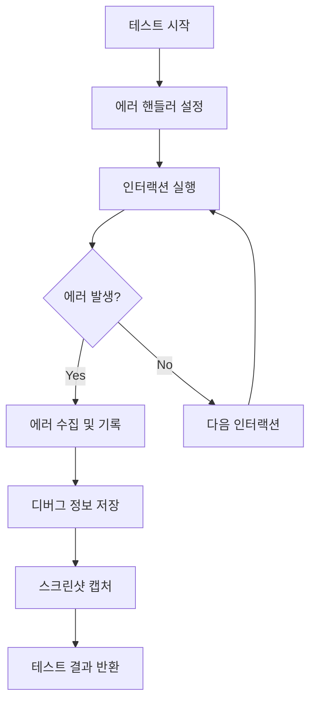
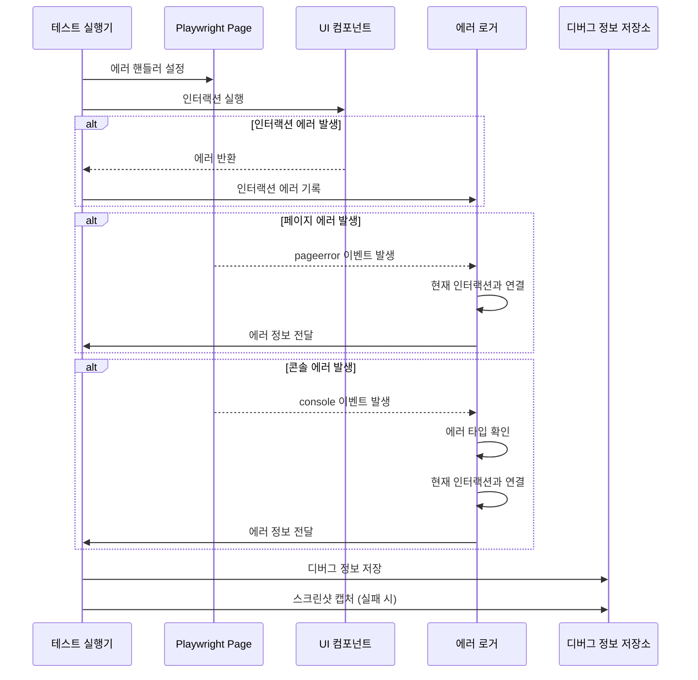
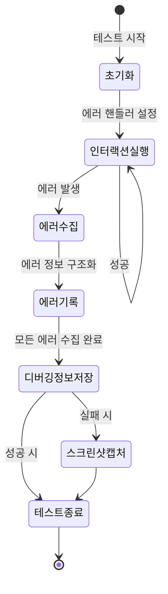

# Storybook UI 컴포넌트 테스트 에러 로깅 가이드

## 개요

이 문서는 `universal-testers.js`에서 구현된 에러 로깅 메커니즘을 설명해. 이 코드는 Storybook UI 컴포넌트에 대한 자동화된 테스트를 수행하면서 발생하는 다양한 에러를 체계적으로 수집, 기록, 분석하는 기능을 제공해.

## 에러 로깅 아키텍처

`universal-testers.js`의 에러 로깅 시스템은 다음과 같은 구조로 설계되어 있어:



## 에러 타입 및 구조

코드에서 다루는 주요 에러 타입은 다음과 같아:

| 에러 타입       | 설명                                          | 수집 방법                                               |
| --------------- | --------------------------------------------- | ------------------------------------------------------- |
| 인터랙션 에러   | 컴포넌트와의 상호작용 중 발생하는 에러        | `executeInteraction` 함수에서 수집                      |
| 페이지 에러     | 브라우저 페이지 레벨에서 발생하는 에러        | `page.on('pageerror', errorHandler)` 이벤트로 수집      |
| 콘솔 에러       | 브라우저 콘솔에 출력되는 에러 메시지          | `page.on('console', consoleErrorHandler)` 이벤트로 수집 |
| Fast-check 에러 | 속성 기반 테스트 라이브러리에서 발생하는 에러 | `fc.check` 함수의 결과에서 수집                         |

## 에러 수집 프로세스

### 1. 에러 핸들러 설정

테스트가 시작될 때 페이지 에러와 콘솔 에러를 수집하기 위한 핸들러가 설정돼:

```javascript
// 페이지 오류 및 콘솔 오류 핸들러 설정 - 인터랙션과 에러 연결
const errorHandler = (exception) => {
	const associatedInteractionMessage = `관련 인터랙션: ${currentInteraction.type} on ${currentInteraction.selector}`

	const errorInfo = {
		message: `페이지 에러: ${exception.message}`,
		stack: exception.stack,
		associatedInteraction: currentInteraction ? { ...currentInteraction } : undefined,
		associatedInteractionMessage,
		timestamp: new Date().toISOString(),
	}
	errors.push(errorInfo)

	// 인터랙션 정보가 있을 경우 로그에 표시
	if (currentInteraction) {
		console.error(`페이지 에러 발생: ${exception.message}`)
		console.error(associatedInteractionMessage)
	}
}

const consoleErrorHandler = (msg) => {
	if (msg.type() === 'error') {
		const errorInfo = {
			message: `콘솔 에러: ${msg.text()}`,
			associatedInteraction: currentInteraction ? { ...currentInteraction } : undefined,
			timestamp: new Date().toISOString(),
		}
		errors.push(errorInfo)

		// 인터랙션 정보가 있을 경우 로그에 표시
		if (currentInteraction) {
			console.error(`콘솔 에러 발생: ${msg.text()}`)
			console.error(`관련 인터랙션: ${currentInteraction.type} on ${currentInteraction.selector}`)
		}
	}
}

page.on('pageerror', errorHandler)
page.on('console', consoleErrorHandler)
```

### 2. 인터랙션 에러 수집

컴포넌트와의 상호작용 중 발생하는 에러는 `executeInteraction` 함수에서 수집돼:

```javascript
async function executeInteraction(page, interaction, waitTime, verbose = false) {
	// 결과 객체 초기화
	const result = {
		success: false,
		type: interaction.type,
		selector: interaction.selector,
		timestamp: new Date().toISOString(),
		// 상세 정보를 위한 필드 추가
		details: {},
	}

	// 현재 실행 중인 인터랙션 정보 설정
	currentInteraction = {
		...interaction,
		timestamp: result.timestamp,
		id: `${interaction.type}-${interaction.selector}-${result.timestamp}`,
	}

	try {
		// 인터랙션 실행 코드...
	} catch (error) {
		// 에러 정보 기록
		result.errorMessage = error.message
		result.errorStack = error.stack
		result.error = error // 원본 에러 객체도 보존

		if (verbose) {
			console.error(
				`인터랙션 실행 중 오류 발생 (${interaction.type} on ${interaction.selector}): ${error.message}`,
			)
		}
	}

	return result
}
```

### 3. 에러 정보 구조화 및 저장

수집된 에러 정보는 구조화된 형태로 `DebugInfo` 객체에 저장돼:

```javascript
const debugInfo = {
	timestamp: getTimestamp(),
	componentName,
	url: page.url(),
	testConfig: config,
	iterations: [],
	errors: [],
	success: true,
}
```

## 에러 로깅 예시

### 예시 1: 인터랙션 에러 로깅

버튼 클릭 인터랙션 중 에러가 발생한 경우:

```
인터랙션 실행 중 오류 발생 (click on #storybook-root button.primary): Error: page.click: Timeout 5000ms exceeded.
=========================
인터랙션 정보:
- 타입: click
- 셀렉터: #storybook-root button.primary
- 타임스탬프: 2023-04-25T14-30-22
=========================
```

### 예시 2: 페이지 에러 로깅

페이지에서 JavaScript 에러가 발생한 경우:

```
페이지 에러 발생: TypeError: Cannot read properties of undefined (reading 'value')
관련 인터랙션: fill on #storybook-root input[type="text"]
```

### 예시 3: 콘솔 에러 로깅

브라우저 콘솔에 에러가 출력된 경우:

```
콘솔 에러 발생: Error: Failed to load resource: the server responded with a status of 404 (Not Found)
관련 인터랙션: click on #storybook-root .load-data-button
```

### 예시 4: Fast-check 반례 로깅

속성 기반 테스트에서 반례가 발견된 경우:

```
--------- 테스트 실패 정보 (축소된 반례) ---------
컴포넌트: button-component
최소 실패 케이스:
1. click on #storybook-root button.primary
2. click on #storybook-root button.secondary
3. fill on #storybook-root input[type="text"]
   값: test123
에러: 페이지 에러: TypeError: Cannot read properties of undefined (reading 'value')
--------------------------------------------------
```

## 에러 로깅 시각화

에러 로깅 프로세스의 흐름을 시각화하면 다음과 같아:



## 에러 로깅 상태 다이어그램

에러 로깅 시스템의 상태 변화를 다이어그램으로 표현하면:



## 주요 에러 로깅 함수

### 1. `executeInteraction`

인터랙션 실행 중 발생하는 에러를 수집하는 핵심 함수야:

```javascript
async function executeInteraction(page, interaction, waitTime, verbose = false) {
	// ... 코드 생략 ...
	try {
		// 인터랙션 실행 코드
	} catch (error) {
		// 에러 정보 기록
		result.errorMessage = error.message
		result.errorStack = error.stack
		result.error = error
		// ... 코드 생략 ...
	}
	return result
}
```

### 2. `saveDebugInfo`

수집된 에러 정보를 파일로 저장하는 함수야:

```javascript
async function saveDebugInfo(dir, filename, data) {
	try {
		await fs.mkdir(dir, { recursive: true })
		const filePath = path.join(dir, filename)
		await fs.writeFile(filePath, JSON.stringify(data, undefined, 2), 'utf8')
		return { success: true, path: filePath }
	} catch (error) {
		console.error(`디버그 정보 저장 실패: ${error.message}`)
		return { success: false, error }
	}
}
```

### 3. `captureScreenshot`

에러 발생 시 화면 상태를 캡처하는 함수야:

```javascript
async function captureScreenshot(page, screenshotPath, options = {}) {
	try {
		const dir = path.dirname(screenshotPath)
		await fs.mkdir(dir, { recursive: true })
		await page.screenshot({ path: screenshotPath, ...options })
		return { success: true, path: screenshotPath }
	} catch (error) {
		console.error(`스크린샷 캡처 실패: ${error.message}`)
		return { success: false, error }
	}
}
```

## 에러 로깅 설정 옵션

테스트 실행 시 에러 로깅 관련 설정을 조정할 수 있어:

| 옵션                   | 설명                                 | 기본값                        |
| ---------------------- | ------------------------------------ | ----------------------------- |
| `debugLogDir`          | 디버그 정보와 스크린샷 저장 디렉토리 | `'./test-results/debug-logs'` |
| `captureScreenshots`   | 실패 시 스크린샷 캡처 여부           | `true`                        |
| `verbose`              | 상세 로그 출력 여부                  | `false`                       |
| `waitAfterInteraction` | 각 인터랙션 후 대기 시간(ms)         | `100`                         |

## 에러 로깅 데이터 구조

### DebugInfo 객체

```typescript
interface DebugInfo {
	componentName: string // 컴포넌트 이름
	errors: ErrorInfo[] // 발생한 에러 목록
	screenshotPath?: string // 스크린샷 저장 경로
	counterExample?: any // Fast-check의 반례 데이터
	state?: string // DOM 상태 요약
	timestamp: string // 발생 시간
	url: string // 테스트 페이지 URL
	testConfig: TestConfig // 테스트 설정
	iterations: IterationInfo[] // 테스트 반복 정보
	success: boolean // 테스트 성공 여부
	debugFilePath?: string // 디버그 정보 파일 경로
}
```

### ErrorInfo 객체

```typescript
interface ErrorInfo {
	message: string // 에러 메시지
	stack?: string // 스택 트레이스
	associatedInteraction?: Interaction // 관련 인터랙션
	timestamp: string // 발생 시간
}
```

## 에러 로깅 활용 방법

### 1. 기본 에러 로깅 활성화

```javascript
const testResult = await testUIComponent(page, {
	verbose: true,
	captureScreenshots: true,
})
```

### 2. 커스텀 디버그 디렉토리 설정

```javascript
const testResult = await testUIComponent(page, {
	debugLogDir: './custom-debug-logs',
	verbose: true,
})
```

### 3. 에러 로그 분석

```javascript
test('컴포넌트 테스트', async ({ page }) => {
	const result = await testUIComponent(page)

	// 에러 로그 분석
	if (!result.success) {
		console.log(`총 ${result.errors.length}개의 에러 발생`)

		// 에러 타입별 분류
		const pageErrors = result.errors.filter((e) => e.message.startsWith('페이지 에러'))
		const consoleErrors = result.errors.filter((e) => e.message.startsWith('콘솔 에러'))

		console.log(`페이지 에러: ${pageErrors.length}개`)
		console.log(`콘솔 에러: ${consoleErrors.length}개`)

		// 스크린샷 경로 확인
		if (result.screenshotPath) {
			console.log(`실패 스크린샷: ${result.screenshotPath}`)
		}
	}
})
```

## 에러 로깅 시스템의 장점

1. **인터랙션 연결**: 발생한 에러를 특정 인터랙션과 연결하여 디버깅을 용이하게 함
2. **다양한 에러 타입 수집**: 인터랙션, 페이지, 콘솔 등 다양한 소스의 에러를 수집
3. **시각적 증거 제공**: 스크린샷을 통해 에러 발생 시점의 UI 상태를 확인 가능
4. **구조화된 저장**: JSON 형식으로 에러 정보를 구조화하여 저장
5. **반례 분석**: Fast-check를 통해 발견된 최소 실패 케이스를 제공

## 에러 로깅 시스템 확장 방법

### 1. 커스텀 에러 핸들러 추가

```javascript
// 커스텀 에러 핸들러 예시
function customErrorHandler(error, interaction) {
	const errorInfo = {
		message: `커스텀 에러: ${error.message}`,
		stack: error.stack,
		associatedInteraction: interaction,
		timestamp: new Date().toISOString(),
		custom: true,
	}

	errors.push(errorInfo)
	console.error(`커스텀 에러 발생: ${error.message}`)
}

// 사용 예시
try {
	// 코드 실행
} catch (error) {
	customErrorHandler(error, currentInteraction)
}
```

### 2. 에러 로그 필터링 기능 추가

```javascript
function filterErrors(errors, criteria) {
	return errors.filter((error) => {
		if (criteria.type && !error.message.includes(criteria.type)) return false
		if (criteria.interaction && error.associatedInteraction?.type !== criteria.interaction)
			return false
		if (
			criteria.timeRange &&
			(new Date(error.timestamp) < criteria.timeRange.start ||
				new Date(error.timestamp) > criteria.timeRange.end)
		)
			return false
		return true
	})
}

// 사용 예시
const filteredErrors = filterErrors(result.errors, {
	type: '페이지 에러',
	interaction: 'click',
})
```

## 자주 발생하는 에러 패턴 및 해결 방법

### 1. 요소를 찾을 수 없음

```
인터랙션 실행 중 오류 발생 (click on #storybook-root .missing-button): Error: page.click: Target element "#storybook-root .missing-button" not found
```

**해결 방법**:

- 셀렉터가 올바른지 확인
- 요소가 동적으로 생성되는 경우 적절한 대기 시간 설정
- 컴포넌트 구조 변경 시 테스트 코드 업데이트

### 2. 타임아웃 에러

```
인터랙션 실행 중 오류 발생 (click on #storybook-root button.slow): Error: page.click: Timeout 5000ms exceeded.
```

**해결 방법**:

- 인터랙션 타임아웃 값 증가
- 컴포넌트 로딩 성능 개선
- 적절한 대기 조건 추가

### 3. JavaScript 런타임 에러

```
페이지 에러 발생: TypeError: Cannot read properties of undefined (reading 'value')
관련 인터랙션: fill on #storybook-root input[type="text"]
```

**해결 방법**:

- 컴포넌트 코드에서 null/undefined 체크 추가
- 인터랙션 순서 변경
- 컴포넌트 초기화 로직 검토

## 결론

`universal-testers.js`의 에러 로깅 시스템은 UI 컴포넌트 테스트 중 발생하는 다양한 에러를 체계적으로 수집, 기록, 분석하는 강력한 기능을 제공해. 이를 통해 개발자는 UI 컴포넌트의 버그를 더 쉽게 발견하고 해결할 수 있어.

에러 로깅 시스템의 핵심은:

1. 다양한 소스(인터랙션, 페이지, 콘솔)에서 에러 수집
2. 에러와 인터랙션 연결을 통한 컨텍스트 제공
3. 구조화된 에러 정보 저장
4. 시각적 증거(스크린샷) 제공
5. 최소 실패 케이스 분석

이러한 기능을 활용하면 UI 컴포넌트 테스트의 신뢰성과 디버깅 효율성을 크게 향상시킬 수 있어.
