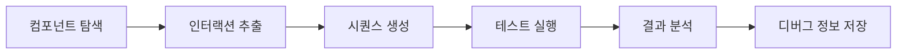
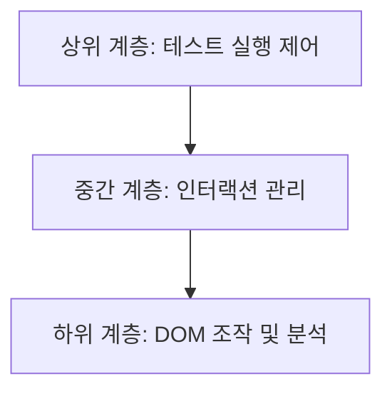
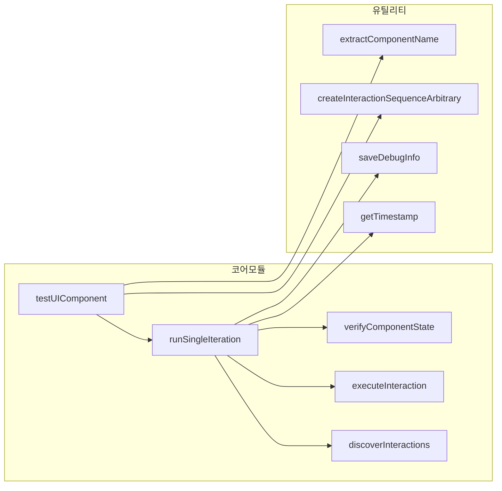
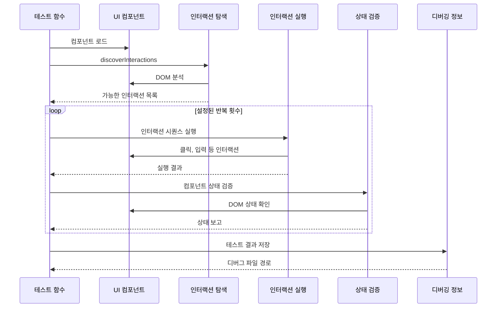
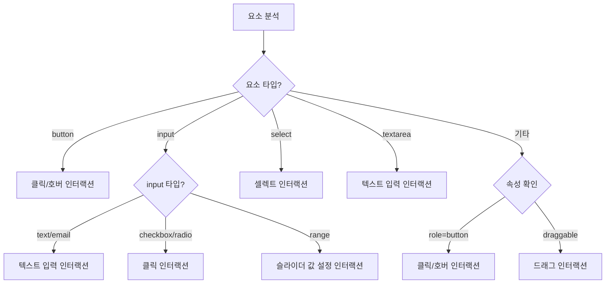
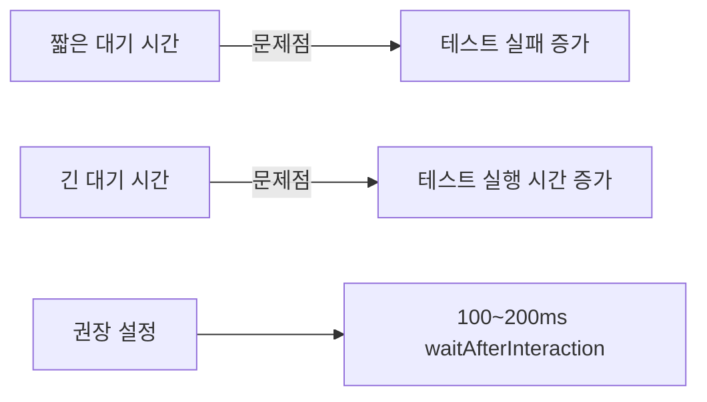
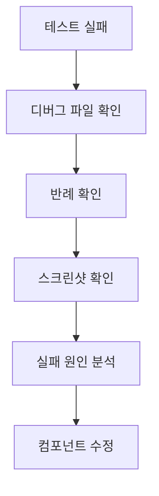
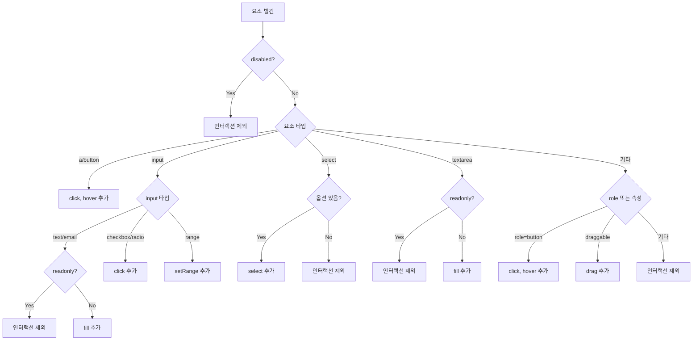

# Storybook UI 컴포넌트 범용 테스트 유틸리티 가이드

## 개요

이 문서는 `universal-testers.js` 파일에 구현된 Storybook UI 컴포넌트 자동화 테스트 도구에 대해 설명해. 이 도구는 UI 컴포넌트에 대한 무작위(Property-based) 테스트를 실행하여 다양한 상황에서의 안정성을 검증하는 기능을 제공해.



## 핵심 기능

1. **자동 인터랙션 탐색**: 컴포넌트의 DOM을 분석하여 가능한 모든 상호작용 요소를 자동으로 발견
2. **무작위 인터랙션 시퀀스**: fast-check 라이브러리를 통한 속성 기반 테스트 실행
3. **자동 에러 감지**: 컴포넌트 렌더링과 인터랙션 중 발생하는 에러 포착
4. **상세 디버깅 정보**: 테스트 실행 과정과 실패 시 정보를 상세하게 기록
5. **시각적 증거 캡처**: 테스트 실패 시 스크린샷 저장 기능

## 아키텍처

이 테스트 유틸리티는 크게 세 가지 계층으로 구성되어 있어:



### 주요 모듈 구성



## 주요 데이터 타입

사용되는 주요 데이터 타입을 이해하면 코드 흐름을 더 잘 파악할 수 있어:

### Interaction

| 속성      | 타입     | 설명                                   |
| --------- | -------- | -------------------------------------- |
| type      | string   | 인터랙션 타입 (click, fill, select 등) |
| selector  | string   | 대상 요소의 CSS 셀렉터                 |
| value     | any      | 인터랙션에 필요한 값 (선택사항)        |
| valueType | string   | 입력 값 타입 (선택사항)                |
| min       | number   | Range 최소값 (선택사항)                |
| max       | number   | Range 최대값 (선택사항)                |
| options   | string[] | Select 옵션 (선택사항)                 |

### TestConfig

| 속성                 | 타입    | 기본값                      | 설명                           |
| -------------------- | ------- | --------------------------- | ------------------------------ |
| iterationCount       | number  | 3                           | 인터랙션 시퀀스 반복 횟수      |
| sequenceLength       | number  | 5                           | 각 테스트 시퀀스의 인터랙션 수 |
| numRuns              | number  | 10                          | Fast-check 실행 횟수           |
| componentSelector    | string  | '#storybook-root'           | 컴포넌트의 기본 셀렉터         |
| waitAfterInteraction | number  | 100                         | 각 인터랙션 후 대기 시간(ms)   |
| resetComponent       | boolean | false                       | 반복마다 컴포넌트 초기화 여부  |
| debugLogDir          | string  | './test-results/debug-logs' | 로그 디렉토리 경로             |
| captureScreenshots   | boolean | true                        | 실패 시 스크린샷 캡처 여부     |
| verbose              | boolean | false                       | 상세 로그 출력 여부            |

## 핵심 함수 설명

### 🔍 testUIComponent

전체 테스트 프로세스를 실행하는 메인 함수야.

```javascript
async function testUIComponent(page, config = {})
```

- **입력**: Playwright 페이지 객체와 테스트 설정
- **출력**: 테스트 결과 객체
- **동작**:
  1. 테스트 설정 초기화
  2. 여러 번의 반복 테스트 실행
  3. 디버깅 정보 수집 및 저장
  4. 테스트 결과 반환

### 🔎 discoverInteractions

컴포넌트의 DOM을 분석하여 가능한 인터랙션을 자동으로 발견해.

```javascript
async function discoverInteractions(page, componentSelector)
```

- **입력**: Playwright 페이지 객체와 컴포넌트 셀렉터
- **출력**: 가능한 인터랙션 배열
- **동작**:
  1. 브라우저 컨텍스트에서 DOM 요소 스캔
  2. 각 요소의 특성에 맞는 인터랙션 생성
  3. 가시성 검사 후 최종 인터랙션 목록 반환

## 테스트 실행 흐름

전체 테스트가 어떻게 진행되는지 시퀀스 다이어그램으로 살펴보자:



## 인터랙션 생성 로직

컴포넌트의 각 요소 타입별로 어떤 인터랙션이 생성되는지 알아보자:



## 실제 사용 예시

테스트 유틸리티를 사용하는 간단한 예제야:

```javascript
import { test } from '@playwright/test'
import { testUIComponent } from './universal-testers'

test('버튼 컴포넌트 테스트', async ({ page }) => {
	// 테스트할 스토리북 페이지로 이동
	await page.goto('http://localhost:6006/?path=/story/components-button--primary')

	// 테스트 실행 (기본 설정 사용)
	await testUIComponent(page)
})

test('입력 폼 컴포넌트 상세 테스트', async ({ page }) => {
	await page.goto('http://localhost:6006/?path=/story/components-form--default')

	// 커스텀 설정으로 테스트 실행
	await testUIComponent(page, {
		iterationCount: 5, // 더 많은 반복 테스트
		sequenceLength: 10, // 더 긴 인터랙션 시퀀스
		verbose: true, // 상세 로그 출력
		waitAfterInteraction: 200, // 인터랙션 후 더 오래 대기
	})
})
```

## 주의사항 및 혼동하기 쉬운 부분

### 1. 테스트 속도와 안정성의 균형



- **문제**: `waitAfterInteraction` 값이 너무 짧으면 컴포넌트가 상태 업데이트를 완료하기 전에 다음 인터랙션이 실행되어 오류가 발생할 수 있어.
- **해결책**: 복잡한 컴포넌트나 애니메이션이 있는 경우 200~300ms로 설정하는 것이 좋아.

### 2. 컴포넌트 상태 초기화

- **문제**: 기본적으로 각 시퀀스 사이에 컴포넌트 상태가 초기화되지 않아서 이전 시퀀스의 영향이 다음 시퀀스에 남을 수 있어.
- **해결책**: `resetComponent: true` 옵션을 설정하고, Storybook에서 `window.resetComponentState` 함수를 제공해야 해.

### 3. 선택자(Selector) 안정성

- **문제**: 자동 생성된 선택자는 컴포넌트 구조가 변경되면 깨질 수 있어.
- **해결책**: 컴포넌트에 `data-testid` 속성을 추가해서 안정적인 선택자를 제공하는 것이 좋아.

## 고급 사용 팁

### 1. 특정 시나리오 테스트

특정 사용자 시나리오를 테스트하고 싶다면, 인터랙션 배열을 직접 작성할 수 있어:

```javascript
import { executeInteraction, verifyComponentState } from './universal-testers'

// 특정 시나리오 테스트
async function testLoginFlow(page) {
	const interactions = [
		{ type: 'fill', selector: '[data-testid="username"]', valueType: 'text', value: 'testuser' },
		{
			type: 'fill',
			selector: '[data-testid="password"]',
			valueType: 'password',
			value: 'password123',
		},
		{ type: 'click', selector: '[data-testid="login-button"]' },
	]

	for (const interaction of interactions) {
		await executeInteraction(page, interaction, 200)
	}

	// 로그인 후 상태 확인
	const state = await verifyComponentState(page, '#app')
	return state
}
```

### 2. 디버깅 정보 활용

테스트가 실패했을 때 생성되는 디버깅 정보와 스크린샷을 적극 활용해:



## 인터랙션 타입별 동작 방식

각 인터랙션 타입이 어떻게 동작하는지 이해하면 도움이 될 거야:

| 인터랙션 타입 | 대상 요소                  | 동작 방식                         |
| ------------- | -------------------------- | --------------------------------- |
| click         | 버튼, 링크, 클릭 가능 요소 | 요소를 클릭                       |
| hover         | 모든 가시적 요소           | 요소 위에 마우스 포인터 올림      |
| fill          | input, textarea            | 무작위 텍스트 생성 후 입력        |
| select        | select 태그                | 가능한 옵션 중 하나를 무작위 선택 |
| setRange      | range 타입 input           | 최소~최대 범위 내 무작위 값 설정  |
| drag          | draggable 요소             | 요소를 드래그 앤 드롭             |

## 문제 해결 가이드

### 테스트 실패 시 확인할 사항

1. **컴포넌트 렌더링 정상 여부**: `verifyComponentState` 함수 결과 확인
2. **인터랙션 가능한 요소 존재 여부**: 로그에서 `발견된 인터랙션 수` 확인
3. **인터랙션 타입과 요소 일치 여부**: 발생한 에러 메시지 확인
4. **비동기 작업 처리 여부**: `waitAfterInteraction` 값 조정 필요성 검토

### 성능 최적화 팁

1. **반복 횟수 조정**: `iterationCount`와 `numRuns` 값을 적절히 조정해서 테스트 시간 단축
2. **스크린샷 선택적 활성화**: 꼭 필요한 경우에만 `captureScreenshots: true` 설정
3. **불필요한 로그 비활성화**: 문제 해결 중이 아니라면 `verbose: false` 유지

## 확장 아이디어

이 테스트 유틸리티를 더 발전시킬 수 있는 아이디어야:

1. **컴포넌트 접근성(a11y) 테스트 추가**: 각 인터랙션 전후로 접근성 검사 실행
2. **성능 메트릭 수집**: 인터랙션 응답 시간 측정 및 기록
3. **테스트 커버리지 분석**: 어떤 요소와 상태가 테스트되었는지 시각화
4. **사용자 행동 패턴 시뮬레이션**: 실제 사용자 행동 데이터 기반 인터랙션 확률 조정

## 요약

Storybook UI 컴포넌트 범용 테스트 유틸리티는 다음 기능을 제공해:

1. UI 컴포넌트의 자동 인터랙션 탐색
2. 무작위 인터랙션 시퀀스 생성 및 실행
3. 컴포넌트 상태 검증 및 오류 감지
4. 테스트 결과와 디버깅 정보 저장

이 도구를 사용하면 수동으로 하기 어려운 다양한 상황에서의 컴포넌트 테스트를 자동화할 수 있어 개발 생산성과 코드 품질을 향상시킬 수 있어.

---

## 부록: 인터랙션 흐름도

특정 요소에 대한 인터랙션의 결정 과정을 좀 더 상세히 살펴보자:


