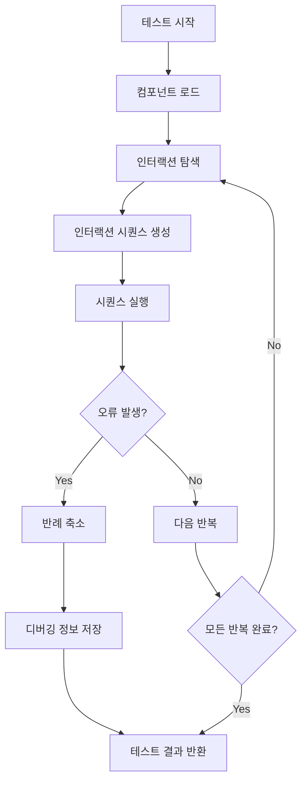
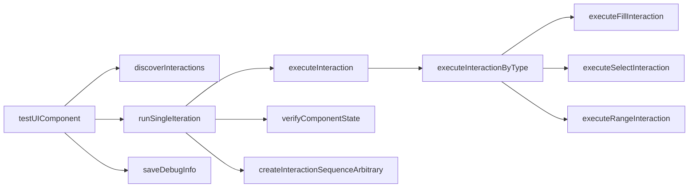
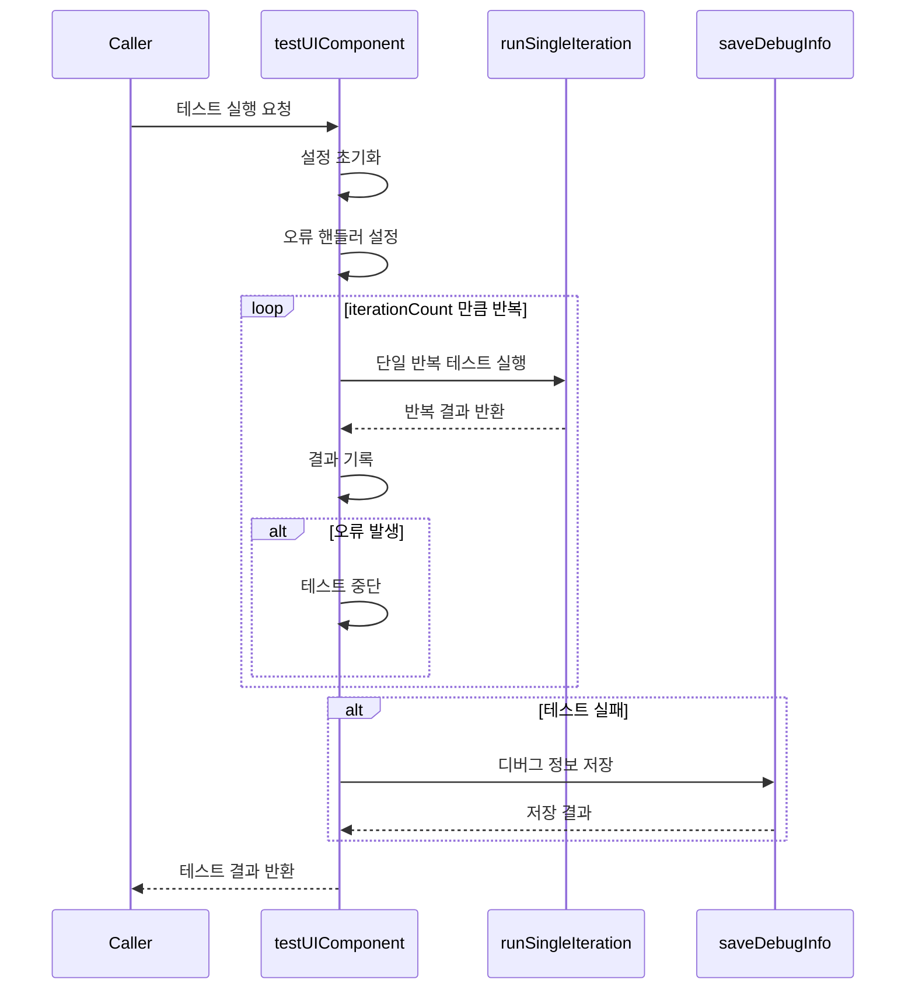
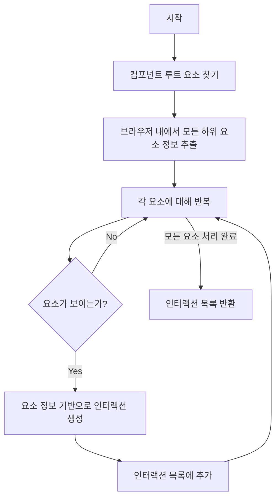
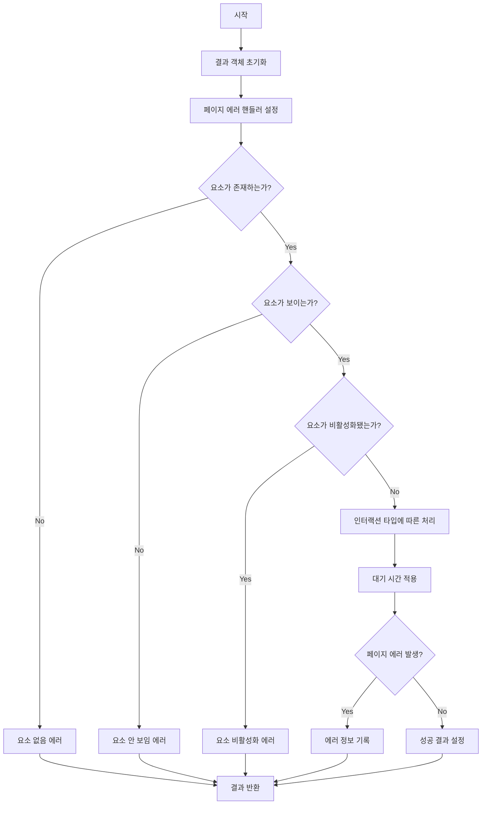
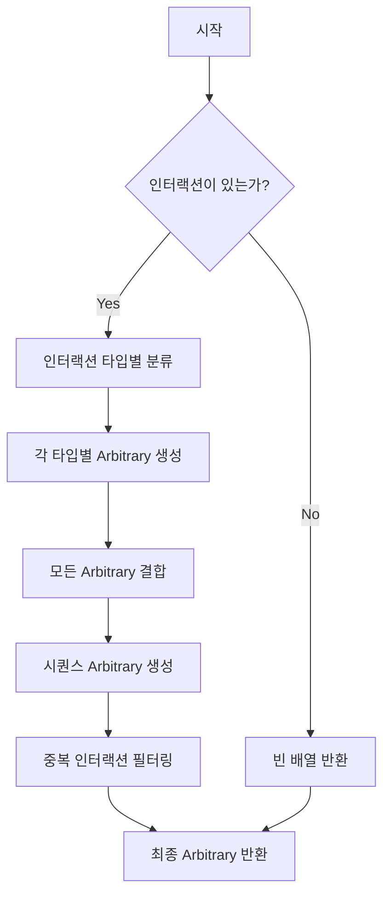
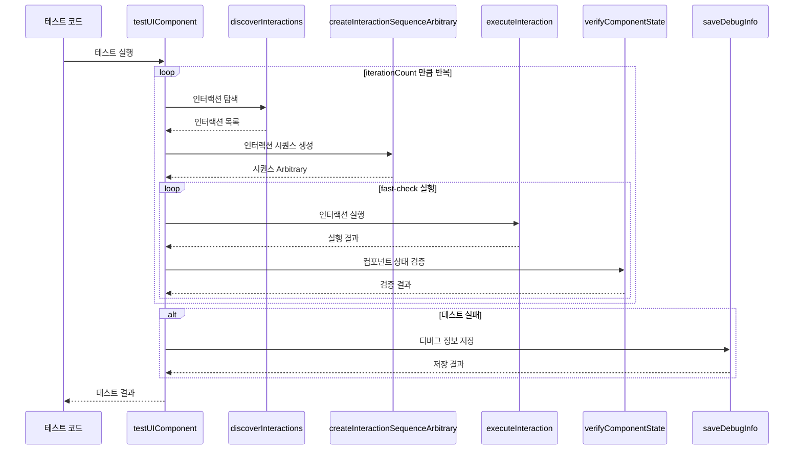
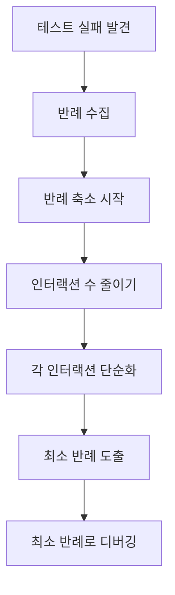
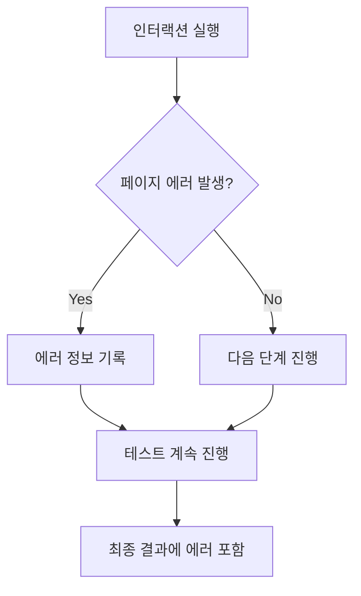
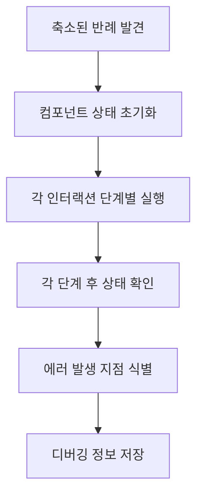

# Storybook UI 컴포넌트 범용 테스터 문서

## 목차

1. [개요](#개요)
2. [아키텍처](#아키텍처)
3. [핵심 기능](#핵심-기능)
4. [주요 타입 정의](#주요-타입-정의)
5. [주요 함수 설명](#주요-함수-설명)
6. [테스트 프로세스 흐름](#테스트-프로세스-흐름)
7. [사용 예시](#사용-예시)
8. [자주 혼동되는 부분](#자주-혼동되는-부분)
9. [성능 고려사항](#성능-고려사항)
10. [오류 처리 및 디버깅](#오류-처리-및-디버깅)

## 개요

이 코드는 Storybook에서 UI 컴포넌트를 자동으로 테스트하기 위한 범용 테스트 유틸리티야. 특히 Property-Based Testing 방식을 사용해서 컴포넌트의 다양한 상태와 인터랙션을 자동으로 테스트하고, 문제가 발생했을 때 최소한의 재현 단계를 찾아내는 기능을 제공해.

### 주요 특징

- **자동 인터랙션 탐색**: 컴포넌트 내의 모든 인터랙티브 요소(버튼, 입력 필드 등)를 자동으로 찾아냄
- **무작위 인터랙션 시퀀스**: fast-check 라이브러리를 사용해 다양한 인터랙션 시퀀스를 생성하고 실행
- **반례 축소(Shrinking)**: 문제가 발생했을 때 최소한의 재현 단계를 찾아내는 기능
- **고급 디버깅**: 오류 발생 시 상세한 디버깅 정보 제공
- **범용성**: 모든 Presentational 컴포넌트에 적용 가능

### 사용 기술

- **Playwright**: 브라우저 자동화 및 테스트 실행
- **fast-check**: Property-Based Testing 라이브러리
- **Node.js**: 파일 시스템 접근 및 디버그 정보 저장

## 아키텍처

이 테스트 유틸리티의 전체 아키텍처는 다음과 같아:



### 주요 모듈 구성



## 핵심 기능

### 1. 인터랙션 탐색

컴포넌트 내의 모든 인터랙티브 요소를 자동으로 찾아내고, 각 요소에 대해 가능한 인터랙션(클릭, 입력 등)을 생성해.

### 2. 인터랙션 시퀀스 생성 및 실행

fast-check 라이브러리를 사용해 다양한 인터랙션 시퀀스를 생성하고, 이를 실행해 컴포넌트의 동작을 테스트해.

### 3. 반례 축소(Shrinking)

문제가 발생했을 때, fast-check의 shrinking 기능을 사용해 최소한의 재현 단계를 찾아내. 이를 통해 디버깅이 훨씬 쉬워져.

### 4. 디버깅 정보 수집 및 저장

테스트 실행 중 발생한 모든 오류와 상태 정보를 수집하고, 이를 JSON 파일로 저장해 나중에 분석할 수 있게 해.

## 주요 타입 정의

테스트 유틸리티에서 사용하는 주요 타입들이야:

| 타입 이름           | 설명               | 주요 속성                                  |
| ------------------- | ------------------ | ------------------------------------------ |
| `Interaction`       | 인터랙션 정보      | type, selector, value, valueType 등        |
| `StepTracker`       | 단계 추적 객체     | currentStep, currentInteraction            |
| `TestConfig`        | 테스트 설정        | iterationCount, sequenceLength, numRuns 등 |
| `IterationInfo`     | 테스트 반복 정보   | iterationNumber, sequences, errors 등      |
| `DebugInfo`         | 디버깅 정보        | componentName, errors, iterations 등       |
| `InteractionResult` | 인터랙션 실행 결과 | success, errorMessage, value 등            |

### Interaction 타입

```typescript
/** 인터랙션 타입 정의 */
interface Interaction {
	type: string // 인터랙션 타입 (click, fill, select 등)
	selector: string // 대상 요소의 셀렉터
	value?: any // 인터랙션에 필요한 값 (fill, select 등에 사용)
	valueType?: string // 입력 시 값 타입 (text, email, number, textarea 등)
	min?: number // Range 최소값 (setRange에 사용)
	max?: number // Range 최대값 (setRange에 사용)
	options?: string[] // Select 옵션 (select에 사용)
}
```

### TestConfig 타입

```typescript
/** 테스트 설정 정의 */
interface TestConfig {
	iterationCount?: number // 인터랙션 시퀀스 반복 횟수 (기본값: 3)
	sequenceLength?: number // 각 테스트 시퀀스의 인터랙션 수 (기본값: 5)
	numRuns?: number // Fast-check 실행 횟수 (기본값: 10)
	componentSelector?: string // 컴포넌트의 기본 셀렉터 (기본값: '#storybook-root')
	waitAfterInteraction?: number // 각 인터랙션 후 대기 시간(ms) (기본값: 100)
	resetComponent?: boolean // 반복마다 컴포넌트 상태 초기화 여부 (기본값: false)
	debugLogDir?: string // 디버그 로그 저장 디렉토리 (기본값: './test-results/debug-logs')
	verbose?: boolean // 상세 로그 출력 여부 (기본값: false)
}
```

## 주요 함수 설명

### testUIComponent

전체 테스트 프로세스를 실행하는 메인 함수야.

```javascript
async function testUIComponent(page, config = {}) {
	// 기본 설정값과 사용자 정의 설정 병합
	// 컴포넌트 이름 추출
	// 디버그 정보 초기화
	// 페이지 오류 및 콘솔 오류 핸들러 설정
	// 설정된 반복 횟수만큼 테스트 실행
	// 디버그 정보 최종 업데이트 및 저장
	// 테스트 결과 반환
}
```

#### 함수 흐름



### discoverInteractions

컴포넌트 내의 모든 인터랙티브 요소를 찾고, 각 요소에 대해 가능한 인터랙션을 생성해.

```javascript
async function discoverInteractions(page, componentSelector) {
	// 컴포넌트의 루트 요소 찾기
	// 브라우저 컨텍스트 내에서 요소 정보 추출
	// 각 요소에 대해 가시성 체크 및 인터랙션 생성
	// 생성된 인터랙션 목록 반환
}
```

#### 인터랙션 탐색 과정



### executeInteraction

주어진 인터랙션을 페이지에서 실제로 수행해.

```javascript
async function executeInteraction(page, interaction, waitTime, verbose = false) {
	// 결과 객체 초기화
	// 현재 실행 중인 인터랙션 정보 설정
	// 페이지 에러 핸들러 설정
	// 대상 요소 존재 및 상호작용 가능 상태 확인
	// 인터랙션 타입에 따른 처리
	// 인터랙션 후 지정된 시간만큼 대기
	// 결과 반환
}
```

#### 인터랙션 실행 과정



### createInteractionSequenceArbitrary

fast-check 라이브러리를 사용해 무작위 인터랙션 시퀀스를 생성해.

```javascript
function createInteractionSequenceArbitrary(interactions, length) {
	// 인터랙션 타입별 분류
	// 구조화된 Arbitrary 생성
	// 최종 시퀀스 Arbitrary 생성 및 반환
}
```

#### 시퀀스 생성 과정



### runSingleIteration

단일 반복 테스트를 실행하는 함수야.

```javascript
async function runSingleIteration(page, iteration, errors, config) {
	// 반복 정보 초기화
	// 컴포넌트 상태 초기화 (필요시)
	// 인터랙티브 요소 탐색
	// 인터랙션 시퀀스 생성 및 실행
	// 최종 컴포넌트 상태 검증
	// 반복 정보 반환
}
```

## 테스트 프로세스 흐름

전체 테스트 프로세스의 흐름은 다음과 같아:



## 사용 예시

### 기본 사용법

```javascript
import { test } from '@playwright/test'
import { testUIComponent } from './universal-testers'

test('Button 컴포넌트 테스트', async ({ page }) => {
	// 스토리북 페이지로 이동
	await page.goto('http://localhost:6006/?path=/story/components-button--primary')

	// 테스트 실행
	const result = await testUIComponent(page, {
		iterationCount: 3,
		sequenceLength: 5,
		verbose: true,
	})

	// 결과 확인
	console.log(`테스트 성공 여부: ${result.success}`)
})
```

### 고급 설정 예시

```javascript
import { test } from '@playwright/test'
import { testUIComponent } from './universal-testers'

test('복잡한 폼 컴포넌트 테스트', async ({ page }) => {
	await page.goto('http://localhost:6006/?path=/story/components-form--default')

	const result = await testUIComponent(page, {
		iterationCount: 5,
		sequenceLength: 10,
		numRuns: 20,
		componentSelector: '#storybook-root .form-container',
		waitAfterInteraction: 200,
		resetComponent: true,
		debugLogDir: './test-results/form-tests',
		verbose: true,
	})

	console.log(`테스트 성공 여부: ${result.success}`)
	if (!result.success) {
		console.log(`디버그 정보 파일: ${result.debugFilePath}`)
	}
})
```

## 자주 혼동되는 부분

### 1. 인터랙션 타입과 실행 방식

인터랙션 타입에 따라 실행 방식이 다르다는 점을 주의해야 해:

| 인터랙션 타입 | 실행 방식             | 주의사항                           |
| ------------- | --------------------- | ---------------------------------- |
| `click`       | 요소 클릭             | 요소가 보이고 활성화되어 있어야 함 |
| `fill`        | 텍스트 입력           | 입력 타입에 따라 적절한 값 생성    |
| `select`      | 옵션 선택             | 옵션이 존재해야 함                 |
| `setRange`    | 범위 값 설정          | min/max 값 범위 내에서 설정        |
| `hover`       | 요소 위에 마우스 올림 | 요소가 보여야 함                   |
| `drag`        | 요소 드래그           | 요소가 draggable 속성을 가져야 함  |

### 2. fast-check의 Shrinking 과정

fast-check는 테스트 실패 시 최소한의 재현 단계를 찾아내는 Shrinking 과정을 수행해. 이 과정은 다음과 같이 진행돼:



### 3. 페이지 에러 처리 방식

페이지 에러가 발생해도 테스트가 중단되지 않고 계속 진행된다는 점을 이해해야 해:



## 성능 고려사항

### 1. 인터랙션 후 대기 시간

`waitAfterInteraction` 설정은 각 인터랙션 후 대기 시간을 결정해. 이 값이 너무 작으면 컴포넌트가 반응할 시간이 부족할 수 있고, 너무 크면 테스트 시간이 길어질 수 있어.

### 2. 시퀀스 길이와 반복 횟수

`sequenceLength`와 `iterationCount` 설정은 테스트의 철저함과 실행 시간 사이의 균형을 결정해. 복잡한 컴포넌트는 더 긴 시퀀스와 많은 반복이 필요할 수 있어.

### 3. fast-check 실행 횟수

`numRuns` 설정은 fast-check가 생성하는 무작위 시퀀스의 수를 결정해. 이 값이 클수록 더 다양한 시나리오를 테스트할 수 있지만, 테스트 시간이 길어질 수 있어.

## 오류 처리 및 디버깅

### 디버깅 정보 구조

테스트 실패 시 저장되는 디버깅 정보의 구조는 다음과 같아:

```javascript
{
  "timestamp": "2023-04-25T14-30-22",
  "componentName": "components-button",
  "url": "http://localhost:6006/?path=/story/components-button--primary",
  "testConfig": { /* 테스트 설정 */ },
  "iterations": [
    {
      "iterationNumber": 1,
      "sequences": [
        {
          "results": [ /* 인터랙션 실행 결과 */ ],
          "errors": [ /* 발생한 에러 */ ],
          "startTime": "2023-04-25T14:30:22.123Z",
          "endTime": "2023-04-25T14:30:25.456Z",
          "finalState": "컴포넌트 정보 - 자식 요소: 3개, 클래스: button primary, ID: none"
        }
        /* 더 많은 시퀀스 */
      ],
      "errors": [ /* 발생한 에러 */ ],
      "startTime": "2023-04-25T14:30:22.000Z",
      "endTime": "2023-04-25T14:30:30.000Z",
      "finalState": { "isVisible": true, "summary": "컴포넌트 정보 - 자식 요소: 3개, 클래스: button primary, ID: none" },
      "success": false
    }
    /* 더 많은 반복 */
  ],
  "errors": [ /* 모든 에러 */ ],
  "success": false,
  "debugFilePath": "./test-results/debug-logs/test-components-button-2023-04-25T14-30-22.json"
}
```

### 축소된 반례 분석

테스트 실패 시 fast-check는 최소한의 재현 단계를 찾아내. 이 정보는 디버깅에 매우 유용해:

```
----------- 축소된 실패 케이스 분석 -----------
총 2개의 인터랙션이 필요합니다
주요 인터랙션 시퀀스:
1. click on #storybook-root .button
2. fill on #storybook-root .input
   값: 테스트 입력 abc123

[Shrinking 과정 요약]
최종 축소 단계: 2회
단계별 상세:
1. click on #storybook-root .button
2. fill on #storybook-root .input
---------------------------------------------
```

### 디버깅 과정

테스트 실패 시 자동으로 수행되는 디버깅 과정은 다음과 같아:



이 과정을 통해 어떤 인터랙션 시퀀스가 문제를 일으키는지, 그리고 어떤 단계에서 정확히 오류가 발생하는지 파악할 수 있어.

## 결론

이 테스트 유틸리티는 UI 컴포넌트의 자동화된 테스트를 위한 강력한 도구야. Property-Based Testing 방식을 사용해 다양한 인터랙션 시퀀스를 자동으로 생성하고 실행함으로써, 수동 테스트로는 발견하기 어려운 문제들을 찾아낼 수 있어.

특히 오류가 발생했을 때 최소한의 재현 단계를 찾아내는 기능은 디버깅을 크게 용이하게 해주고, 상세한 디버깅 정보 수집은 문제 해결에 큰 도움이 돼.

이 도구를 효과적으로 사용하려면 테스트 설정을 컴포넌트의 복잡도에 맞게 조정하고, 디버깅 정보를 잘 활용하는 것이 중요해.
