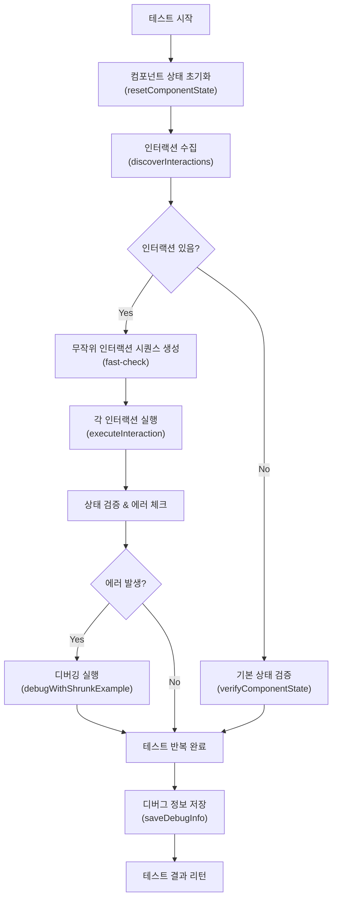
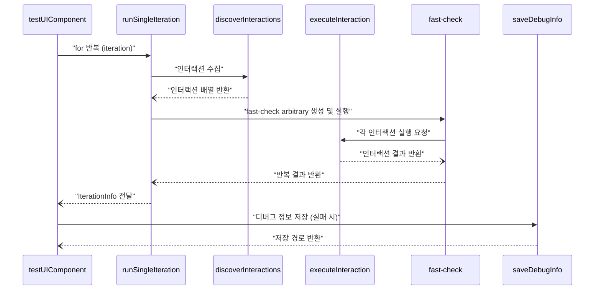
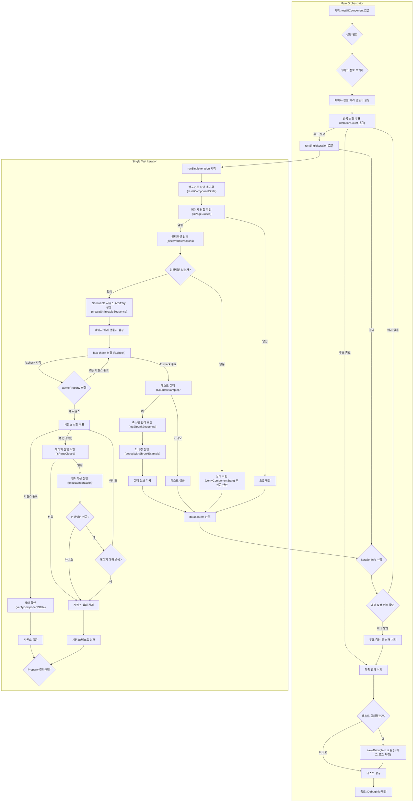
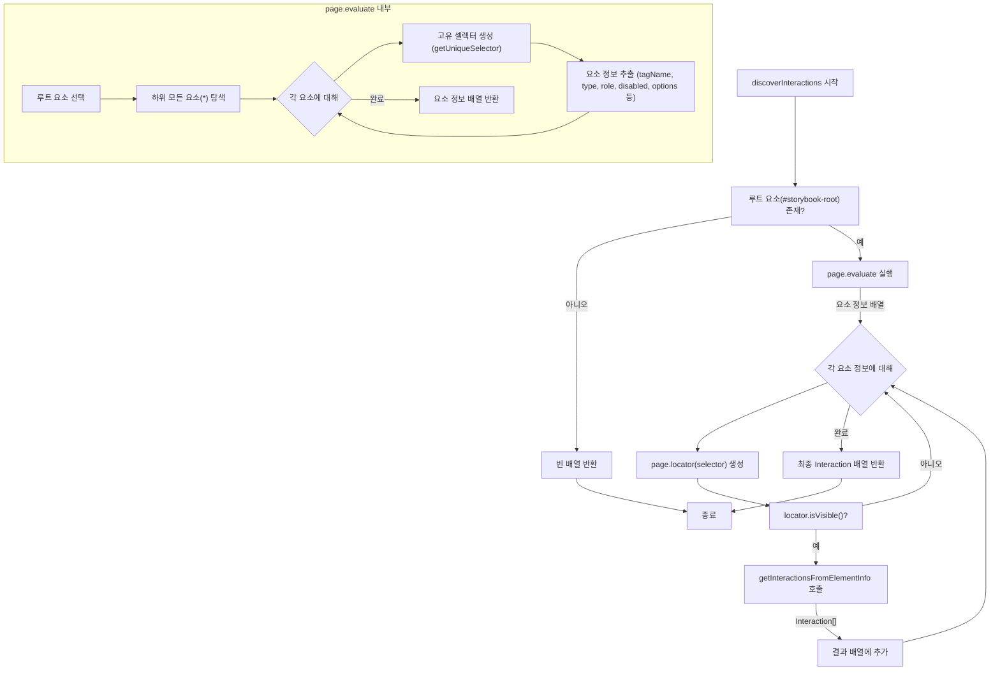
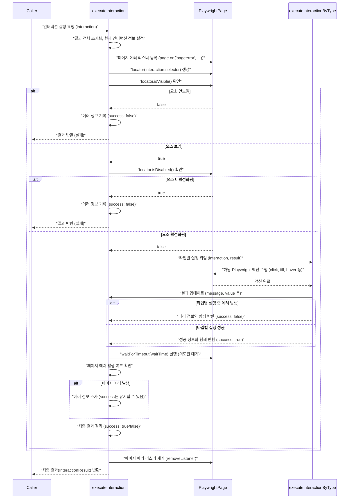
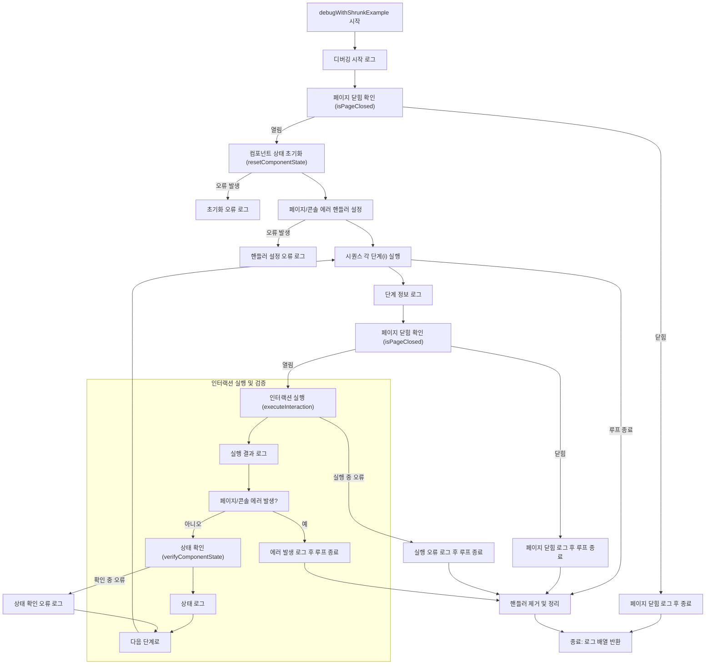

# Storybook UI 컴포넌트 범용 테스트 유틸리티 문서

이 문서는 Storybook UI 컴포넌트를 대상으로 하는 범용 테스트 유틸리티 코드에 대한 설명서야.
코드의 주목적은 Playwright를 기반으로 컴포넌트에 대한 다양한 인터랙션(클릭, 채우기, 드래그 등)을 자동화 테스트하고, fast-check 라이브러리를 사용해 프로퍼티 기반 테스트(Property-based testing)를 수행하며 디버깅 정보를 체계적으로 수집하는 거야.

---

## 1. 개요 (Overview)

- **목적:**
  UI 컴포넌트의 렌더링, 상호작용, 그리고 상태를 검증하기 위한 테스트 프로세스를 구현했어. 또한, 발생하는 에러 및 인터랙션 실행 결과를 디버깅 정보로 저장하고, fast-check의 반례(실패한 케이스)에 대해 단계별 디버깅 로직을 포함하고 있어.

- **사용 언어 및 라이브러리:**

  - 프로그래밍 언어: JavaScript (ES6)
  - 프레임워크/라이브러리:
    - Playwright (웹 UI 테스트)
    - fast-check (프로퍼티 기반 테스트)
    - Node.js (fs, path 모듈)
    - 기타 헬퍼 라이브러리 (예: @library/helpers/R)

- **핵심 기능:**
  - **인터랙션 수집:** DOM 내부 요소를 확인하고, 요소 속성에 따라 가능한 인터랙션(클릭, 채움, 호버, 선택 등)을 생성해.
  - **인터랙션 실행:** 인터랙션마다 Playwright 액션을 통해 실제 동작(클릭, 입력, 드래그 등)을 실행함.
  - **상태 검증:** 컴포넌트가 화면에 제대로 표시되는지, 자식 요소 정보 등을 확인해.
  - **디버깅:** 테스트 실행 중 발생한 에러, fast-check의 반례를 로그/파일 형태로 저장하고 단계별 디버깅 진행해.
  - **프로퍼티 기반 테스트:** fast-check를 이용해 무작위 인터랙션 시퀀스를 생성하고, 여러 번 반복하여 테스트를 수행함.

---

## 2. 아키텍처 및 구조 (Architecture / Structure)

이 코드는 크게 세 가지 주요 부분으로 나뉘어 있어:

1. **인터랙션 수집 및 생성**

   - 함수: `discoverInteractions`, `getInteractionsFromElementInfo`
   - DOM 탐색(code 내부 `page.evaluate` 사용)과 요소의 속성에 따라 인터랙션 객체 리스트를 반환하는 역할을 해.

2. **인터랙션 실행 및 검증**

   - 함수: `executeInteraction`, `executeInteractionByType`, `executeFillInteraction`, `executeSelectInteraction`, `executeRangeInteraction`
   - 각 인터랙션 타입에 따라 적절한 Playwright 동작(예: click, fill, hover 등)을 수행함.

3. **테스트 실행 및 디버깅**
   - 함수: `runSingleIteration`, `testUIComponent`, `debugWithShrunkExample`
   - 전체 테스트 반복, fast-check 프로퍼티 기반 테스트 실행, 인터랙션 시퀀스 실행 후 상태 검증 및 실패 케이스 디버깅 진행해.

아래 다이어그램은 전체적인 흐름을 시각적으로 표현한 것이야.



---

## 3. 핵심 기능 상세 설명 (Core Functionality Details)

### 3.1 인터랙션 수집과 생성

- **discoverInteractions(page, componentSelector):**

  - 역할: 주어진 페이지에서 컴포넌트 셀렉터를 기반으로 하위 요소들을 모두 탐색해. 각 요소에 대해 고유 선택자를 생성하고, getInteractionsFromElementInfo()를 통해 가능한 인터랙션 목록을 생성해.
  - 주의: 요소의 가시성(visible)과 disabled 상태를 반드시 체크하며, 브라우저 컨텍스트에서 직접 DOM을 탐색하는 평가(evaluate) 함수를 활용함.

- **getInteractionsFromElementInfo(elementInfo):**
  - 역할: DOM 요소의 정보를 기반으로 인터랙션 배열을 생성해. 요소의 태그, 입력 타입, role 등이 조건에 부합하면 click, fill, select, drag 등 다양한 인터랙션 객체를 반환함.
  - 예시: 버튼 요소(`a`, `button`)는 click과 hover 인터랙션을 추가.

> **혼동포인트:**
>
> - 여러 인터랙션이 같은 요소에 대해 중복 생성될 수 있음. 예를 들어, 버튼은 두 번의 인터랙션(클릭, 호버)을 추가함.
> - 요소가 비활성화(disabled) 상태일 경우 인터랙션이 제거됨.

### 3.2 인터랙션 실행

- **executeInteraction(page, interaction, waitTime, verbose):**

  - 역할: 전달된 인터랙션 객체에 따라 적절한 동작을 수행함.
  - 동작 과정:
    1. 페이지의 에러와 콘솔 에러를 사전에 등록하여 인터랙션 도중 에러 발생을 감지.
    2. 요소의 존재 및 가시성, disabled 여부를 체크.
    3. 내부적으로 executeInteractionByType()를 호출해 타입별 실행.
    4. 실행 후 일정 시간 wait 후 결과 반환함.

- **executeInteractionByType(page, interaction, result):**

  - 다양한 타입별 실행 세부 로직을 분리해서 관리함.
  - 예시:
    - 'click' 타입은 page.click()
    - 'drag' 타입은 hover 후 dragAndDrop 사용
    - 'fill' 타입은 executeFillInteraction() 호출

- **실행 보조 함수:**
  - executeFillInteraction, executeSelectInteraction, executeRangeInteraction
  - 입력 타입에 따라 적절한 테스트 값을 생성하고, Playwright 액션을 실행함.

> **혼동포인트:**
>
> - 각 인터랙션 실행 후 에러가 발생해도 인터랙션은 계속 진행되도록 설계되어 있음.
> - 비동기 실행 및 페이지 에러 핸들링 로직에 주의가 필요해.

### 3.3 테스트 실행 및 디버깅

- **runSingleIteration(page, iteration, errors, config):**

  - 역할: 단일 반복(iteration) 테스트를 실행해.
  - 동작:
    1. 컴포넌트 상태 초기화
    2. 인터랙션 수집
    3. fast-check를 통해 인터랙션 시퀀스 생성 및 실행
    4. 실행 결과 및 에러 데이터를 수집 후 반환

- **testUIComponent(page, config):**

  - 역할: 전체 테스트 프로세스를 총괄 담당하며, 여러 반복 실행(iteration) 및 최종 디버그 정보 저장을 수행해.
  - 특징: 실패 시 fast-check의 반례를 활용한 디버깅 로직 실행, debugInfo 정보를 파일에 저장

- **디버깅 관련:**
  - debugWithShrunkExample(): fast-check의 최소 반례(축소된 실패 케이스)로 단계별 디버깅을 수행함.
  - logShrunkSequence(): 축소된 반례를 로그 형식으로 출력

> **혼동포인트:**
>
> - fast-check 라이브러리를 통한 랜덤 인터랙션 시퀀스 생성 및 shrinking 과정이 복잡할 수 있음.
> - 페이지가 이미 닫힌 경우나, 인터랙션 실행 중 에러 처리 방식에 주의.

---

## 4. 데이터 흐름 (Data Flow)

1. 초기 설정 및 컴포넌트 상태 초기화
   → page 호출로 resetComponentState() 실행
2. DOM 요소 탐색 및 인터랙션 생성
   → discoverInteractions() 호출 → 각 요소에 대해 getInteractionsFromElementInfo()에서 인터랙션 객체 생성
3. 인터랙션 시퀀스 생성
   → fast-check arbitrary를 사용해 무작위 시퀀스 생성
4. 생성된 인터랙션 배열을 순차적으로 실행
   → executeInteraction() 및 타입별 실행 함수 호출
5. 실행 결과 및 에러 정보 수집
   → IterationInfo 객체에 저장
6. 에러 발생 시 디버깅 로직 실행
   → debugWithShrunkExample()로 상세 디버깅 진행
7. 최종 테스트 결과 및 디버그 정보 저장
   → saveDebugInfo() 통해 파일로 저장하고, test.info().attach()로 Playwright 보고

아래 시퀀스 다이어그램은 주요 함수 간 호출 순서를 나타내:



---

## 5. API 상세 설명 (API Documentation)

아래는 주요 함수들의 파라미터, 반환 값, 예외 처리에 대한 요약 표야.

| 함수 이름                      | 파라미터                                           | 반환 값                                   | 설명                                             |
| ------------------------------ | -------------------------------------------------- | ----------------------------------------- | ------------------------------------------------ |
| discoverInteractions           | page (Playwright Page), componentSelector (string) | Promise&lt;Interaction[]&gt;              | DOM 탐색 후 가능한 인터랙션 목록 반환            |
| getInteractionsFromElementInfo | elementInfo (object)                               | Interaction[]                             | 요소의 속성에 따라 가능한 인터랙션 배열 생성     |
| executeInteraction             | page, interaction, waitTime, verbose               | Promise&lt;InteractionResult&gt;          | 전달된 인터랙션 실행 및 결과 객체 반환           |
| executeInteractionByType       | page, interaction, result                          | 없음 (내부에서 result에 값 추가)          | 인터랙션 타입에 따라 세부 실행 함수 호출         |
| runSingleIteration             | page, iteration, errors, config                    | Promise&lt;IterationInfo&gt;              | 단일 반복 테스트 실행 및 결과 데이터 수집        |
| testUIComponent                | page, config                                       | Promise&lt;DebugInfo&gt;                  | 전체 테스트 프로세스 실행, 디버그 정보 최종 반환 |
| resetComponentState            | page                                               | Promise&lt;void&gt;                       | 컴포넌트 상태 초기화 (페이지 리로드 포함)        |
| verifyComponentState           | page, componentSelector                            | Promise&lt;{isVisible, summary}&gt;       | 컴포넌트 표시 여부 및 기본 상태 요약             |
| saveDebugInfo                  | dir, filename, data                                | Promise&lt;{ success, path?, error? }&gt; | 디버그 정보 파일 JSON으로 저장                   |

> **주의:** 각 함수는 비동기(async)로 실행되며, 페이지 상태나 에러 핸들링에 유의해야 해.

---

## 6. 사용 예제 (Usage Examples)

아래는 단순 실행 흐름 예시야:

```javascript
import { testUIComponent } from './storybook/e2e/universal-testers.js'
import { test } from '@playwright/test'

test('컴포넌트 인터랙션 테스트', async ({ page }) => {
	await page.goto('http://localhost:6006/?id=sample--example') // 스토리북 URL
	await testUIComponent(page, {
		iterationCount: 3,
		sequenceLength: 5,
		verbose: true,
	})
})
```

이 예제는 스토리북 URL에 접근하여 UI 컴포넌트의 다양한 인터랙션 시퀀스를 자동으로 실행하고, 결과를 디버그 정보로 기록해.

---

## 7. 혼동하기 쉬운 부분 및 주의할 점 (Easily Confused Parts & Precautions)

- **DOM 탐색 및 선택자 생성:**

  - 코드 내 `page.evaluate`를 사용해 브라우저 컨텍스트에서 DOM을 직접 탐색하고, 고유 선택자(getUniqueSelector)를 생성하는 부분은 조건문과 DOM 구조에 따라 복잡해질 수 있으므로 주의해야 해.

- **비동기 호출 및 에러 핸들링:**

  - 인터랙션 실행 중에도 페이지나 콘솔에러가 발생할 수 있고, 이를 계속 로그로 기록하는 구조다. 에러 발생 시 호출 스택이나 관련 인터랙션을 함께 출력하는 로직이 있으므로, 디버깅 시 이러한 순서를 면밀히 살펴봐야 해.

- **fast-check 기반 테스트:**

  - fast-check의 arbitrary 생성 및 shrinking 과정은 랜덤 인터랙션 시퀀스 생성을 위한 강력하지만 복잡한 기능이야. 반례 발생 시 축소와 디버깅을 함께 수행하는 로직이 있으니, fast-check 설정과 제한 사항을 잘 이해해야 해.

- **페이지 상태 확인:**
  - `isPageClosed(page)` 함수를 통해 페이지가 닫혔는지 확인하는 로직이 여러 곳에 적용되어 있는데, 비정상적인 페이지 상태에서 에러가 발생할 수 있으므로, 테스트 환경의 안정성을 반드시 점검해야 해.

---

## 8. 결론 (Conclusion)

이 문서는 제공된 범용 테스트 유틸리티 코드의 주요 부분을 쉽게 이해할 수 있도록 구성했어.

- **구조적 흐름**,
- **주요 함수 역할 및 데이터 처리 방식**,
- **fast-check을 활용한 랜덤 인터랙션 테스트 처리**
  등을 시각적 다이어그램과 표로 정리했어.
  또한, 복잡하고 혼동하기 쉬운 부분에 대해 세세한 주의 사항과 디버깅 방법도 다루었어.

이 문서를 참고하면 코드의 흐름과 주요 기능, 그리고 테스트 과정에서의 에러 처리 및 디버깅 방법을 빠르게 이해하고 활용할 수 있을 거야.

---

추가적으로 이 코드를 사용하면서 발생할 수 있는 성능 이슈, 이벤트 핸들러 등록/제거 문제, 그리고 비동기 호출 순서를 꼼꼼하게 점검하면 더욱 안정적인 테스트 자동화가 가능할 거야.

이 문서가 코드 이해에 도움이 되었길 바라!

---

# Storybook 범용 UI 테스터 문서

## 1. 개요

이 문서는 `storybook/e2e/universal-testers.js` 파일에 정의된 Storybook 범용 UI 테스터 유틸리티에 대한 설명이야. 이 코드는 Playwright와 fast-check 라이브러리를 활용하여 Storybook에 렌더링된 UI 컴포넌트에 대한 **프로퍼티 기반 E2E(End-to-End) 테스트**를 자동화하는 것을 목표로 해.

**핵심 기능:**

1. **인터랙션 자동 탐색:** 주어진 컴포넌트 내에서 사용자가 상호작용할 수 있는 요소(버튼, 입력 필드, 셀렉트 박스 등)를 자동으로 찾아내.
2. **무작위 시퀀스 생성 및 실행:** 탐색된 인터랙션을 기반으로 무작위 순서의 사용자 행동 시퀀스를 생성하고, Playwright를 통해 이를 실제 브라우저에서 실행해.
3. **상태 검증 및 에러 탐지:** 각 인터랙션 후 또는 시퀀스 종료 후 컴포넌트의 상태를 확인하고, 예기치 않은 동작이나 JavaScript 오류 발생 여부를 감지해.
4. **Shrinking 기반 디버깅:** 테스트 실패 시, fast-check의 Shrinking 기능을 활용하여 실패를 유발하는 가장 간단한 인터랙션 시퀀스(Counterexample)를 찾아내고, 이를 단계별로 재현하여 디버깅을 용이하게 해.
5. **상세 로그 및 리포팅:** 테스트 과정, 발생한 에러, 최종 결과 등을 포함한 상세한 디버그 정보를 JSON 파일로 저장하여 문제 분석을 도와줘.

이 유틸리티는 특히 복잡한 상태 변화를 가지거나 다양한 사용자 인터랙션이 가능한 컴포넌트의 안정성을 검증하고, 예측하기 어려운 엣지 케이스나 잠재적인 레이스 컨디션을 발견하는 데 유용하게 사용될 수 있어.

## 2. 아키텍처 및 실행 흐름

테스터의 전체적인 구조와 실행 흐름은 다음과 같아.



**흐름 요약:**

1. `testUIComponent` 함수가 테스트 전체를 관리해. 설정값을 받고, 반복 횟수만큼 `runSingleIteration`을 호출하면서 결과를 집계해.
2. `runSingleIteration` 함수는 단일 테스트 반복을 담당해. 컴포넌트 상태를 초기화하고, `discoverInteractions`로 상호작용 가능한 요소들을 찾아.
3. 찾아낸 인터랙션을 기반으로 `createShrinkableSequence`가 fast-check가 사용할 무작위 시퀀스 생성 규칙(Arbitrary)을 만들어. 이 Arbitrary는 실패 시 원인을 효과적으로 축소(Shrinking)할 수 있도록 특별히 설계되었어.
4. `fc.check`가 `asyncProperty`를 통해 여러 개의 무작위 시퀀스를 생성하고 실행해.
5. 각 시퀀스 내에서는 `executeInteraction` 함수가 개별 인터랙션(클릭, 입력 등)을 Playwright를 통해 수행해. 매 인터랙션 전후로 페이지가 닫혔는지(`isPageClosed`) 확인하고, 인터랙션 성공 여부 및 페이지/콘솔 에러를 체크해.
6. 시퀀스 실행 후 `verifyComponentState`로 컴포넌트 최종 상태를 검증해.
7. 만약 `fc.check`가 실패(예: 인터랙션 실패, 에러 발생)하면, fast-check는 자동으로 실패를 재현하는 가장 짧은 인터랙션 시퀀스(Counterexample)를 찾아줘 (Shrinking 과정).
8. 찾아낸 Counterexample은 `logShrunkSequence`를 통해 로그에 기록되고, `debugWithShrunkExample` 함수가 이 최소 실패 시퀀스를 단계별로 재현하면서 상세한 디버깅 정보를 제공해.
9. 테스트 실패 시, `saveDebugInfo` 함수가 모든 테스트 과정, 설정, 에러, Counterexample 등을 포함한 JSON 파일을 생성해줘.

## 3. 핵심 기능 상세 설명

### 3.1. `testUIComponent(page, config)`

테스트 실행의 메인 진입점이야. 전체 테스트 프로세스를 조율하고 최종 결과를 반환해.

- **역할:**
  - 테스트 설정(기본값 + 사용자 정의) 관리
  - 지정된 횟수(`iterationCount`)만큼 `runSingleIteration` 반복 호출
  - 전체 테스트 실행 중 발생하는 페이지/콘솔 에러 수집 (`page.on('pageerror', ...)` 등)
  - 각 반복의 결과(`IterationInfo`)를 `debugInfo.iterations`에 누적
  - 테스트 실패 시 최종 `debugInfo` 객체를 `saveDebugInfo`를 통해 JSON 파일로 저장
  - Playwright 테스트 스텝을 통해 최종 성공/실패 단언(`expect`) 수행
- **반환:** `DebugInfo` 객체 (테스트 전체 결과 요약)

### 3.2. `runSingleIteration(page, iteration, errors, config)`

단일 테스트 반복(iteration)을 수행하는 함수야.

- **역할:**
  - `resetComponentState` 호출하여 테스트 시작 전 컴포넌트 상태 초기화
  - `isPageClosed`로 페이지 상태 확인
  - `discoverInteractions` 호출하여 현재 화면의 인터랙티브 요소 목록 가져오기
  - 인터랙션이 없으면 상태 확인 후 종료
  - `createShrinkableSequence`로 fast-check Arbitrary 생성
  - `fc.check`와 `asyncProperty`를 사용하여 무작위 인터랙션 시퀀스 테스트 실행
    - `asyncProperty` 내부: 각 시퀀스 실행, `executeInteraction` 호출, 에러 및 상태 검증
  - `fc.check` 실패 시:
    - Shrinking을 통해 얻은 Counterexample 로깅 (`logShrunkSequence`)
    - `debugWithShrunkExample` 호출하여 단계별 디버깅 실행 및 로그 첨부
    - 실패 정보(`failureInfo`) 기록
  - 페이지 에러 핸들러 관리 (테스트 중 발생한 페이지 에러 수집)
- **반환:** `IterationInfo` 객체 (해당 반복의 결과)

### 3.3. `discoverInteractions(page, componentSelector)`

지정된 컴포넌트 셀렉터 하위에서 사용자와 상호작용 가능한 모든 DOM 요소를 찾아내고, 이를 `Interaction` 객체 목록으로 변환해.



- **동작 방식:**
  1. 먼저 `page.evaluate`를 사용하여 브라우저 컨텍스트 내에서 DOM을 직접 순회해. 이는 복잡한 DOM 구조나 속성에 접근하기 위해 필요할 수 있어. (`getUniqueSelector` 함수도 브라우저 내에서 실행)
  2. 각 요소에 대해 태그 이름, 타입, 역할, 비활성화 상태, 옵션 목록 등의 정보를 수집하고 고유한 CSS 셀렉터를 생성해.
  3. `evaluate`가 반환한 요소 정보 목록을 순회하면서, 각 요소에 대해 Playwright의 `locator`를 생성하고 `locator.isVisible()`을 호출하여 **실제로 화면에 보이는 요소인지** 확인해. (이중 확인)
  4. 화면에 보이는 요소에 대해서만 `getInteractionsFromElementInfo` 함수를 호출하여 해당 요소에서 수행 가능한 인터랙션(`Interaction` 객체) 목록을 만들어 최종 결과에 추가해.
- **`getInteractionsFromElementInfo(elementInfo)`:** 요소 정보 객체를 받아 해당 요소에 맞는 `Interaction` 객체(들)를 생성해. 예를 들어 `<button>`이면 `{ type: 'click', selector }, { type: 'hover', selector }`를, `<input type="text">`이면 `{ type: 'fill', selector, valueType: 'text' }` 등을 반환해. 비활성화(`disabled`)된 요소는 빈 배열을 반환해.

### 3.4. `executeInteraction(page, interaction, waitTime, verbose)`

단일 `Interaction` 객체를 받아 Playwright API를 사용하여 실제 브라우저에서 해당 인터랙션을 수행해.



- **주요 특징:**
  - `locator`를 사용하여 대상 요소를 찾고 상태(가시성, 비활성화)를 먼저 확인해.
  - 실제 인터랙션 수행은 `executeInteractionByType` 헬퍼 함수에 위임하여 코드 복잡도를 낮춰.
  - 인터랙션 수행 후 `page.waitForTimeout`을 사용하여 의도적으로 잠시 대기해 (비동기 업데이트 등을 기다리기 위함일 수 있으나, 주의 필요).
  - 실행 중 발생할 수 있는 Playwright 오류나 페이지 자체의 JavaScript 오류를 `try...catch` 및 페이지 에러 리스너로 감지하고 `InteractionResult` 객체에 기록해. **에러가 발생해도 테스트가 즉시 중단되지 않고 결과 객체에 실패 정보만 담아 반환**하는 것이 중요해 (fast-check가 Shrinking을 계속할 수 있도록).
- **`executeInteractionByType(page, interaction, result)`:** `interaction.type`에 따라 `page.click`, `page.fill`, `page.hover`, `page.selectOption`, `page.dragAndDrop` 또는 커스텀 로직(`executeFillInteraction`, `executeSelectInteraction`, `executeRangeInteraction`)을 호출해. 각 타입별 실행 함수는 필요한 값을 생성하거나(예: `fill` 타입의 랜덤 문자열), 옵션 중에서 선택하는 등의 구체적인 작업을 수행해.

### 3.5. `createShrinkableSequence(interactions, length)` & `createInteractionSequenceArbitrary(...)`

fast-check 라이브러리를 사용하여 무작위 인터랙션 시퀀스를 생성하는 규칙(Arbitrary)을 정의해. 특히 **Shrinking**(실패 시 원인 축소) 성능을 고려하여 구현되었어.

- **Shrinking 최적화:**
  - 단순히 `fc.constantFrom(interactions)`를 사용하지 않고, 인터랙션 타입별로 분리한 뒤 `fc.nat` (자연수 Arbitrary)으로 인덱스를 선택하고 `fc.map`을 이용해 실제 인터랙션 객체로 변환하는 방식을 사용해. 이는 fast-check가 실패 시 인터랙션 객체 자체의 복잡한 구조 대신 간단한 '인덱스'를 축소하게 만들어 Shrinking 과정을 더 효율적으로 유도할 수 있어.
  - `fill`, `select`, `setRange`처럼 인터랙션 시 값이 필요한 경우, `fc.chain` 대신 `fc.tuple`과 `getRandomValueForType`/`getRandom`을 조합하여 사용해. 이는 Arbitrary 생성 단계와 값 생성 단계를 분리하여 Shrinking 중 값의 변화를 더 예측 가능하게 만들려는 시도로 보여. (값 자체는 실행 시점에 랜덤하게 결정됨)
  - 최종적으로 `fc.array(interactionArb, { minLength: 1, maxLength: ... })`를 사용하여 다양한 길이의 인터랙션 시퀀스를 생성하며, 배열 길이 자체도 Shrinking 대상이 돼.
- **반환:** `fc.Arbitrary<Interaction[]>` (fast-check가 사용할 인터랙션 배열 시퀀스 생성 규칙)

### 3.6. `debugWithShrunkExample(page, shrunkSequence, componentSelector, waitTime)`

fast-check가 찾아낸 최소 실패 시퀀스(`shrunkSequence`)를 받아, 이를 단계별로 실행하면서 상세한 로그를 남기는 디버깅 함수야.



- **동작:**
  1. 테스트 시작 전처럼 `resetComponentState`를 호출해 상태를 초기화해.
  2. 페이지 및 콘솔 에러 리스너를 등록하여 각 단계에서 발생하는 에러를 감지해.
  3. `shrunkSequence`의 각 인터랙션을 `executeInteraction`을 통해 **하나씩** 실행해.
  4. 매 단계 실행 전후로 페이지 닫힘 여부(`isPageClosed`)를 확인해.
  5. 각 인터랙션 실행 후 결과, 발생한 에러, `verifyComponentState`를 통한 컴포넌트 상태를 콘솔에 상세히 로깅해.
  6. 에러가 발생하면 해당 단계에서 루프를 중단하고 종료해 (최소 실패 지점 확인).
  7. 모든 단계가 끝나거나 중간에 종료되면 등록했던 에러 리스너를 제거해.
- **목적:** 자동화된 테스트에서 실패가 발생했을 때, 어떤 순서의 어떤 인터랙션이 문제를 일으켰는지 개발자가 명확하게 파악하고 재현할 수 있도록 돕는 것이 핵심이야.

### 3.7. `isPageClosed(page)`

Playwright의 `page` 객체가 여전히 유효한지(즉, 페이지나 브라우저 컨텍스트가 닫히지 않았는지) 확인하는 중요한 헬퍼 함수야.

- **동작:** `page.evaluate('1 + 1')`과 같은 간단한 스크립트 실행을 시도해. 페이지가 닫혔다면 이 작업은 예외를 발생시켜. `try...catch` 블록에서 특정 에러 메시지("Target page...", "Target closed", "Protocol error" 등)를 확인하여 페이지가 닫혔는지 여부를 판단해.
- **중요성:** Playwright 작업은 비동기적으로 이루어지며, 특히 긴 테스트 시퀀스나 에러 처리 중에 페이지가 예기치 않게 닫힐 수 있어. 닫힌 페이지 객체에 작업을 시도하면 에러가 발생하여 테스트 전체가 불안정해질 수 있으므로, 중요한 Playwright API 호출 전에 이 함수로 페이지 상태를 확인하는 것은 **테스트 안정성을 위해 필수적**이야.

### 3.8. 기타 헬퍼 함수

- `resetComponentState(page)`: 스토리북 환경에 `window.resetComponentState` 함수가 정의되어 있으면 호출하고, 없으면 `page.reload()`를 통해 페이지를 새로고침하여 상태를 초기화하려고 시도해.
- `verifyComponentState(page, componentSelector)`: 대상 컴포넌트가 화면에 보이는지(`locator.isVisible()`) 확인하고, 보인다면 간단한 정보(자식 요소 수, 클래스, ID)를 요약 문자열로 반환해.
- `saveDebugInfo(dir, filename, data)`: 테스트 결과를 담은 `data` 객체를 지정된 `dir`에 `filename`으로 JSON 형식으로 저장해. 디렉토리가 없으면 생성해줘.
- `getTimestamp()`: 파일명에 사용하기 적합한 형식의 타임스탬프 문자열을 생성해.
- `extractComponentName(url)`: Storybook URL에서 컴포넌트 이름을 추출해 (주로 `id` 쿼리 파라미터 사용).
- `logShrunkSequence(checkResult)`: fast-check의 실패 결과(`checkResult`)에서 Counterexample(축소된 시퀀스)을 추출하여 콘솔에 보기 좋게 출력해.
- `getRandom...`: 테스트 데이터 생성을 위한 랜덤 값 생성 함수들.

## 4. 데이터 구조 (타입 정의)

JSDoc 주석으로 정의된 주요 데이터 구조들이야.

| 타입명              | 설명                                                         | 속성 (예시)                                                                                                                                                                                                                                                                                                                                                                                                   |
| :------------------ | :----------------------------------------------------------- | :------------------------------------------------------------------------------------------------------------------------------------------------------------------------------------------------------------------------------------------------------------------------------------------------------------------------------------------------------------------------------------------------------------ |
| `Interaction`       | 단일 사용자 인터랙션을 나타내는 객체                         | `type`: 'click', 'fill', 'select', 'hover', 'drag', 'setRange'<br>`selector`: 대상 요소 CSS 셀렉터<br>`value?`: 입력/선택/설정할 값<br>`valueType?`: 값의 종류 ('text', 'number' 등)<br>`options?`: Select 옵션 목록<br>`min?`, `max?`: Range 범위                                                                                                                                                            |
| `StepTracker`       | 단계별 디버깅 시 현재 진행 상황 추적 객체                    | `currentStep`: 현재 단계 번호 (null 가능)<br>`currentInteraction`: 현재 인터랙션 객체 (null 가능)                                                                                                                                                                                                                                                                                                             |
| `TestConfig`        | `testUIComponent` 함수의 설정을 정의하는 객체                | `iterationCount?`: 반복 횟수 (기본 3)<br>`sequenceLength?`: 시퀀스 당 인터랙션 수 (기본 5)<br>`numRuns?`: fast-check 실행 횟수 (기본 10)<br>`componentSelector?`: 대상 컴포넌트 셀렉터 (기본 '#storybook-root')<br>`waitAfterInteraction?`: 인터랙션 후 대기 시간(ms) (기본 100)<br>`resetComponent?`: 반복마다 리셋 여부 (기본 false)<br>`debugLogDir?`: 디버그 로그 경로<br>`verbose?`: 상세 로그 출력 여부 |
| `IterationInfo`     | 단일 테스트 반복(`runSingleIteration`)의 결과를 담는 객체    | `iterationNumber`: 반복 번호<br>`sequences`: 실행된 시퀀스 정보 배열 (`SequenceInfo[]`)<br>`errors`: 해당 반복 중 발생한 에러 목록<br>`startTime`, `endTime?`: 시작/종료 시간<br>`stateSummary?`: 상태 요약 (인터랙션 없을 시)<br>`noInteractions?`: 인터랙션 없음 여부<br>`finalState?`: 최종 상태 정보<br>`failureInfo?`: 실패 시 fast-check 정보 (Counterexample 등)<br>`success`: 성공 여부               |
| `DebugInfo`         | `testUIComponent`가 반환하는 전체 테스트 결과 및 디버깅 정보 | `componentName`: 컴포넌트 이름<br>`errors`: 전체 에러 목록<br>`counterExample?`: 최종 실패 시 Counterexample<br>`state?`: 최종 DOM 상태 요약<br>`timestamp`: 테스트 시작 시간<br>`url`: 테스트 페이지 URL<br>`testConfig`: 사용된 설정<br>`iterations`: 각 반복 결과 배열 (`IterationInfo[]`)<br>`success`: 전체 테스트 성공 여부<br>`debugFilePath?`: 생성된 디버그 파일 경로                                |
| `SequenceInfo`      | 단일 인터랙션 시퀀스의 실행 결과를 담는 객체                 | `results`: 각 인터랙션 결과 배열 (`InteractionResult[]`)<br>`errors`: 해당 시퀀스 중 발생한 에러 목록<br>`startTime`, `endTime?`: 시작/종료 시간<br>`finalState?`: 시퀀스 종료 후 상태                                                                                                                                                                                                                        |
| `InteractionResult` | `executeInteraction`의 실행 결과를 담는 객체                 | `success`: 인터랙션 성공 여부<br>`errorMessage?`, `errorStack?`, `error?`: 에러 정보<br>`value?`: 실행 결과 값 (예: 입력된 값)<br`message?`: 추가 정보 (예: '클릭')<br>`details?`: 기타 상세 정보                                                                                                                                                                                                             |

## 5. 혼동하기 쉬운 부분 및 주의사항

이 코드는 다소 복잡하며 몇 가지 주의 깊게 이해해야 할 부분이 있어.

1. **`page.evaluate`와 `locator`의 혼용:**

   - `discoverInteractions` 함수는 초기 요소 정보 수집 및 복잡한 DOM 속성 접근을 위해 브라우저 컨텍스트 내에서 실행되는 `page.evaluate`를 사용해.
   - 하지만 이후 요소의 실제 가시성 확인(`locator.isVisible()`)이나 인터랙션 실행(`executeInteraction` 내부)에서는 Playwright의 `locator` API를 사용해. 이는 Playwright가 제공하는 자동 대기(auto-waiting) 및 안정성 기능을 활용하기 위함이야.
   - **왜 혼용하는가?** `evaluate`는 브라우저 내부 로직 접근에 유연하지만 Playwright의 장점을 활용하기 어렵고, `locator`만으로는 복잡한 초기 탐색 로직 구현이 번거로울 수 있기 때문에 각자의 장점을 취한 것으로 보여.

2. **Fast-check Shrinking 로직의 복잡성:**

   - `createInteractionSequenceArbitrary` 함수는 fast-check가 실패 원인을 효과적으로 축소(Shrinking)하도록 돕기 위해 의도적으로 복잡하게 구현되었어.
   - 단순히 인터랙션 객체 목록에서 랜덤하게 뽑는 대신, **타입별로 분리하고 인덱스(`fc.nat`)를 사용**하여 fast-check가 더 단순한 값(숫자 인덱스)을 기준으로 축소하도록 유도해.
   - 값이 필요한 인터랙션(`fill`, `select`, `setRange`)의 경우, Arbitrary 생성 시점에는 값 생성을 위한 '준비'만 하고(예: `fc.tuple` 사용), 실제 값은 **테스트 실행 시점**(`asyncProperty` 내부 또는 `executeInteractionByType` 내부)에 `getRandom...` 함수를 통해 생성돼. 이는 Shrinking 과정에서 값의 변화를 제어하고 예측 가능성을 높이려는 의도일 수 있어.
   - 이러한 복잡성은 Shrinking 성능을 최적화하기 위한 트레이드오프일 수 있으므로, 수정 시 Shrinking 동작에 미칠 영향을 고려해야 해.

3. **`isPageClosed` 확인의 중요성:**

   - Playwright 테스트, 특히 비동기 작업이 많고 에러 발생 가능성이 있는 경우, 페이지나 브라우저 컨텍스트가 예기치 않게 닫힐 수 있어.
   - 닫힌 `page` 객체에 `.click()`, `.evaluate()`, `.locator()` 등의 메서드를 호출하면 `"Target page, context or browser has been closed"` 또는 유사한 에러가 발생하며 테스트가 비정상 종료될 수 있어.
   - 이 코드에서는 중요한 Playwright 작업 **직전에 `await isPageClosed(page)`를 호출**하여 페이지 상태를 확인하고, 닫혔다면 해당 작업을 건너뛰거나 에러 처리를 하는 방식으로 안정성을 확보하고 있어. 이는 매우 중요한 방어 로직이야.

4. **에러 처리 전략:**

   - `executeInteraction` 내에서 인터랙션 실행 중 오류가 발생해도 `throw`하지 않고 `InteractionResult` 객체에 에러 정보를 담아 반환해 (`success: false`).
   - `runSingleIteration`의 `asyncProperty` 내부에서도 개별 인터랙션 실패 시 `throw`하여 해당 **시퀀스**를 실패 처리하지만, fast-check의 `fc.check` 자체는 다른 시퀀스 실행을 계속할 수 있어 (`endOnFailure: false` 설정 때문).
   - 페이지 자체의 JavaScript 에러(`page.on('pageerror', ...)`)는 감지하여 로깅하고 에러 목록에 추가하지만, 그 자체만으로 즉시 테스트 실행을 중단시키지는 않아. 다만, 시퀀스 실행 중 페이지 에러가 발생하면 해당 시퀀스는 실패로 간주될 수 있어 (`asyncProperty` 내부 로직).
   - **이유:** 이 전략은 단일 에러로 전체 테스트가 중단되는 것을 막고, fast-check가 여러 시도를 통해 **진짜 문제의 원인이 되는 최소한의 시퀀스(Counterexample)**를 찾도록 하기 위함이야. 최종적으로 에러가 한 번이라도 발생했다면 전체 테스트는 실패로 처리돼.

5. **`page.waitForTimeout(waitTime)` 사용:**

   - `executeInteraction` 함수 마지막에 고정된 시간(`waitTime`)만큼 대기하는 `page.waitForTimeout`이 사용돼.
   - 이는 인터랙션 후 컴포넌트의 비동기적 상태 업데이트나 렌더링 완료를 기다리기 위한 **임시방편**일 수 있어.
   - **주의:** `waitForTimeout`은 명시적인 상태 변화를 기다리는 것이 아니므로, 때때로 충분히 기다리지 못하거나 필요 이상으로 기다리는 **레이스 컨디션**의 원인이 될 수 있어. 가능하면 Playwright의 `expect(locator).toBeVisible()`, `page.waitForSelector()`, `page.waitForFunction()` 등 명시적인 대기 메커니즘을 사용하는 것이 더 안정적이야. 이 코드에서는 모든 상황에 적용 가능한 명시적 대기를 찾기 어려워 사용했을 수 있지만, 잠재적인 불안정 요소임을 인지해야 해.

6. **`resetComponentState`의 동작:**
   - 이 함수는 먼저 브라우저 전역 스코프에 `resetComponentState`라는 함수가 있는지 확인하고, 있으면 호출해. 이는 Storybook 환경에서 특정 스토리가 자체적인 상태 초기화 로직을 제공하는 경우를 위한 거야.
   - 만약 전역 함수가 없다면, `page.reload()`를 호출하여 페이지 전체를 새로고침해. 이는 확실한 초기화 방법이지만, 비용(시간)이 크다는 단점이 있어.

## 6. 사용 방법

1. Storybook에서 테스트하려는 컴포넌트의 스토리를 Playwright `page` 객체로 열어.
2. `testUIComponent(page, config)` 함수를 호출해. `config` 객체는 선택 사항이며, 필요에 따라 테스트 설정을 커스터마이징할 수 있어 (예: `iterationCount`, `sequenceLength`).
3. 테스트 실행 결과를 확인해. 성공하면 `DebugInfo` 객체가 반환되고, 실패하면 `expect` 단언 실패와 함께 `debug-logs` 디렉토리에 상세 정보가 담긴 JSON 파일이 생성될 거야.

```javascript
// 예시: Playwright 테스트 파일 내 사용
import { test, expect } from '@playwright/test'
import { testUIComponent } from './path/to/universal-testers' // 경로 수정 필요

test('MyComponent should handle random interactions', async ({ page }) => {
	// 대상 컴포넌트 스토리 URL로 이동
	await page.goto('http://localhost:6006/?path=/story/mycomponent--default')

	// 테스트 실행
	const result = await testUIComponent(page, {
		iterationCount: 5, // 반복 횟수 늘리기
		sequenceLength: 7, // 시퀀스 길이 늘리기
		waitAfterInteraction: 150, // 인터랙션 후 대기 시간 조정
		verbose: true, // 상세 로그 출력 활성화
	})

	// 최종 결과 확인 (선택적)
	// testUIComponent 내부에서 이미 expect 처리를 하므로 필수는 아님
	// expect(result.success, `Test failed. Check logs: ${result.debugFilePath}`).toBe(true);
})
```

## 7. 디버깅 프로세스

테스트가 실패했을 때 (`testUIComponent`가 실패를 반환하거나 `expect` 단언이 실패할 때), 다음 단계를 따라 디버깅할 수 있어:

1. **Playwright 리포트 확인:** 테스트 실행 로그 및 Playwright가 생성한 HTML 리포트를 확인해. `testUIComponent` 내부의 `test.step`과 `console.log`/`console.error` 출력, 그리고 최종 `expect` 실패 메시지가 표시될 거야.
2. **디버그 로그 파일 분석:** 테스트 실패 시 `debugLogDir`(기본값: `./test-results/debug-logs`)에 `test-<컴포넌트명>-<타임스탬프>.json` 형식의 파일이 생성돼. 이 파일을 열어봐.
   - `success: false` 확인.
   - `errors` 배열: 테스트 중 발생한 모든 에러 메시지와 스택 트레이스 목록.
   - `iterations` 배열: 각 반복의 상세 정보 (`IterationInfo`).
     - 실패한 반복(`success: false`)을 찾아.
     - `failureInfo`: fast-check가 보고한 실패 정보.
       - `counterExample`: **가장 중요!** Shrinking을 통해 찾아낸 최소 실패 인터랙션 시퀀스 (`Interaction[]`).
       - `error`: 실패 원인 메시지.
     - `sequences`: 해당 반복에서 실행된 시퀀스들. 실패한 시퀀스의 `errors` 확인.
3. **Counterexample 분석:** `failureInfo.counterExample`에 기록된 인터랙션 시퀀스가 문제를 일으키는 가장 간단한 재현 경로야. 이 시퀀스를 주의 깊게 살펴봐.
4. **단계별 디버깅 로그 확인:** 테스트 실행 로그에서 `debugWithShrunkExample` 함수가 출력하는 로그를 찾아봐 (`----------- 축소된 실패 케이스 디버깅 시작 -----------` 부분). 이 로그는 Counterexample 시퀀스를 한 단계씩 실행하면서 각 단계의 인터랙션 내용, 결과, 발생 에러, 컴포넌트 상태 등을 보여줘. 어떤 단계에서 문제가 발생하는지 정확히 파악하는 데 도움이 돼.
5. **코드 수정 및 재검증:** 분석 결과를 바탕으로 컴포넌트 코드나 테스트 설정을 수정하고, 다시 테스트를 실행하여 문제가 해결되었는지 확인해.

## 8. 언제 사용하고, 한계는 무엇인가?

**사용하면 좋은 경우:**

- 사용자 입력, 버튼 클릭, 드래그 등 다양한 상호작용이 복합적으로 이루어지는 컴포넌트.
- 상태 변화가 복잡하여 예측하지 못한 상태 전이나 버그가 발생할 가능성이 있는 컴포넌트.
- 여러 인터랙션이 빠르게 연속될 때 발생할 수 있는 레이스 컨디션 등을 테스트하고 싶을 때.
- 개발자가 미처 생각하지 못한 엣지 케이스를 자동으로 탐색하고 싶을 때.

**한계점:**

- **모든 버그를 찾지는 못함:** 시각적 리그레션(UI 깨짐), 성능 문제, 비즈니스 로직 오류 등은 발견하기 어려울 수 있어.
- **실행 시간:** 무작위 시퀀스를 여러 번 실행하므로 일반적인 예제 기반 테스트보다 실행 시간이 길어질 수 있어.
- **설정의 복잡성:** `discoverInteractions`가 모든 종류의 커스텀 인터랙션 요소를 완벽하게 감지하지 못할 수 있으며, 테스트 설정을 상황에 맞게 조정해야 할 수 있어.
- **Flakiness 가능성:** `page.waitForTimeout` 사용 등으로 인해 때때로 테스트가 불안정(Flaky)해질 수 있어. 명시적인 대기 조건 추가 등의 개선이 필요할 수 있어.
- **결과의 해석:** 실패 시 Counterexample이 제공되지만, 왜 해당 시퀀스가 실패를 유발하는지는 여전히 개발자가 분석해야 해.
