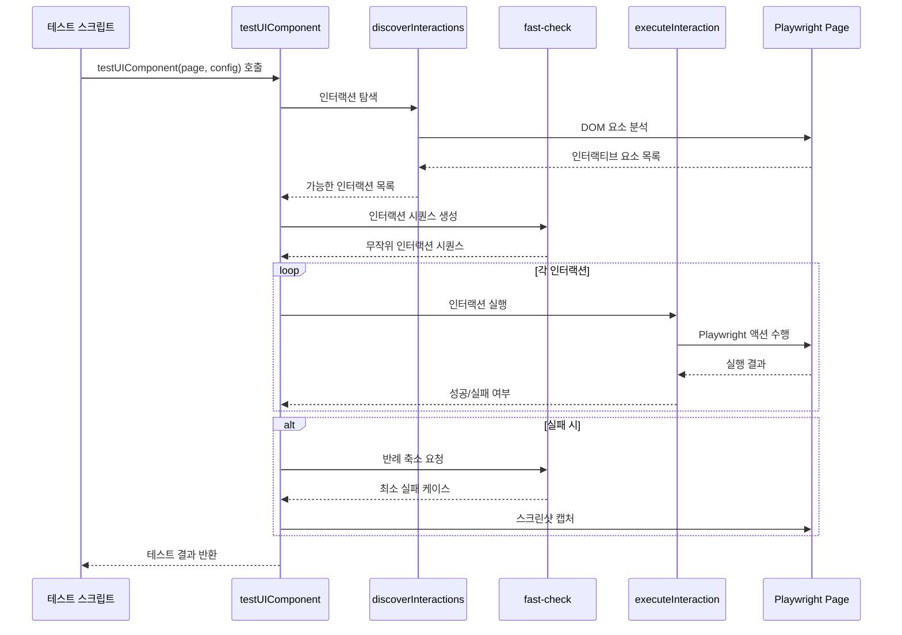

# Storybook UI 컴포넌트 범용 테스트 유틸리티 가이드

## 개요

이 문서는 Storybook UI 컴포넌트에 대한 범용 테스트 유틸리티를 설명해. 이 유틸리티는 프로퍼티 기반 테스트(Property-Based Testing) 방식을 사용해서 UI 컴포넌트의 안정성을 자동으로 검증하는 도구야.

### 주요 특징

- **자동화된 인터랙션 탐색**: 컴포넌트에서 상호작용 가능한 요소들을 자동으로 찾아내고 테스트해
- **무작위 테스트 시퀀스**: fast-check 라이브러리를 활용한 무작위 인터랙션 시퀀스 생성
- **실패 케이스 축소(Shrinking)**: 문제 발생 시 최소한의 재현 단계를 찾아내는 기능
- **고급 디버깅 지원**: 상세한 로그, 스크린샷, 실패 분석 도구 제공
- **범용성**: 모든 Presentational 컴포넌트에 적용 가능한 설계

## 아키텍처 및 구조

이 테스트 유틸리티는 다음과 같은 주요 모듈로 구성되어 있어:


### 핵심 컴포넌트

| 컴포넌트            | 역할                                                          |
| ------------------- | ------------------------------------------------------------- |
| **인터랙션 탐색기** | DOM에서 상호작용 가능한 요소를 찾고 가능한 인터랙션 목록 생성 |
| **시퀀스 생성기**   | fast-check를 사용해 무작위 인터랙션 시퀀스 생성               |
| **인터랙션 실행기** | 생성된 인터랙션을 Playwright를 통해 실행                      |
| **상태 검증기**     | 컴포넌트가 예상대로 동작하는지 확인                           |
| **디버깅 도구**     | 실패 시 상세 정보 수집 및 분석                                |

## 핵심 개념

### 인터랙션(Interaction)

인터랙션은 사용자가 UI와 상호작용하는 방식을 나타내. 클릭, 입력, 드래그 등의 동작이 포함돼.

```typescript
interface Interaction {
	type: string // 인터랙션 타입 (click, fill, select 등)
	selector: string // 대상 요소의 셀렉터
	value?: any // 인터랙션에 필요한 값 (fill, select 등에 사용)
	valueType?: string // 입력 시 값 타입 (text, email, number 등)
	min?: number // Range 최소값
	max?: number // Range 최대값
	options?: string[] // Select 옵션
}
```

### 지원하는 인터랙션 타입

| 타입       | 설명                    | 필요한 추가 속성     |
| ---------- | ----------------------- | -------------------- |
| `click`    | 요소 클릭               | -                    |
| `fill`     | 입력 필드에 값 입력     | `value`, `valueType` |
| `select`   | 드롭다운에서 옵션 선택  | `options`            |
| `hover`    | 요소 위에 마우스 올리기 | -                    |
| `setRange` | 슬라이더 값 설정        | `min`, `max`         |
| `drag`     | 요소 드래그             | -                    |

### 테스트 설정(TestConfig)

테스트 실행 방식을 커스터마이즈할 수 있는 설정 객체야.

```typescript
interface TestConfig {
	iterationCount?: number // 인터랙션 시퀀스 반복 횟수 (기본값: 3)
	sequenceLength?: number // 각 테스트 시퀀스의 인터랙션 수 (기본값: 5)
	numRuns?: number // Fast-check 실행 횟수 (기본값: 10)
	componentSelector?: string // 컴포넌트의 기본 셀렉터 (기본값: '#storybook-root')
	waitAfterInteraction?: number // 각 인터랙션 후 대기 시간(ms) (기본값: 100)
	resetComponent?: boolean // 반복마다 컴포넌트 상태 초기화 여부 (기본값: false)
	debugLogDir?: string // 디버그 로그 저장 디렉토리 (기본값: './test-results/debug-logs')
	captureScreenshots?: boolean // 실패 시 스크린샷 캡처 여부 (기본값: true)
	verbose?: boolean // 상세 로그 출력 여부 (기본값: false)
}
```

## 동작 원리

### 테스트 실행 흐름



### 인터랙션 탐색 과정


1. **DOM 분석**: 컴포넌트의 DOM 구조를 분석해 상호작용 가능한 요소 탐색
2. **요소 분류**: 버튼, 입력 필드, 체크박스 등 요소 타입 식별
3. **인터랙션 생성**: 각 요소에 적합한 인터랙션 타입 결정
4. **가시성 확인**: 화면에 보이는 요소만 선택
5. **최종 목록 생성**: 실행 가능한 인터랙션 목록 반환

### 인터랙션 실행 메커니즘


## 주요 함수 설명

### 1. testUIComponent

전체 테스트 프로세스를 실행하는 메인 함수야.

```javascript
async function testUIComponent(page, config = {})
```

**역할**:

- 테스트 설정 초기화
- 에러 핸들러 설정
- 반복 테스트 실행
- 디버그 정보 수집 및 저장
- 테스트 결과 반환

**사용 예**:

```javascript
import { test } from '@playwright/test'
import { testUIComponent } from './universal-testers'

test('Button 컴포넌트 테스트', async ({ page }) => {
	await page.goto('http://localhost:6006/iframe.html?id=components-button--primary')
	const result = await testUIComponent(page, {
		iterationCount: 5,
		verbose: true,
	})
	// 결과 확인
})
```

### 2. discoverInteractions

컴포넌트에서 상호작용 가능한 요소를 찾고 가능한 인터랙션 목록을 생성해.

```javascript
async function discoverInteractions(page, componentSelector)
```

**동작 방식**:

1. 컴포넌트 내 모든 DOM 요소 탐색
2. 각 요소의 타입, 속성, 상태 분석
3. 요소별 가능한 인터랙션 생성
4. 가시성 확인 후 최종 목록 반환

### 3. executeInteraction

주어진 인터랙션을 실제로 실행하는 함수야.

```javascript
async function executeInteraction(page, interaction, waitTime, verbose = false)
```

**처리 과정**:

1. 요소 존재 및 가시성 확인
2. 요소의 활성화 상태 확인
3. 인터랙션 타입에 따른 적절한 액션 실행
4. 실행 결과 및 오류 정보 반환

### 4. createInteractionSequenceArbitrary

fast-check 라이브러리를 사용해 무작위 인터랙션 시퀀스를 생성하는 함수야.

```javascript
function createInteractionSequenceArbitrary(interactions, length)
```

**특징**:

- 인터랙션 타입별 특화된 arbitrary 생성
- 값이 필요한 인터랙션(fill, select 등)에 대한 값 생성 로직 포함
- 시퀀스 길이 제한 설정

### 5. verifyComponentState

컴포넌트의 상태를 검증하는 함수야.

```javascript
async function verifyComponentState(page, componentSelector)
```

**확인 사항**:

- 컴포넌트 가시성
- 자식 요소 수
- 클래스 및 ID 정보

## 고급 기능

### 실패 케이스 축소(Shrinking)

테스트 실패 시 문제를 재현하는 최소한의 단계를 찾아내는 기능이야.


**장점**:

- 복잡한 실패 케이스를 단순화
- 디버깅 효율성 향상
- 정확한 실패 원인 파악 용이

### 디버깅 정보 수집

테스트 실행 중 발생하는 모든 정보를 체계적으로 수집하고 저장해.

**수집 정보**:

- 인터랙션 시퀀스 및 결과
- 오류 메시지 및 스택 트레이스
- 컴포넌트 상태 변화
- 스크린샷
- 콘솔 오류 및 페이지 오류

**저장 형식**:

- JSON 파일 (상세 정보)
- PNG 파일 (스크린샷)

## 자주 혼동되는 부분

### 1. 인터랙션 vs 이벤트


**인터랙션**은 사용자 동작을 시뮬레이션하는 높은 수준의 추상화야. 예를 들어 `click`은 요소를 찾고, 가시성을 확인하고, 실제 클릭을 수행하는 전체 과정을 포함해.

**이벤트**는 DOM 이벤트 자체를 의미해. 예를 들어 `element.dispatchEvent(new Event('click'))`는 단순히 이벤트만 발생시키고 실제 사용자 동작을 시뮬레이션하지는 않아.

### 2. 반례(Counterexample)와 축소(Shrinking)


**반례(Counterexample)**는 테스트가 실패하게 만든 입력값이야. 이 경우에는 특정 인터랙션 시퀀스를 의미해.

**축소(Shrinking)**는 반례를 단순화하는 과정이야. fast-check는 실패를 재현하는 가장 간단한 입력값을 찾아내려고 시도해. 이를 통해 디버깅이 훨씬 쉬워져.

### 3. 동기 vs 비동기 실행

이 코드에서는 많은 비동기 함수들이 사용되고 있어. 특히 Playwright 액션과 관련된 부분은 모두 비동기야. 이로 인해 발생할 수 있는 혼동 사항:

- `await`를 빼먹으면 Promise 객체가 반환되어 예상치 못한 동작 발생
- 비동기 함수 내에서 발생한 오류는 try-catch로 잡아야 함
- 비동기 작업의 순서가 중요한 경우가 많음

## 성능 고려사항

### 1. 테스트 실행 시간 최적화


**권장 설정**:

- 개발 중 빠른 피드백: `iterationCount: 1, sequenceLength: 3, numRuns: 5`
- CI/CD 파이프라인: `iterationCount: 3, sequenceLength: 5, numRuns: 10`
- 철저한 테스트: `iterationCount: 5, sequenceLength: 10, numRuns: 20`

### 2. 메모리 사용량

디버그 정보와 스크린샷은 많은 메모리를 사용할 수 있어. 특히 많은 테스트를 실행할 때는 다음을 고려해:

- `captureScreenshots: false`로 설정하여 스크린샷 캡처 비활성화
- 정기적으로 디버그 로그 디렉토리 정리
- 테스트 간에 브라우저 컨텍스트 재사용 최소화

## 일반적인 오류 및 해결 방법

### 1. 요소를 찾을 수 없음

**증상**: `요소가 페이지에 존재하지 않음: [selector]` 오류 발생

**가능한 원인**:

- 잘못된 셀렉터
- 요소가 아직 로드되지 않음
- 동적으로 생성되는 요소
- 컴포넌트 구조 변경

**해결 방법**:

- 컴포넌트 셀렉터 확인
- 대기 시간 증가
- 요소가 로드될 때까지 명시적 대기 추가

### 2. 인터랙션 실패

**증상**: 인터랙션 실행 중 오류 발생

**가능한 원인**:

- 요소가 화면에 보이지 않음
- 요소가 비활성화됨
- 다른 요소에 가려짐
- 이벤트 핸들러 오류

**해결 방법**:

- 요소의 가시성 및 활성화 상태 확인
- 스크롤 위치 조정
- 이벤트 핸들러 오류 디버깅

### 3. 테스트 불안정성

**증상**: 동일한 테스트가 때때로 성공하고 때때로 실패함

**가능한 원인**:

- 타이밍 이슈
- 무작위성으로 인한 다양한 인터랙션 시퀀스
- 외부 의존성 (API 호출 등)
- 컴포넌트 내부 상태 관리 문제

**해결 방법**:

- `waitAfterInteraction` 값 증가
- `resetComponent: true`로 설정하여 각 반복마다 상태 초기화
- 외부 의존성 모킹
- 특정 실패 케이스에 대한 명시적 테스트 추가

## 사용 예제

### 기본 테스트 실행

```javascript
import { test } from '@playwright/test'
import { testUIComponent } from './universal-testers'

test('Button 컴포넌트 테스트', async ({ page }) => {
	// 스토리북 페이지로 이동
	await page.goto('http://localhost:6006/iframe.html?id=components-button--primary')

	// 기본 설정으로 테스트 실행
	const result = await testUIComponent(page)

	// 테스트 결과 확인
	console.log(`테스트 성공 여부: ${result.success}`)
	if (!result.success) {
		console.log(`실패 정보: ${JSON.stringify(result.errors)}`)
	}
})
```

### 커스텀 설정으로 테스트 실행

```javascript
import { test } from '@playwright/test'
import { testUIComponent } from './universal-testers'

test('복잡한 폼 컴포넌트 테스트', async ({ page }) => {
	await page.goto('http://localhost:6006/iframe.html?id=components-form--complex')

	// 커스텀 설정으로 테스트 실행
	const result = await testUIComponent(page, {
		iterationCount: 5, // 더 많은 반복 실행
		sequenceLength: 10, // 더 긴 인터랙션 시퀀스
		waitAfterInteraction: 200, // 인터랙션 후 더 오래 대기
		resetComponent: true, // 각 반복마다 컴포넌트 초기화
		verbose: true, // 상세 로그 출력
	})

	// 결과 처리
	if (!result.success) {
		console.log('실패한 테스트 케이스:')
		console.log(result.iterations.find((i) => !i.success)?.failureInfo?.counterExample)
	}
})
```

### 특정 인터랙션만 테스트

```javascript
import { test } from '@playwright/test'
import { discoverInteractions, executeInteraction } from './universal-testers'

test('특정 버튼 클릭 테스트', async ({ page }) => {
	await page.goto('http://localhost:6006/iframe.html?id=components-button--primary')

	// 인터랙션 탐색
	const interactions = await discoverInteractions(page, '#storybook-root')

	// 버튼 클릭 인터랙션 찾기
	const buttonClick = interactions.find((i) => i.type === 'click' && i.selector.includes('button'))

	if (buttonClick) {
		// 특정 인터랙션만 실행
		const result = await executeInteraction(page, buttonClick, 100, true)
		console.log(`버튼 클릭 결과: ${result.success ? '성공' : '실패'}`)
	}
})
```

## 확장 및 커스터마이징

### 새로운 인터랙션 타입 추가

현재 지원하지 않는 인터랙션 타입을 추가하려면:

1. `getInteractionsFromElementInfo` 함수에 새 인터랙션 타입 처리 로직 추가
2. `executeInteractionByType` 함수에 새 인터랙션 실행 로직 추가
3. 필요시 새 인터랙션 타입에 맞는 arbitrary 생성 로직 추가

### 컴포넌트 상태 초기화 커스터마이징

컴포넌트 상태 초기화를 위한 특별한 로직이 필요한 경우:

1. 스토리북 페이지에 `globalThis.resetComponentState` 함수 정의
2. 이 함수 내에서 컴포넌트 상태를 초기화하는 로직 구현
3. 테스트 실행 시 `resetComponent: true` 설정

```javascript
// 스토리북 페이지에 추가할 코드
window.resetComponentState = function () {
	// 컴포넌트 상태 초기화 로직
	document.querySelector('#my-form').reset()
	// 또는 React 컴포넌트 상태 초기화
	window.__STORYBOOK_CLIENT_API__.raw('components-form--complex').render()
}
```

## 주의사항 및 제한사항

### 1. 동적 컴포넌트 테스트

동적으로 내용이 변경되는 컴포넌트(예: 비동기 데이터 로딩)는 테스트가 불안정할 수 있어. 이런 경우:

- 데이터 로딩이 완료될 때까지 대기하는 로직 추가
- 모킹을 통해 일관된 데이터 제공
- `waitAfterInteraction` 값을 충분히 높게 설정

### 2. 복잡한 상태 관리

복잡한 상태 관리를 가진 컴포넌트는 무작위 인터랙션으로 인해 예측하기 어려운 상태가 될 수 있어:

- 각 반복마다 상태를 초기화(`resetComponent: true`)
- 특정 상태 전이에 대한 명시적 테스트 추가
- 상태 변화를 모니터링하는 로직 추가

### 3. 이벤트 버블링 및 캡처링

이벤트 버블링이나 캡처링에 의존하는 컴포넌트는 테스트가 어려울 수 있어:

- 이벤트 전파 방식을 고려한 셀렉터 설계
- 이벤트 핸들러가 올바르게 등록되었는지 확인
- 필요시 직접 이벤트 발생 로직 추가

## 결론

이 범용 테스트 유틸리티는 UI 컴포넌트의 안정성을 자동으로 검증하는 강력한 도구야. 프로퍼티 기반 테스트 방식을 통해 개발자가 미처 생각하지 못한 엣지 케이스까지 발견할 수 있어 컴포넌트의 품질을 크게 향상시킬 수 있어.

주요 장점:

- 수동 테스트 대비 시간 절약
- 일관된 테스트 커버리지
- 예상치 못한 버그 발견
- 디버깅 효율성 향상

이 도구를 효과적으로 활용하면 UI 컴포넌트의 품질과 안정성을 크게 향상시킬 수 있을 거야.
