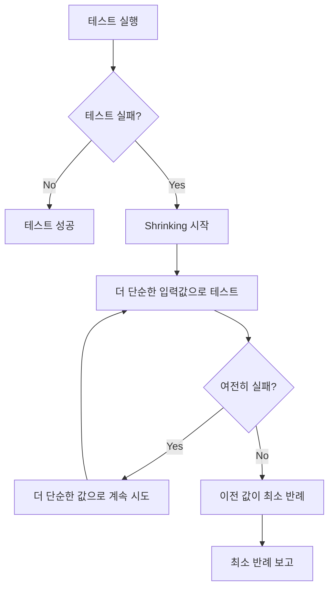
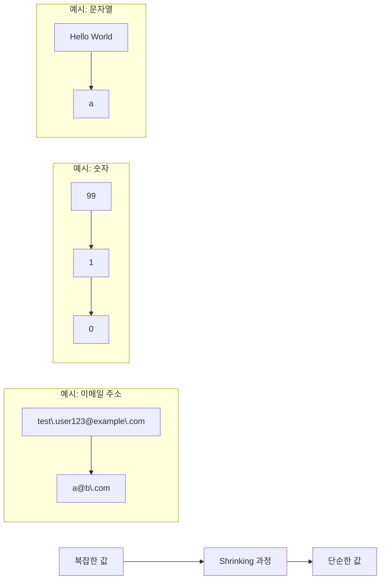
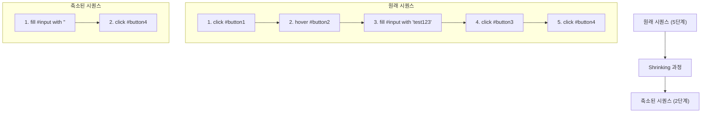
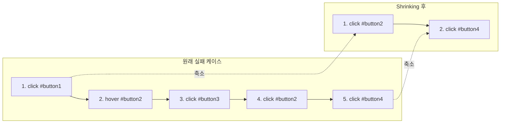
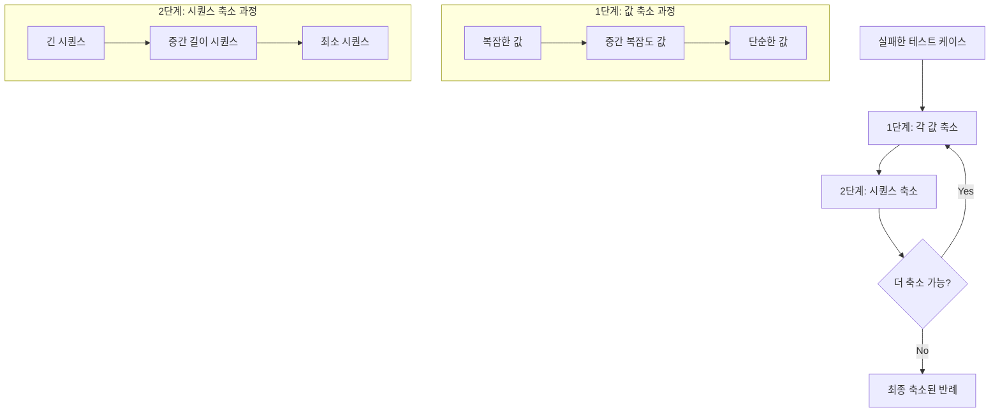

# Storybook UI 컴포넌트 테스트의 Shrinking 기능 상세 문서

## 개요

이 문서는 `universal-testers.js` 파일에 구현된 UI 컴포넌트 테스트 시스템에서 **shrinking** 기능이 어떻게 작동하는지 설명해. 이 테스트 시스템은 [fast-check](https://github.com/dubzzz/fast-check) 라이브러리를 활용한 Property-Based Testing(속성 기반 테스트)를 구현하고 있어. 특히 shrinking은 테스트 실패 시 최소한의 반례(counterexample)를 찾아내는 중요한 기능이야.

## Shrinking이란?

Shrinking은 테스트가 실패했을 때 해당 실패를 재현할 수 있는 **가장 단순한 입력값**을 찾아내는 과정이야. 이 과정은 디버깅을 훨씬 쉽게 만들어주지.



## 2단계 Shrinking 프로세스

`universal-testers.js`에서 shrinking은 **2단계 프로세스**로 구현되어 있어:

### 1단계: 개별 인터랙션 값의 축소

각 인터랙션 내부의 값(value)을 더 단순한 형태로 축소하는 과정이야.



코드에서는 `createInteractionSequenceArbitrary` 함수 내에서 각 인터랙션 타입별로 값을 생성하고 축소하는 로직을 구현하고 있어:

```javascript
// fill 타입 처리 - 값 생성 포함
if (fillInteractions.length > 0) {
	const fillArb = fc.constantFrom(...fillInteractions).chain((interaction) => {
		// 입력 타입에 따른 적절한 값 생성
		let valueArb
		switch (interaction.valueType) {
			case 'email':
				valueArb = fc.emailAddress() // 자동으로 단순한 이메일로 축소됨
				break
			case 'number':
				valueArb = fc.nat(100) // 0~100 사이의 자연수
				break
			case 'textarea':
				valueArb = fc.string() // 문자열
				break
			default:
				valueArb = fc.string() // 문자열
		}

		// 값이 포함된 새 인터랙션 객체 생성
		return valueArb.map((value) => ({
			...interaction,
			value,
		}))
	})
	arbitraries.push(fillArb)
}
```

이 코드에서 각 입력 타입별로 적절한 arbitrary를 생성하고, fast-check가 자동으로 이 값들을 축소할 수 있게 해. 예를 들어:

- `fc.emailAddress()`는 복잡한 이메일 주소를 더 단순한 형태로 축소해
- `fc.nat(100)`은 0~100 사이의 자연수를 더 작은 값으로 축소해
- `fc.string()`은 문자열을 더 짧은 문자열로 축소해

### 2단계: 인터랙션 시퀀스의 축소

인터랙션 시퀀스 자체를 더 짧고 단순하게 만드는 과정이야. 불필요한 인터랙션을 제거하고 최소한의 단계로 실패를 재현할 수 있게 해.



코드에서는 `createInteractionSequenceArbitrary` 함수의 마지막 부분에서 이를 구현하고 있어:

```javascript
// 2단계: 최종 시퀀스 Arbitrary 생성
const interactionArb = fc.oneof(...arbitraries)

// 배열 길이와 요소가 자동으로 축소되도록 함
return fc.array(interactionArb, { minLength: 1, maxLength: length })
```

여기서 `fc.array`는 배열의 길이와 요소를 자동으로 축소할 수 있는 arbitrary를 생성해. 이를 통해 fast-check는:

1. 시퀀스에서 불필요한 인터랙션을 제거해
2. 인터랙션의 순서를 최적화해
3. 최소한의 인터랙션으로 실패를 재현할 수 있는 시퀀스를 찾아내

## 코드에서의 Shrinking 구현 상세

### 1. Fast-check 설정

`universal-testers.js`에서는 `fc.check` 함수를 사용해 shrinking을 활성화하고 있어:

```javascript
const checkResult = await fc.check(
	fc.asyncProperty(sequenceArbitrary, async (sequence) => {
		// 테스트 로직...
	}),
	{
		numRuns,
		verbose: true,
		// endOnFailure 옵션 제거하여 shrinking이 제대로 동작하도록 함
	},
)
```

여기서 중요한 점은 `endOnFailure` 옵션을 제거했다는 주석이야. 이 옵션이 없어야 shrinking이 제대로 동작해.

### 2. 반례 처리 및 분석

테스트가 실패하면 fast-check는 shrinking을 통해 최소 반례를 찾아내고, 이를 `checkResult.counterexample`에 저장해:

```javascript
if (!checkResult.failed) {
	// 테스트 성공
	iterationInfo.success = true
} else {
	// 테스트 실패 - 축소된 반례 활용
	iterationInfo.success = false

	// fast-check의 반례가 있는지 확인
	if (checkResult.counterexample && checkResult.counterexample.length > 0) {
		// shrinking 후 발견된 최소 반례
		const shrunkValue = checkResult.counterexample[0]

		// 반례 분석
		if (Array.isArray(shrunkValue)) {
			analyzeShrunkSequence(shrunkValue)

			// 축소된 반례로 디버깅
			await debugWithShrunkExample(page, shrunkValue, componentSelector, waitAfterInteraction)
		}
	}
}
```

축소된 반례는 `analyzeShrunkSequence` 함수를 통해 분석돼:

```javascript
function analyzeShrunkSequence(shrunkSequence) {
	console.log('----------- 축소된 실패 케이스 분석 -----------')
	console.log(`총 ${shrunkSequence.length}개의 인터랙션이 필요합니다`)

	// 인터랙션 타입별 분류
	const typeCount = {}
	for (const interaction of shrunkSequence) {
		typeCount[interaction.type] = (typeCount[interaction.type] || 0) + 1
	}

	console.log('인터랙션 타입 분포:')
	for (const [type, count] of Object.entries(typeCount)) {
		console.log(`- ${type}: ${count}개`)
	}

	// 핵심 인터랙션 식별
	if (shrunkSequence.length === 1) {
		console.log('단일 인터랙션으로 실패를 재현할 수 있습니다:')
		console.log(`- ${shrunkSequence[0].type} on ${shrunkSequence[0].selector}`)
		if (shrunkSequence[0].value !== undefined) {
			console.log(`  값: ${shrunkSequence[0].value}`)
		}
	} else {
		console.log('주요 인터랙션 시퀀스:')
		for (let i = 0; i < shrunkSequence.length; i++) {
			const interaction = shrunkSequence[i]
			console.log(`${i + 1}. ${interaction.type} on ${interaction.selector}`)
			if (interaction.value !== undefined) {
				console.log(`   값: ${interaction.value}`)
			}
		}
	}
}
```

## Shrinking 작동 방식 예시

### 예시 1: 입력 값 축소 (1��계 Shrinking)

폼에 특정 값을 입력했을 때 오류가 발생하는 경우를 생각해보자.

**원래 실패 케이스**:

```
1. fill on #email-input with "test.user123@example.com"
2. fill on #password-input with "P@ssw0rd!123"
3. click on #submit-button
```

**Shrinking 후**:

```
1. fill on #email-input with ""
2. click on #submit-button
```

여기서 shrinking은:

1. 이메일 입력값을 점점 단순화하여 결국 빈 문자열로 축소 (1단계 shrinking)
2. 비밀번호 입력이 문제의 원인이 아님을 발견하고 제거 (2단계 shrinking)
3. 최소한의 단계로 오류를 재현

```mermaid
flowchart TD
    subgraph "1단계: 값 축소"
    A1["test.user123@example.com"] --> A2["test@example.com"] --> A3["a@b.com"] --> A4[""]
    B1["P@ssw0rd!123"] --> B2["password"] --> B3["pass"] --> B4["a"]
    end

    subgraph "2단계: 시퀀스 축소"
    C1["1. fill #email-input with ''"] --> C2["2. fill #password-input with 'a'"] --> C3["3. click #submit-button"]
    C1 --> D1["1. fill #email-input with ''"] --> D2["2. click #submit-button"]
    end
```

### 예시 2: 버튼 클릭 시퀀스 축소 (2단계 Shrinking)

UI 컴포넌트에 여러 버튼이 있고, 특정 순서로 클릭했을 때 오류가 발생한다고 가정해보자.

**원래 실패 케���스**:

```
1. click on #button1
2. hover on #button2
3. click on #button3
4. click on #button2
5. click on #button4
```

**Shrinking 후**:

```
1. click on #button2
2. click on #button4
```

이 경우 shrinking은 불필요한 단계(#button1 클릭, 호버 등)를 제거하고 실패를 재현하는 최소한의 단계만 남겨놓았어.



### 예시 3: 복합적 Shrinking (1단계 + 2단계)

다양한 인터랙션과 값이 섞인 복잡한 시나리오:

**원래 실패 케이스**:

```
1. fill on #username with "administrator"
2. fill on #email with "admin@company.org"
3. click on #terms-checkbox
4. select on #role-dropdown with "manager"
5. fill on #description with "This is a test account for demonstration purposes"
6. click on #submit-button
```

**Shrinking 후**:

```
1. fill on #email with ""
2. click on #submit-button
```

이 경우 shrinking은:

1. 각 입력 필드의 값을 단순화 (1단계 shrinking)
2. 불필��한 인터랙션을 제거 (2단계 shrinking)
3. 최종적으로 이메일 필드에 빈 값을 입력하고 제출 버튼을 클릭하는 것만으로 오류를 재현할 수 있음을 발견

```mermaid
flowchart TD
    subgraph "1단계: 값 축소"
    A1["administrator"] --> A2["admin"] --> A3["a"]
    B1["admin@company.org"] --> B2["a@b.com"] --> B3[""]
    C1["manager"] --> C2["user"]
    D1["This is a test account..."] --> D2["test"] --> D3[""]
    end

    subgraph "2단계: 시퀀스 축소"
    E1["1. fill #username with 'a'"] --> E2["2. fill #email with ''"]
    E2 --> E3["3. click #terms-checkbox"]
    E3 --> E4["4. select #role-dropdown with 'user'"]
    E4 --> E5["5. fill #description with ''"]
    E5 --> E6["6. click #submit-button"]

    E1 --> F1["1. fill #email with ''"]
    F1 --> F2["2. click #submit-button"]
    end
```

## Shrinking 알고리즘 작동 방식

Fast-check의 shrinking 알고리즘은 다음과 같은 방식으로 작동해:

### 1단계 Shrinking (값 축소)

1. **숫자 축소**: 큰 숫자를 더 작은 숫자로 축소 (예: 100 → 50 → 10 → 1 → 0)
2. **문자열 축소**: 긴 문자열을 더 짧은 문자열로 축소 (예: "Hello World" → "Hello" → "H" → "")
3. **이메일 축소**: 복잡한 이메일을 더 단순한 형태로 축소 (예: "<user.name@domain.com>" → "<a@b.com>")
4. **객체 축소**: 객체의 각 속성을 개별적으로 축소

### 2단계 Shrinking (시퀀스 축소)

1. **제거 시도**: 시퀀스에서 요소를 하나씩 제거해보며 여전히 실패하는지 확인
2. **순서 변경 시도**: 요소의 순서를 변경해보며 최소한의 순서 의존성 찾기
3. **이진 검색**: 시퀀스를 반으로 나누어 어느 부분이 실패를 유발하는지 빠르게 찾기



## 실제 사용 예: 테스트 실패 시 출력

테스트가 실패하면 다음과 같은 출력을 볼 수 있어:

```
----------- 축소된 실패 케이스 분석 -----------
총 2개의 인터랙션이 필요합��다
인터랙션 타입 분포:
- click: 1개
- fill: 1개
주요 인터랙션 시퀀스:
1. fill on #email-input
   값: ""
2. click on #submit-button
---------------------------------------------

축소된 반례를 사용한 디버깅 시작...
단계 1/2: fill on #email-input
단계 1 성공: 값 입력 성공:
상태: 정상 - 컴포넌트 정보 - 자식 요소: 3개, 클래스: form-container, ID: none
단계 2/2: click on #submit-button
단계 2 실패: 요소가 비활성화됨: #submit-button
실패 지점 발견: 단계 2
```

이 출력은 이메일 입력 필드에 빈 값을 입력하고 제출 버튼을 클릭했을 때 오류가 발생했음을 보여줘. 원래는 더 복잡한 시퀀스였을 수 있지만, shrinking을 통해 최소한의 단계로 축소됐어.

## Shrinking의 장점

1. **디버깅 효율성**: 최소한의 반례를 제공해 디버깅 시간을 크게 단축
2. **테스트 가독성**: 복잡한 실패 케이스를 단순화해 이해하기 쉽게 만듦
3. **회귀 테스트**: 축소된 반례는 회귀 테스트 케이스로 활용 가능
4. **버그 보고**: 최소한의 재현 단계를 제공해 버그 보고를 명확하게 함

## 코드에서의 Shrinking 최적화

**타입별 Arbitrary 설계**: 각 인터랙션 타입별로 특화된 arbitrary를 생성해 효율적인 shrinking을 가능하게 함

```javascript
// 타입별 인터랙션 필터링
const fillInteractions = interactions.filter((i) => i.type === 'fill')
const clickInteractions = interactions.filter((i) => i.type === 'click')
// ...

// 타입별 특화된 arbitrary 생성
const arbitraries = []

// fill 타입 처리 - 값 생성 포함
if (fillInteractions.length > 0) {
	const fillArb = fc.constantFrom(...fillInteractions).chain((interaction) => {
		// 입력 타입에 따른 적절한 값 생성
		let valueArb
		switch (interaction.valueType) {
			case 'email':
				valueArb = fc.emailAddress()
				break
			// ...
		}

		return valueArb.map((value) => ({
			...interaction,
			value,
		}))
	})
	arbitraries.push(fillArb)
}
```

## 결론

Shrinking은 property-based testing의 핵심 기능으로, 복잡한 UI 컴포넌트 테스트에서 디버깅을 크게 단순화해줘. `universal-testers.js`는 fast-check 라이브러리의 shrinking 기능을 활용해 UI 컴포넌트 테스트에서 발생하는 오류를 최소한의 단계로 재현할 수 있게 해주고 있어.

특히 2단계 shrinking 프로세스(개별 값 축소 + 시퀀스 축소)를 통해 매우 복잡한 인터랙션 시퀀스에서도 최소한의 반례를 효과적으로 찾아낼 수 있어. 이를 통해 개발자는 복잡한 UI 컴포넌트의 버그를 더 쉽게 이해하고 수정할 수 있게 돼.
